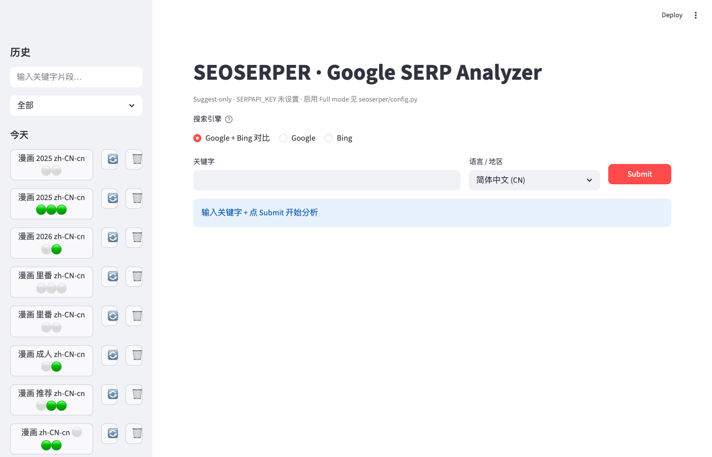

# SEOSERPER

[](https://github.com/redredchen01/seoserper/actions/workflows/test.yml)
[](LICENSE)
[](pyproject.toml)

Local-first Google + Bing SERP analyzer. Pulls **Autocomplete Suggestions**, **People Also Ask**, and **Related Searches** for any query, saves history to SQLite, exports Markdown or CSV.

Solo-operator tool, self-use. No account, no cloud — bring your own SerpAPI key (optional, free tier works).

## Modes

| Mode | Trigger | Surfaces |
|------|---------|----------|
| **Full (Google)** | engine=Google + `SERPAPI_KEY` set | Suggestions (free) + PAA + Related (via SerpAPI) — 1 credit/submit |
| **Suggest-only (Google)** | engine=Google + `SERPAPI_KEY` unset | Suggestions only — 0 credits |
| **Bing** | engine=Bing + `SERPAPI_KEY` set | PAA + Related (via SerpAPI `engine=bing`) — 1 credit/submit. **No Suggest** — Bing has no public/free autocomplete endpoint. |

SerpAPI free tier is ~100-250 searches/month (depends on your plan — check https://serpapi.com/manage-api-key). No credit card. **Google and Bing share the same quota pool.** See `seoserper/config.py` module docstring for the full setup + locale + quota details.

**Note on Bing PAA**: Google returns PAA on ~80% of queries; Bing on ~20-40%. Don't be surprised when Bing's PAA surface is EMPTY — it's upstream behavior, not a tool error.

## Quick start

```bash
# 1. Clone + deps (Python 3.10+ required)
pip install -e .

# 2. Optional: configure SerpAPI for Full mode
cp .env.example .env          # edit and paste your key
export $(grep -v '^#' .env | xargs)

# 3. Run
streamlit run app.py
```

Open http://localhost:8501. Pick a locale (English / 简体中文 / 繁體中文 / 日本語), submit a query.

## Screenshots



The default view shows Google + Bing side by side with `🟰` markers on items both engines returned, a quota progress bar at the top, and a filterable history sidebar.

## Export formats

| Format | Content |
|--------|---------|
| Markdown | H1 + frontmatter + sections — paste into Notion / 飞书 / VS Code |
| CSV | Flat `surface,rank,text,answer_preview` rows — open in Excel / LibreOffice (UTF-8 BOM for zh/ja compat) |

## Cache

Full-mode responses are cached by `(query, lang, country)` for 24 hours. Repeat queries don't burn SerpAPI quota. Reset / prune:

```bash
python3 scripts/reset_serp_cache.py              # nuke all
python3 scripts/reset_serp_cache.py --prune-only # drop only expired
```

## Tests

```bash
pip install -e '.[dev]'
pytest tests/ -q
```

## Plans

Design history lives under `docs/plans/` — active plan is the highest-numbered `status: active` file. Completed plans stay for context.

## License

MIT — see [LICENSE](LICENSE).
