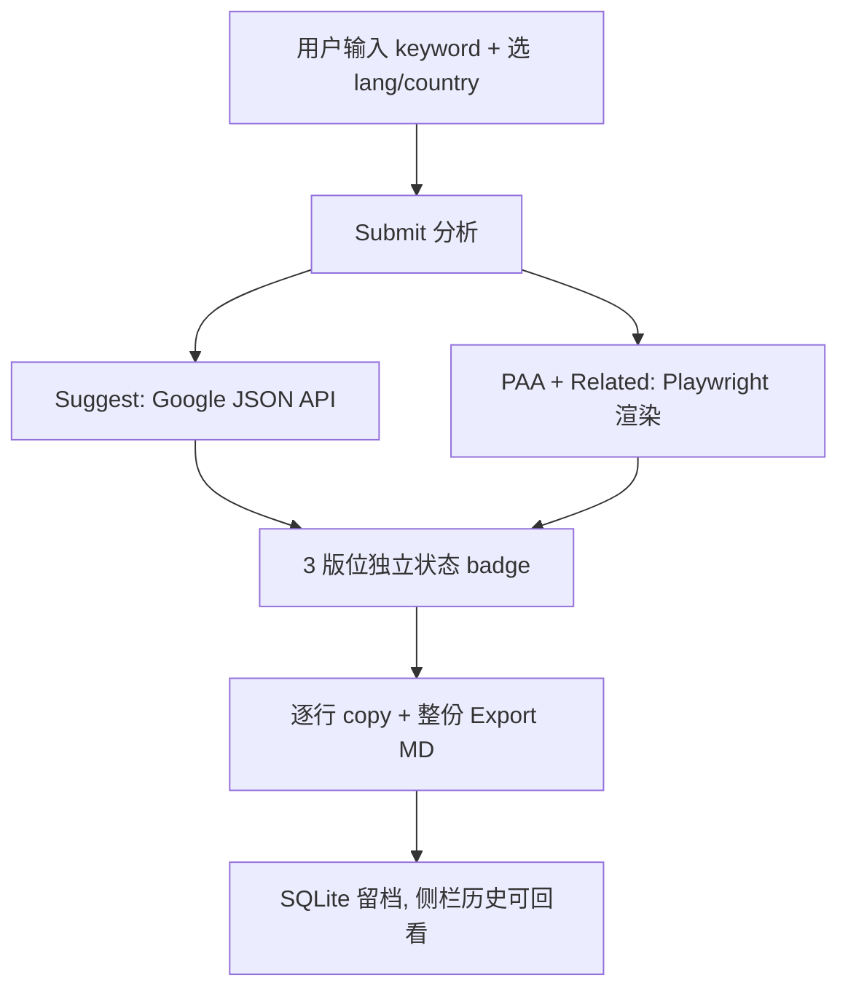

# Google SERP Analyzer

## Problem Frame

自用 SEO 工具。做关键字研究时，需要在 Google 三个版位上看：

- **Autocomplete Suggestions** — 搜索框输入时的下拉建议
- **People Also Ask (PAA)** — 结果页的折叠问答
- **Related Searches** — 页面底部的相关搜索

现状靠手工打开 Google、肉眼扫 3 个版位、记笔记。慢、易漏、不可复用、不可留档。workspace 虽有 TS 版 `playwrightSerpProvider`（在 `seo-content-system` 后端），但那是 API 服务方向，不是本地交互探索工具。

MVP 要解决的痛：**输入 1 个关键字 → ~10 秒内拿到 3 版位结构化数据 → 每行可复制 + 一键导出 Markdown（直接贴进写作/情报文档）→ 本地 SQLite 留档**。

## User Flow



## Requirements

**核心分析流程**

- **R1.** 用户输入单一关键字 + language + country，系统返回 3 个版位的结构化数据：suggestions、PAA questions、related searches
- **R2.** Suggestions 使用 Google autocomplete JSON 端点（`suggestqueries.google.com/complete/search`，非公开契约但历史稳定），**不使用 Bing fallback**。端点返回形状异常时须 fail fast，不静默返回空
- **R3.** PAA 和 Related Searches 使用 Playwright 渲染 Google 搜索结果页抓取
- **R4.** 每条结果保留原始 rank（suggest 下拉序号 / PAA 显示顺序 / related 呈现顺序）
- **R5.** 每次 job 记录数据来源层级标识（"Google Suggest API" / "Google Search Playwright"）和整次 job 的抓取时间戳。UI 和导出 MD metadata 区域展示这两项（让用户看清数据来源与新鲜度）

**状态与失败处理**

- **R6.** 3 版位独立状态：每版位各自标记 `ok` / `failed` / `empty`；整体 job 只要有 ≥1 版位 `ok` 即视为 `completed`（而非"全成功才完成"）
- **R7.** UI 必须清晰展示每版位 badge（🟢 ok / 🔴 failed / ⚪ empty），用户一眼看出哪部分数据可用
- **R7b.** UI 状态机：Idle（无 query）→ Loading（点击 Submit，每版位显示 skeleton）→ Progressive reveal（Suggest 秒级到达先渲染，PAA + Related 5-10s 后到达独立更新）→ 终态（`ok` / `failed` / `empty` 的 badge）。重提交时旧结果保留直到新的第一版位到达（避免闪屏）；历史视图有持久 banner 区分 live vs historical
- **R8.** UI 提供**单个 Retry 按钮**；engine 只重跑 `failed` / `empty` 的版位（保留 `ok` 的），不做 per-surface 独立 UI
- **R9.** 遇 captcha / consent screen (`consent.google.com` / CMP 弹窗) / Google 反爬时，明确报错 + 建议（如"稍候几分钟重试"），**不降级到其他数据源**，不静默 work around。失败原因**初始 taxonomy**：`blocked_by_captcha` / `blocked_by_consent` / `blocked_rate_limit` / `selector_not_found` / `network_error` / `browser_crash`——plan 阶段若发现某几类最终展示同一条 user-facing 文案，可合并到 `blocked` 一级（内部 debug 字段保留细分）。consent 检测路径：URL 前缀匹配 (`consent.google.com`) + DOM probe（`form[action*="consent"]` / 已知 CMP 节点）两者并用

**结果可操作性**

- **R10.** 每条建议/PAA/related 项后附"复制"按钮；单击复制**纯文本**（不含 rank/source 前缀）到剪贴板，按钮显示 `Copied!` 短暂反馈约 1.5s 后恢复。按钮始终可见（不 hover-gated——Streamlit 无 row-level hover state）。多选复制 + 带 metadata 复制推迟到 Phase 2
- **R11.** 整次分析结果可一键导出为 Markdown 文件：query 作为 H1 / 3 版位分 3 个 section / 每 section 列表呈现 / 顶部含 metadata（query、language、country、timestamp、每版位 status）。文件名格式 `seoserper-{slugified-query}-{lang}-{country}-{YYYYMMDD-HHmm}.md`；slugify：小写、非字母数字→`-`、截断至 60 字符
- **R12.** MD 生成放在单一可测试纯函数（签名如 `render_analysis_to_md(analysis) -> str`），**不**提前设计抽象接口、**不**设计插件化渲染层。Phase 2 若落地，届时基于两个实际消费者再决定是否提取共享抽象（避免 speculative generality）

**历史与留档**

- **R13.** 每次分析自动落盘 SQLite，保留历史（不覆盖旧记录）
- **R14.** 侧边栏展示最近 50 条历史，按 Today / This week / Older 分组；每行两行——第 1 行 `{query}`（>40 字符截断），第 2 行小号灰字 `{lang}-{country}  {相对时间}  [状态点]`；可滚动；超过 50 条时旧记录从侧栏滚出但仍保留在 SQLite。点击历史项：(a) 从 SQLite 恢复快照到主视图（**不**重新抓取 Google）；(b) 填充 keyword/lang/country 输入；(c) 显示持久 banner `正在回看 {timestamp} 历史结果 [重新运行] [返回当前]`；(d) 如有 query 进行中，先弹窗 `有查询进行中——放弃并回看？[取消] [仍要回看]`
- **R15.** 同一 (query, language, country) 多次执行创建新 job（不 update 旧记录）。避免误覆盖历史，也自然支持重跑对比

**Selector 健壮性**

- **R16.** Plan 阶段冻结 en-US / zh-CN / ja-JP 的 PAA + Related HTML 作为 test fixture。**这是代码回归测试**（防改错 selector），**不是 live DOM drift 监测**：fixture 是 frozen snapshot，Google 改版时不会自动触发。命中率对 fixture 失败时测试 fail——人工介入，**不做自动降级**。Live drift 监测（nightly canary 对真 Google 跑固定 query 看 PAA 数量）留给 post-launch 运维，不在 MVP 范围

## Success Criteria

- 单次分析端到端耗时：P50 ≤ 8 秒、P95 ≤ 20 秒（网络正常、未被 captcha）
- Suggest 层成功率作为 post-launch 观测指标（**非 Day-0 验收 gate**）。端点返回形状异常时须标记 `failed` 而非 `empty`（防静默数据丢失）
- PAA + Related 在第一周手动抽查通过率 ≥ 80%
- 导出 MD 粘贴进 Notion / 飞书 / VS Code 后：(a) 三级标题渲染正确、(b) frontmatter 作为 code block 或 properties 渲染、(c) 有序列表保留编号、(d) 无散落的 `*` 或 ``` 字符、(e) 中文不出现编码异常
- 历史记录 ≤ 50 条时，查询响应 < 500 ms
- Post-launch 观察指标（**非 Day-0 验收**）：每日 query ≤ 30、连续 query 间隔 ≥ 10 秒条件下，Google 反爬阻断率 ≤ 20%。工具须清晰区分 `blocked` / `empty` / `ok` 三种状态（不让 blocked 被误标为 empty）
- 原 spec 里 "建议 ≥ 8 条 / PAA ≥ 3 条 / related ≥ 6 条" 这类绝对阈值**不作为验收标准**——long-tail 关键字上 Google 本来就不提供那么多，系统应"返回 Google 当下提供的全部"

**Outcome indicators（MVP 试用 2 周后自评）：**

- 至少 1 份基于本工具导出 MD 的内容简报/大纲实际用于后续创作（证明导出格式真能贴进下游工作流）——**observable proxy**: 任一 exported MD 的文件名片段出现在后续文档里（grep 即可）
- SQLite 可观测指标：任意 5 工作日滚动窗口内 ≥ 15 个 completed job、≥ 3 不同 query/工作日（取代主观的"60% 会话从本工具开始"）
- **Kill trigger：** 在 **research-active 3 周**（用户自行标记 "本周有做关键字研究"）中，每周 SQLite 新增 job < 15 条 持续 3 周 → 触发复盘，**默认动作：** ship Suggest-only CLI 变体（drop Playwright/PAA/Related），revisit 只在月活量翻倍时。1 次允许 ignore（避免 vacation/项目切换 false trigger）

## Scope Boundaries

**MVP 明确包括**

- 单关键字查询 × 3 版位 × 可选 language + country
- 每行 copy + 整份 Markdown 导出
- SQLite 本地留档 + 侧边栏历史回看
- 3 版位独立状态 + 单按钮 "重跑失败版位"（engine 只重跑非 ok 的版位）

**MVP 明确不包括（→ Phase 2）**

- 批量查询 + CSV 输入
- 跨关键字聚合（共现 PAA / 共现 related → 内容缺口表）——**acknowledged**: Product-lens 认为这才是工具 10x 价值所在，用户选择先验证单查询工作流能否嵌入日常再扩展，接受 Phase 2 改写成本
- Featured snippet / top 3-5 organic domains / knowledge panel 抓取——Playwright 渲染已含完整 SERP，Phase 2 再评估是否加入作为第 4 版位（acknowledged: Product-lens 认为这是 MVP 缺口，但决定留到 Phase 2 以保持 MVP 聚焦）

**MVP 明确不包括（→ Phase 3 / 未来）**

- 周期性 SERP diff 监测（跑同一关键字清单对比 T1 vs T2 版位变化）
- 账号体系 / 多设备同步
- 自定义数据源、其他搜索引擎（Bing / 百度 / DuckDuckGo）

**明确不做**

- Bing / 其他搜索引擎 fallback（数据污染，不如 fail fast）
- 代理 / residential IP / captcha 破解（遇到就明确报错）
- Export 到 PDF / HTML（只做 MD；CSV 在 Phase 2）
- 移动端适配 / 无障碍优化（桌面 Streamlit 自用）

## Key Decisions

- **数据源完全限定 Google**。Suggest 用 Google autocomplete 端点（`suggestqueries.google.com`，内部 autocomplete 后端，非公开契约但历史稳定），PAA + Related 用 Playwright 渲染 Google 搜索页。端点形状变化时 Suggest 层也可能 `failed`——**不承诺 Suggest 99% SLA**。不保留 Bing fallback——Bing 建议与 Google 建议逻辑差别大，混入等于数据污染
- **3 版位独立状态**，不采用"全成功才算完成"的严格模型。Google DOM 选择器会漂移（尤其 related 区），部分成功仍有价值
- **Python + Streamlit + SQLite 路线独立于 workspace 的 TS SERP stack**。可参考 TS 版（`seo-content-system/backend/src/services/playwrightSerpProvider.ts`）已知的 PAA *容器* 定位（`.related-question-pair`）作为起点——但 PAA 文本提取、Related Searches 选择器、consent 屏处理、captcha 检测对本项目都是 greenfield，**不继承 TS 的已验证置信度**
- **UI 布局：3 版位垂直堆叠**（suggestions 顶 / PAA 中 / Related 底）。suggestions 是高密度扫描目标（密集列表），PAA 是完整句子需重读（宽松行距），Related 是 chip-like 短查询（横向 wrap）；垂直堆叠让 3 块一屏可见，避免 tab 隐藏 2/3 内容
- **Playwright 浏览器 warm-resident**：首次 submit 时启动一次 chromium，Streamlit session 内保留；每 query 开 fresh context（清 cookies/localStorage——**注意**：不清网络层 fingerprint / TLS cache / DNS，Google 仍把 sustained session 当同一 client 对待）。冷启 P50 ≤ 15 s、warm P50 ≤ 8 s 分别计量。**线程模型**：Playwright sync_api 必须在独立 `threading.Thread` 中运行（Streamlit script thread 在 rerun 时会丢 greenlet 上下文），Streamlit 主线程通过 queue 提交任务、轮询结果——参考 workspace sibling `projects/tools/claude-crawler-clean/crawler/core/render.py` 的 RenderThread 实现。**重启策略**：每 50 query 或 1 h（whichever first）restart chromium，防 RSS 无界增长；crash recovery 透明（BrowserClosedError → auto-restart，不计 job failure）
- **SQLite 持久化模型**：job 开始 INSERT（status=`running`、3 版位占位）→ 各版位独立 UPDATE。历史侧栏过滤 `running` 不展示。避免 job 中途崩溃不留记录
- **MVP-scope locale：en-US / zh-CN / ja-JP**。PAA + Related 抽查通过率仅对这 3 个市场生效；其他 locale 支持但不承诺质量
- **Language + country UI**：2 个 free-text 输入框（默认 `en` / `us`），SQLite 记住上次选择。**不**预置下拉、**不**做 matrix validation——Google 对非法 `hl`/`gl` 自动降级到默认
- **"自用" 是当前观察，非永久约束**。若 6 个月后需团队使用，Streamlit + SQLite + 无账号 架构大概率要重写（不是增量演化）——这是接受的 reversal 成本
- **Bing 决策精准化**：拒绝的是 *fallback*（同字段替代数据源），不是 *parallel independent source*（并列独立版位）。Parallel Bing 不会污染（源标签分开），但 MVP 认为单独维护不值得
- **MD 生成作为纯函数落地**，**不**提前抽象为渲染层。Phase 2 若发生再根据实际两个消费者决定是否提取共享抽象
- **硬阈值不作为验收标准**，改用"返回 Google 当下提供的全部"的弹性契约
- **失败透明优先于可用性兜底**。用户看到 "Google 被拦截" 比看到 "Bing 返回了 10 条建议" 更有价值。"失败透明" 指不用其他数据源冒充 Google——不是"任一版位失败则整 job 无输出"；Suggest=ok + PAA=failed + Related=failed 是合法的 partial success（见 R6）
- **MVP SQLite schema 只包含 MVP 需要的字段**。Phase 2 若需要 `batch_id` / `parent_job_id`，届时用 `ALTER TABLE ADD COLUMN`（nullable、零迁移成本）添加；不为不存在的 Phase 2 形态预留列

## Design Principles

- **suggestions 是高密度扫描目标** — 密集列表、小行距、无行间分隔
- **PAA 是完整句子需要重读** — 宽松行距、限制行宽、问题间视觉分隔
- **related 是短 chip-like 查询** — 横向 wrap、紧凑排列
- **3 版位一屏同时可见** — 已知用户行为是跨版位对比（"这个 PAA 问题是不是也出现在 related？"），不用 tab 隐藏
- **Copy 是 terminal 动作而非 browse 动作** — 按钮始终可见、不 hover-gated（Streamlit 无 row-level hover state 也是客观约束）
- **失败状态内含诊断信息** — error category + Retry 按钮一起显示，不要求点开 Show Details 才看到原因

## Dependencies / Assumptions

- **假设**：用户网络可稳定访问 Google（非 cn 限制地区）
- **假设**：用户接受低频 captcha → 等几分钟重试的失败模式（不做 proxy / residential IP）
- **假设**：MVP 只实现单查询；Phase 2 若落地会独立 brainstorm，**不**现在为未定义形态的 Phase 2 预留扩展点
- **依赖**：Playwright chromium（约 170 MB 本地下载）
- **依赖**：Python 3.10+（新式 typing `int | None` 语法）
- **依赖**：pre-plan 的 "captcha 基线 spike"（见 Next Steps）——1 天内用目标 IP 跑 20-30 次真实 Playwright 查询（节奏 1-2 min/次）实测阻断率；>10% 则回 brainstorm 重评 proxy 决策

## Outstanding Questions

### Resolve Before Planning

（无——产品层决策已收口）

### Deferred to Planning

- **[Affects R3][Needs research]** Google PAA 的"展开更多"点击：当代 Google PAA 多数初始展示 4 条、点击后偶尔 lazy-load 更多——plan 阶段的 selector spike 里实验并决定是否执行 expand click
- **[Affects R2][Technical]** Google Suggest JSON API 参数细节：`client=firefox` vs `client=chrome` 返回结构差异、`hl` + `gl` 参数透传方式、返回条数是否固定 10
- **[Affects R2][Needs research]** Google autocomplete 端点的 per-IP rate-limit 实测阈值 + 检测策略（响应头、body 特征、连续空响应计数）。捕获 200 正常响应 + 已知错误形态作 contract fixture
- **[Affects R9][Product]** Silent data contamination 检测启发式：比如当 PAA 返回 0 但 Suggest 层命中 ≥ 8 时（暗示是流行 query），把 PAA 状态从 `empty` 升级为 `suspicious` 以提醒用户可能被静默污染——值得做吗？能做多准？
- **[Affects R15][Product]** 短时间重复跑同一 query 的 dedup / merge 视图：侧栏按 (query, lang, country) 合并相同组，展开显示各次 run——避免侧栏被手抖的重跑刷屏
- **[Affects R12][Product]** Phase 2 批量形态的具体草图：粘贴 N 行 query 的 textarea vs 上传 CSV vs 两者都支持；输出是 1 份合并 MD 还是 N 份独立 MD + 1 份跨查询聚合表——留作 Phase 2 独立 brainstorm

**Plan 阶段技术预研清单（从 Pass 2 review 整理，非产品级决策）：**

- **[Affects R7b][Technical]** Streamlit progressive reveal 实现路径：`st.empty()` 顺序阻塞 vs `st.experimental_fragments` vs worker thread + polling + `st.rerun()`——plan 阶段先跑 POC，评估哪个支持 R7b 的"Suggest 秒级 + Playwright 5-10s 独立到达"
- **[Affects R13, R15][Technical]** Orphan `running` 行 reaper 策略：启动时扫描 `status=running AND started_at < now()-30 min` 标记 `failed`；或加 TTL 自动 cleanup；或接受为 noise
- **[Affects R10][Technical]** Streamlit 每行 copy 按钮组件选择：`streamlit-extras` vs `st.components.v1.html` 自定义 vs 整版位"Copy all"降级方案
- **[Affects R8, R7b][Design]** UI 状态机交叉点：历史回看时 Retry / 历史回看时输入被编辑 / 提交中点击历史项——3 个交叉 case 的完整状态转移表
- **[Affects R14][Design]** Sidebar 每行状态点：single dot（丢失 partial success 信号）vs 3 mini-dots 对应 3 版位——推荐 3 mini-dots 与主视图 badge 一致
- **[Affects R2][Technical]** Suggest 响应形状契约：捕获 3-5 个 200 响应 freeze 为 contract fixture；定义 anomaly 条件（wrong top-level type / suggestions array missing / content-type 非 JSON / HTML 响应等）并映射到 R9 category
- **[Affects R11][Design]** Appendix A MD 模板需补充 `status: failed` 分支的 section 渲染（比如 "_PAA 获取失败: blocked_by_captcha_"）
- **[Affects R9, R7b][Design]** 每个 R9 失败 category 的 user-facing 文案（决定是否 collapse taxonomy）以及 loading / empty / failed 三态的具体文案
- **[Affects R12][Migration]** Phase 2 SQLite schema 演进：用 `PRAGMA user_version` 追踪 schema version，app 启动时跑 idempotent `ALTER TABLE ADD COLUMN` 迁移——避免手动运维
- **[Affects R1, R5, R7b, R14][Design]** 顶层页面骨架：keyword/lang/country 输入行 / Submit / metadata 条 / 3 surface stack / Retry / Export MD / Sidebar 的空间关系——给一个低保真 sketch 避免 implementer 各自发挥
- **[Affects R10][Technical]** Clipboard 失败回退：Streamlit clipboard 跨浏览器有已知坑，需要"Copy blocked — select text manually"兜底文案 + 高亮该行

## Next Steps

**Pre-plan gate (3-day pattern-matched spike)：**

1. 目标 IP 跑 **≥ 60 次** 真实 Playwright Google 查询，分散在 3 个工作日；每天模拟真实研究节奏（3 个 burst，每 burst 3-5 query，间 1-2 min；burst 之间数小时间隔）——模拟实际使用而非一次性冲量
2. 冻结 en-US / zh-CN / ja-JP 当前 PAA + Related HTML 作为 R16 test fixture
3. 判定（Wilson 置信区间说明：N=60、观察 6/60 (10%) 的 95% CI ≈ [3.8%, 20.5%]，故阈值附近不宜机械判定）：
   - **0 阻断** → ship
   - **1-2 阻断** (1.7-3.3%) → ship，记录为 baseline
   - **3-5 阻断** (5-8.3%) → note-and-ship，post-launch 每月再测一次
   - **≥ 6 阻断** (≥10%) → 回 `/ce:brainstorm` 重评 proxy 决策。**注意 Suggest-only 不是 MVP 范围削减而是产品定义变更**（workspace TS stack 已有同等能力），要另起 brainstorm 而不是默认降级

通过 spike 后 → `/ce:plan` for structured implementation planning

## Appendix A: Markdown Export Template

文件名示例：`seoserper-best-running-shoes-en-us-20260420-1430.md`

````markdown
---
query: best running shoes
language: en
country: us
timestamp: 2026-04-20T14:30:00Z
source_suggest: Google Suggest API
source_serp: Google Search Playwright
status_suggestions: ok
status_paa: ok
status_related: empty
---

# best running shoes

## Suggestions (10)

1. best running shoes for flat feet
2. best running shoes for men
3. …

## People Also Ask (4)

1. **What are the top-rated running shoes in 2026?**
2. **Are Nike running shoes good for flat feet?**
3. …

## Related Searches

_No related searches returned for this query._

---

_Generated by SEOSERPER · 2026-04-20 14:30 UTC_
````
