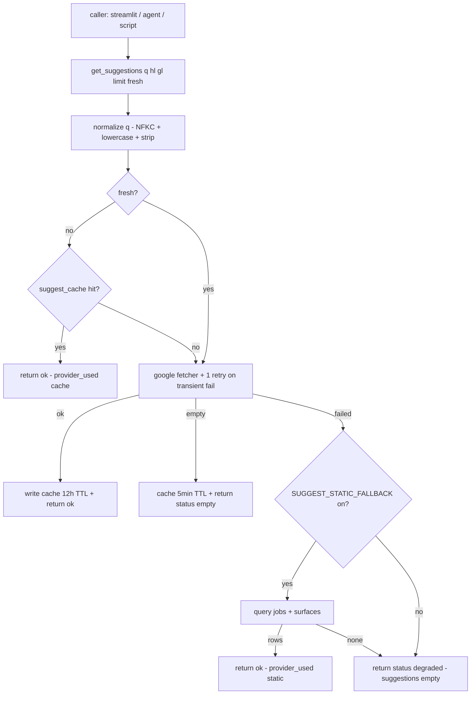

# Suggest Shared Library (SEOSERPER sub-feature)

## Problem Frame

SEOSERPER's `seoserper.fetchers.suggest` works today, but its defensive-parse, retry, and cache behavior is split between the fetcher itself and ad-hoc wrappers in the Streamlit engine layer. Future Python callers in the YD 2026 workspace — agents, scripts, notebooks — that want keyword suggestions will either re-import the raw fetcher and reinvent the protective wrapper, or hit `suggestqueries.google.com` directly.

This brainstorm scopes a **shared Python library** inside SEOSERPER: a small stable function `seoserper.suggest.get_suggestions(...)` that wraps the existing fetcher with a minimal resilience layer (normalize → cache → upstream → optional static → safe-degrade) and returns a normalized result. Streamlit migrates to it; future Python agents import it.

This revises an earlier framing (HTTP-service, initially written to the original Node/TS brief) after a six-persona document review converged: the HTTP machinery (FastAPI + uvicorn + per-caller rate limit + circuit breaker + request coalescing + Provider Protocol + 8-signal metric registry + `CallerIdentity` abstraction + `/healthz` with provider booleans) was an over-import of a multi-tenant production spec onto a single-user local codebase with zero named non-Python callers. A thin FastAPI adapter on top of `get_suggestions` remains a one-day follow-on if/when a concrete non-Python caller appears — it is out of scope here.

## Library Flow

## Requirements

**Public API**

- R1. Expose `seoserper.suggest.get_suggestions(q: str, hl: str = 'zh-TW', gl: str = 'TW', limit: int = 10, fresh: bool = False) -> SuggestResult`. `q` is stripped + NFKC-normalized; must be 1–128 chars after normalization; longer or empty `q` raises `ValueError`. `limit` clamped to 1..20.
- R2. `SuggestResult` is a frozen dataclass: `query`, `normalized_query`, `suggestions: list[str]`, `provider_used: Literal["cache","google","static","none"]`, `status: Literal["ok","empty","degraded"]`, `from_cache: bool`, `latency_ms: int`, `warnings: list[str]` (empty on the happy path).
- R3. The function never raises on upstream failure. All recoverable errors — network timeout, connection error, non-2xx, unparseable body — translate to `status="degraded"` with empty suggestions (or static-sourced suggestions when R9 is enabled). Only programmer errors (wrong types, `q` out of bounds) raise synchronously.

**Core resolution**

- R4. Resolution order: normalize → cache read (skipped if `fresh=True`) → `_google_fetch` with 1 retry on transient failure (timeout, connection error, 5xx — but NOT on parse failure or 4xx) → optional static fallback → empty + degraded.
- R5. `_google_fetch` wraps the existing `seoserper.fetchers.suggest` call path and preserves its OK / EMPTY / FAILED trichotomy. **EMPTY is a success**, not a failure: a well-formed upstream response with zero suggestions returns `status="empty"` with `provider_used="google"` and is cached. FAILED alone triggers the optional static fallback.

**Caching**

- R6. Cache key = `(normalized_q, hl, gl, limit)`. SQLite-backed. Planning decides between extending `seoserper.fetchers.serp_cache` with a `source` discriminator column or adding a parallel `suggest_cache` table; either reuses the idempotent migration pattern in `storage.init_db`.
- R7. TTL 12h for OK; 5min for EMPTY; **never cache FAILED/degraded responses** — recovery must be instantly visible on the next call. (This also dissolves the recovery-blindness concern adversarial review raised about the HTTP-service draft.)
- R8. `fresh=True` skips the cache read but writes through on success as usual. No separate rate bucket, no secondary quota — `fresh` is a hint, not a governance knob.

**Static fallback (OFF by default)**

- R9. Static fallback is disabled in MVP via `SUGGEST_STATIC_FALLBACK: bool = False` in `seoserper.config`. Rationale: adversarial review argued that when Google is down AND cache misses, the same query is usually novel, so history won't match — the provider is unlikely to fire usefully. We keep the code path implemented and tested, then flip it on only if observed cache-miss behavior shows a repeat-pattern the static source could fill.
- R10. When enabled, static fallback reads the `jobs` table (completed, locale-matched) joined to `surfaces` (`surface='suggest'` AND `status='ok'`), prefix-matches against `jobs.query`, and returns up to `limit` items sorted by recency. Locale filter is `jobs.language = hl` AND `jobs.country = gl.lower()`. Zero matches after filter returns empty — do not unfilter.

**Observability**

- R11. One structured log line per call via stdlib `logging` with a JSON formatter. Fields: `normalized_query_hash` (first-8-char sha256 of `normalized_q`), `hl`, `gl`, `limit`, `fresh`, `provider_used`, `status`, `latency_ms`, `from_cache`. **Raw `q` is never logged** — it sits in the same confidentiality tier as `jobs.query`. Disk logs are a separate exposure channel from the in-memory call path, so the hygiene survives the scope cut.
- R12. No metric registry, no Prometheus exporter, no percentile estimator. If aggregate numbers are needed later, they are derived by log-grep or a Prometheus exporter wired against the already-emitted fields — instrumentation can be added then, at lower-surface cost than a no-op hook layer installed now.

**Integration**

- R13. The Streamlit engine migrates to call `get_suggestions` instead of `seoserper.fetchers.suggest` directly. The existing fetcher becomes an internal implementation detail of the library.
- R14. No HTTP surface is built in MVP. A thin FastAPI adapter over `get_suggestions` is a separate, later brainstorm — triggered when a named non-Python or cross-process caller actually exists, not speculatively.

## Success Criteria

Outcome-shaped, not mechanics-shaped (per review findings on measurability):

- SC1. Streamlit migrates to `get_suggestions` with zero user-visible behavior change on the `suggest-only` path. The existing 30/30 live-smoke baseline (`scripts/suggest_baseline.jsonl`, 2026-04-20) still passes after migration.
- SC2. At least one Python caller outside Streamlit uses `get_suggestions` in its first real implementation rather than the raw fetcher. Near-term candidate: refactor `scripts/suggest_baseline.py` to call the library (serves as a tracer bullet), or the next agent / script that needs suggestions.
- SC3. When Google returns a 5xx or a changed shape, `get_suggestions` returns `status="degraded"` with no exception propagating. Streamlit's existing degraded-state UI still renders correctly end-to-end.
- SC4. Over a 20-call sequential mixed repeat/novel keyword test, cache hit ratio — measured via `from_cache=true` count in the log stream — is ≥ 40%. Log-grep-able; does not depend on a metrics registry.

## Scope Boundaries

**Explicitly out of MVP (cut in response to review findings):**
- HTTP service / FastAPI / uvicorn / port binding / CORS / auth flow / rate limit / 429 / 503 / `/healthz`.
- Circuit breaker (consecutive-failure counter, rolling-window failure-rate arm, half-open probe, 2-minute cooldown).
- Per-caller rate limit, `fresh=true` secondary bucket, pluggable `CallerIdentity` resolver, 401 status reservation.
- In-process request coalescing / single-flight map.
- `SuggestProvider` Protocol abstraction with `is_healthy()`. Two concrete functions (`_google_fetch`, `_static_fallback`) behind matching signatures suffice — extract to Protocol if/when a third provider lands.
- 8-signal metric hook layer with no-op default implementation.
- Redis, any new runtime dependency. Library runs on the existing `requests` + stdlib `logging` + `sqlite3` surface. `pip install seoserper` footprint is unchanged.

**Inherited from the suggest-only-pivot brainstorm:**
- Home-IP `suggestqueries.google.com` remains the only live upstream. The parent's kill criterion (>20% failed in a rolling 20-query window) continues to apply, with a re-calibration hook: if future agent workloads push through batches that can trip the window on a 5s network blip, widen to a rolling 200-call window or a time-bucket — deferred until such workloads actually exist.
- Locale commitment: `en-US / zh-CN / zh-TW / ja-JP`.

**Non-goals regardless of scope:**
- Place / address / business autocomplete.
- Bing / YouTube / other upstream providers.
- PII-handling or authenticated-context-aware queries. All traffic is the single user's own research intent.

## Key Decisions

- **Library, not HTTP service.** Load-bearing reversal. Six-persona document review converged that the HTTP framing imported production-grade resilience for a multi-caller deployment that does not exist: zero named non-Python callers, single-user local environment, Streamlit already in-process. Library form keeps the protections (normalize, cache, defensive parse, safe degrade), eliminates the cross-process SQLite concurrency question, dissolves the `CallerIdentity` / rate-limit / `/healthz` / IP-identity / cache-poisoning / bind-scope concerns, and matches the actual caller topology. HTTP can be added on top later when a concrete non-Python caller materializes — built on the same `get_suggestions`, same cache, same fetcher.
- **No new runtime deps.** Stays on `requests` + `sqlite3` + stdlib `logging`. The feasibility-flagged optional-extras split is not needed because there is nothing new to install.
- **Static fallback ships OFF.** Respects adversarial AR-1: the fallback rarely fires usefully in the outage case it was designed for (novel query + Google down = history also empty). Keep the code + tests; flip on only when logs justify it.
- **Query privacy in logs.** Raw `q` is never persisted; only an 8-char sha256 prefix is. Disk logs are a separate exposure channel from the in-process trust boundary, so the hygiene earns its keep even after cutting the HTTP surface.
- **Locale normalization is library-internal.** `hl='zh-TW'` → `jobs.language='zh-TW'`; `gl='TW'` → `jobs.country='tw'` (case-fold). Defined once in the library; callers pass their preferred case / form without knowing the storage mapping.
- **Retry policy: 1 attempt, transient-only.** One retry on network timeout / connection error / 5xx, no retry on parse failure or 4xx (the upstream's shape issue is not going to heal in 200 ms). Exact backoff delay (none vs small jitter) deferred to planning.

## Dependencies / Assumptions

- `seoserper.fetchers.suggest` (existing, synchronous, `requests`-based) stays as the internal upstream call + defensive parse. After library rollout, callers import `seoserper.suggest.get_suggestions`, not the fetcher. The 30/30 live-smoke baseline is the regression target for SC1.
- `jobs` table has `query`, `language`, `country`, `overall_status` (verified at `seoserper/storage.py:34-50`); `surfaces` table holds suggestion output as JSON in `data_json` keyed by `(job_id, surface)`. Any schema change to either invalidates R10; for MVP (R9 off), no live dependency exists.
- Single-process usage means SQLite access stays sequential within a caller. The cross-process WAL / async-executor concerns that dominated the HTTP framing dissolve. If Streamlit and a future uvicorn adapter ever share the DB file, that brainstorm re-raises the concurrency question — at that point, not now.
- Google Suggest endpoint continues to serve the home IP (validated 2026-04-20, 30/30 ok). Parent's kill criterion applies.

## Outstanding Questions

### Resolve Before Planning

(none — all product decisions resolved in this rewrite. Static fallback keep/drop is decided: keep code, ship flag OFF per R9.)

### Deferred to Planning

- [Affects R1, R13][Technical] Module placement: a new top-level `seoserper/suggest.py` that imports `seoserper.fetchers.suggest` as an implementation detail, or refactor `seoserper.fetchers.suggest` in place to expose `get_suggestions` as its public API. Planning weighs the Streamlit import-diff vs the clarity of a separate module.
- [Affects R6][Technical] Cache table: extend `serp_cache` with a `source` discriminator column (values `serpapi` / `suggest`) vs add a parallel `suggest_cache` table. Reuse vs isolation tradeoff; whichever is simpler to migrate idempotently in `init_db`.
- [Affects R4][Technical] Retry backoff: 0 ms (immediate) vs 100–500 ms jitter. Depends on transient-failure shape observed during the 30/30 baseline runs; planning can sample the existing baseline JSONL to pick a number.
- [Affects R9, R10][Technical] If R9 is ever flipped on: fallback source = `jobs.query` (user's past inputs) vs `surfaces.data_json` extracted entries (Google's past outputs) vs both merged. Semantics differ — the former reflects what the user researched, the latter what Google answered before.
- [Affects R11][Technical] Align the library's log field names with whatever Streamlit's engine already emits so the two surfaces aggregate cleanly under a single log pipeline.
- [Affects Parent kill criterion][Reliability] When (if ever) agent workloads make the parent's 20-query window miscalibrated, widen to a rolling 200-call window or a 15-min time bucket. No action needed until agent traffic exists.

## Next Steps

→ `/ce:plan` for the library migration (API definition, cache schema, Streamlit engine migration, log hygiene, static-fallback path behind the OFF flag, tests covering OK / EMPTY / degraded / retry / locale-filter paths). Estimated 1 small-to-medium unit of work; no new modules outside the `seoserper` package; no new runtime dependencies.
