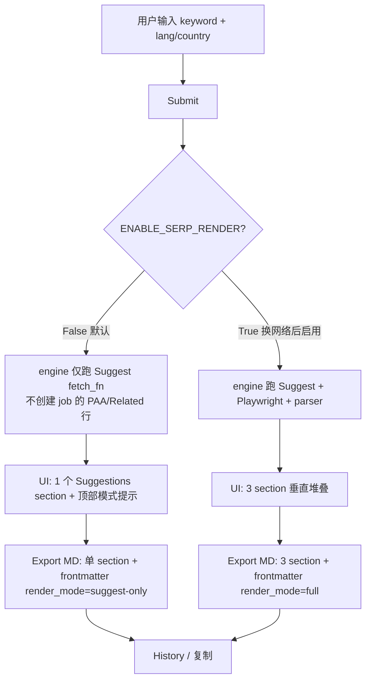

# SEOSERPER Suggest-Only Pivot

## Problem Frame

Original brainstorm (`2026-04-20-google-serp-analyzer-requirements.md`) specified a 3-day captcha-baseline spike as the Pre-plan gate before Unit 4 (SERP parser) could ship. Spike ran 5/5 real Playwright queries to `google.com/search` from the user's home IP; **100% were redirected to `/sorry/index`** within 0.8-2s. Per the original `Next Steps` Wilson CI thresholds (≥ 6 blocked / 60 queries → brainstorm), this is a hard gate failure — no amount of additional sampling changes the verdict on this IP.

However, the `suggestqueries.google.com` endpoint (Suggest) remained healthy on the same IP throughout all Unit 2 live smoke tests — it's a separate Google subsystem not subject to the `/search` rate-limit. So **Suggest data is still accessible; PAA + Related are not**.

This pivot rescopes SEOSERPER to a Suggest-only tool while keeping the already-shipped Playwright / engine infrastructure (Units 3, 5) dormant in-tree against the possibility that the user later operates from a different network.

## Requirements

Requirements are deltas against the original doc. Unaffected requirements (R2 Suggest contract, R4 rank preservation, R5 source+timestamp, R10 copy button, R12 pure MD function, R13-R15 SQLite history) carry forward unchanged.

**Active surface**

- **S1.** Suggest is the only actively queried surface. Every Submit pulls from `suggestqueries.google.com` and renders results in the Suggestions section.
- **S2.** The MVP-scope locales (en-US / zh-CN / ja-JP) continue to apply; other locales work but are not quality-targeted.

**Dormant surfaces (PAA + Related)**

- **D1.** Unit 3 (RenderThread) and Unit 5 (engine's SERP code path) remain in-tree and tested. They are not invoked at runtime.
- **D2.** A single config flag `ENABLE_SERP_RENDER` (default `False`) gates the SERP code path. Flipping it to `True` reactivates the **Playwright + engine render pipeline**. Note: PAA + Related end-to-end also requires Unit 4 (parser + fixtures) to ship; flag flip alone is not sufficient. See the reactivation caveat in Dependencies.
- **D3.** When the flag is `False`, the engine **does not create PAA or Related surface rows** for the job. `create_job` writes only the Suggest surface row. Storage stays a faithful log of what was actually attempted — no phantom `blocked_rate_limit` rows, no overloaded failure category (scope-guardian SC-4 resolution). `complete_job`'s ok-count rule operates on 1 surface instead of 3.
- **D4.** When the flag is `False`, the RenderThread is not instantiated on app boot. No Chromium subprocess exists. Preflight (Playwright availability check) still runs so flipping the flag later gives a clean diagnostic; preflight failure under flag=False is a soft notice, not a hard block (feasibility F7 resolution).

**UI posture**

- **U1.** When `ENABLE_SERP_RENDER=False` (default), the Streamlit UI collapses to a **single Suggestions section** — PAA and Related are not rendered. A compact top-of-page notice (one line, muted grey, non-italic) conveys the current mode: `Suggest-only 模式 · 当前环境被 /search 限速 · 恢复方式见 [HOW_TO_RE_ENABLE.md]`. When the flag is `True`, the original 3-vertical-section layout returns unmodified.
- **U2.** The notice in U1 is not dismissible and not styled as an error. It must not embed the literal config identifier in end-user copy; the recovery link points to an in-repo `HOW_TO_RE_ENABLE.md` that names the canonical flag form after planning resolves the env-var-vs-constant question.
- **U3.** Job-level status rules change: `overall_status=completed` iff Suggest returned `ok`; PAA/Related being `failed` under the config gate does not count against completion. **Storage enum stays at 3 values** (running / completed / failed); a "degraded" label (Suggest ok, SERP gated) is derived in the UI at render time from the flag state, not stored.
- **U4.** Retry button reappears only when Suggest itself failed; it does not trigger a SERP re-render.

**Export**

- **E1.** When `ENABLE_SERP_RENDER=False`, MD export emits a **single `## Suggestions` section** plus frontmatter. Frontmatter adds one new field `render_mode: suggest-only | full` so historical exports are self-describing and re-imports can distinguish scope. When the flag is `True`, the original 3-section Appendix A layout returns.
- **E2.** No banner text is injected into MD for dormant surfaces — they are simply absent. This keeps exports clean when pasted downstream (Notion / 飞书 / VS Code).

## User Flow

## Success Criteria

- Single-surface end-to-end P50 < 3s.
- Suggest endpoint success rate from home IP ≥ 95% over any rolling 5-workday window (tracked via SQLite `overall_status` counts). **Baseline validated 2026-04-20: 30 consecutive queries across en-US / zh-CN / ja-JP returned 30/30 ok** (`scripts/suggest_baseline.jsonl`).
- **Kill criterion (Suggest SPOF)**: if `overall_status=failed` rate exceeds 20% in any rolling 20-query window, assume the IP's Suggest budget is also flagged. Stop using the tool; no fallback is engineered. Next action is either network switch or permanent project archive.
- SQLite observable cadence: ≥ 15 completed Suggest jobs per rolling 5-workday window (unchanged from parent — measures actual use, not tool availability).
- Export MD still passes the parent brainstorm's Success Criteria (H1/H2/H3 render correctly, frontmatter renders as code block or properties, ordered lists preserve numbering, no stray `*` or `` ` `` characters, Chinese encoding clean). Under Suggest-only mode the format is simpler (H1 + frontmatter + one `## Suggestions` section + footer) but the same invariants apply.

## Scope Boundaries

**Disabled by default (dormant, reactivatable by flag flip):**
- Live PAA + Related data collection via Playwright (Units 3/5 code paths)
- SERP fixture capture workflow; Unit 4 parser remains unimplemented (see D2 caveat below)
- Pre-plan gate spike workflow as an active process

**Explicitly dropped from product scope:**
- Cross-surface comparison ("does this PAA also appear in Related?") — Product-lens identified this as the 10x value in original brainstorm; accepted loss

**Still explicitly excluded (carried from original):**
- Proxy / residential IP / captcha 破解 — confirmed after spike; not breaking this scope boundary
- Bing / other search engines as fallback
- Batch queries / CSV input
- Featured snippet / top organic / knowledge panel

**Carried forward unchanged:**
- Local-first (SQLite, no account system)
- Self-use assumption
- en-US / zh-CN / ja-JP locale commitment (applies to Suggest only now)

## Key Decisions

- **Keep Unit 3 + Unit 5 code in-tree, not deleted.** Rationale: concrete current cost — ~1100 LOC across `seoserper/core/render.py` + `seoserper/core/engine.py` plus 60 tests (Unit 3: 42, Unit 5: 18). Honest carrying cost is **not zero**: dependency bumps (Playwright / Chromium) and any refactor of shared modules (storage, config) must still validate both code paths; dormant tests can fail CI; captured contract fixtures decay as Google shifts DOM. Deletion-on-pivot is the cheaper-today option, but recovery cost on a network change is non-trivial (tests + fixtures need re-building from git history). This decision trades ongoing maintenance tax for preservation of verified infrastructure; see Outstanding Questions for the sunset-date question.
- **Single config flag `ENABLE_SERP_RENDER` (default `False`)** rather than a new failure category / code branch. Rationale: one switch to reactivate, no new enums to maintain, no refactor of storage schema.
- **No project rename.** Rationale: "SEOSERPER" describes the aspiration; renaming to `gsuggest` or similar signals a dead end stronger than reality warrants. Re-examine only if the user decides Suggest-only is permanent long-term.
- **90-day sunset on 2026-07-19 rather than "no re-eval trigger".** Adversarial review surfaced that without a trigger the pivot becomes permanent by default — `/search` could silently unblock and the user would never notice to flip the flag. Calendar reminder lives in auto-memory (not in the code); sunset date is fixed so the re-evaluation happens regardless of usage cadence. At sunset: either (a) flag has been flipped successfully in the interim (ignore sunset), (b) usage data warrants another 90-day deferral, or (c) Unit 3/5 + render tests get deleted and the reactivation path requires fresh spike + fresh fixtures + fresh Unit 4 — honest cost model, not a "one-line commit" illusion.
- **Reversed: MD + UI collapse to 1 section when flag is False.** Reviewer consensus (product-lens / scope-guardian / adversarial) rejected the 3-section-with-banners path as optimizing for a hypothetical reactivation at the cost of every export carrying ritual noise. Frontmatter field `render_mode` makes historical exports self-describing; reactivation restores the 3-section layout via flag flip without migrating past exports.
- **No new `DISABLED_BY_CONFIG` failure category.** Use the existing `blocked_rate_limit` category with a UI-level message swap based on the flag. Rationale: YAGNI on taxonomy churn; the distinction is a UI concern, not a data-model concern.
- **Engine short-circuits at job-creation time when flag is off** — no render attempt, no PAA/Related storage rows (updated from earlier "write-failed" stance per scope-guardian SC-4 + feasibility F8). Rationale: Chromium boot costs ~5-10s per Submit for zero information gain; and writing phantom "blocked_rate_limit" rows pollutes the kill-criterion measurement (failure rate) since real blocks and config gates would share the same category.
- **Retry under flag=False only re-runs Suggest.** `retry_failed_surfaces` reads job state, finds only the Suggest surface exists, retries it. No render path to gate (feasibility F4 resolution).
- **MD export stays a pure function of AnalysisJob.** Storage layer stamps `render_mode` (suggest-only | full) into the job row at creation time based on flag; export reads it from the dataclass, no flag lookup at render time (feasibility F6 resolution).

## Dependencies / Assumptions

- **Suggest endpoint durability**: the entire tool's utility depends on `suggestqueries.google.com` continuing to serve this IP. Adversarial review raised this as an untested assumption; baseline measurement on 2026-04-20 (30 queries across 3 locales, all ok) validates the assumption empirically **as of spike date** — Suggest does not inherit the `/search` block on this IP. Low-probability-high-impact risk remains for long-term drift; kill criterion in Success Criteria is the engineered tripwire.
- **User's network stays on current home IP**: no automatic detection of network change. If user switches to a different network where `/search` would work, they must manually flip the flag.

## Outstanding Questions

### Resolve Before Planning

(none — all product decisions resolved in this pivot)

### Deferred to Planning

- [Affects D2, D3][Technical] Config flag location — env var (`SEOSERPER_ENABLE_SERP_RENDER=1`), `seoserper/config.py` constant, or both. Planning decides based on how UI / engine consume it. Once resolved, banner copy (U2) should be updated so the recovery hint matches the canonical form exactly.
- *(Resolved by D2 decision: single Suggestions section + top-of-page mode notice; dormant sections are not rendered at all when flag=False.)*
- [Affects D4][Reliability] App boot path changes when render is gated off — preflight still runs (to detect Chromium presence for future flag flips) but does not start the RenderThread. Open sub-question: if Chromium is not installed *and* flag is False, should preflight failure degrade to a soft warning (Suggest still works) rather than hard-block the whole app.
- [Affects Storage][Technical] Schema delta: add `render_mode TEXT NOT NULL DEFAULT 'full'` column on `jobs`. Engine sets to `'suggest-only'` when flag is False at job-creation time. Idempotent `ALTER TABLE ADD COLUMN` migration per existing pattern in `storage.init_db`.
- [Affects E2][Technical] MD export branches on `job.render_mode`: when `suggest-only`, render single-section layout (H1 + frontmatter including `render_mode` + one `## Suggestions` section + footer); when `full`, render existing 3-section layout. Stay a pure function.

## Next Steps

→ `/ce:plan` for the Suggest-only delta implementation (config flag + engine short-circuit + UI banner + MD export copy). Estimated 1 small unit of work, no new modules.
