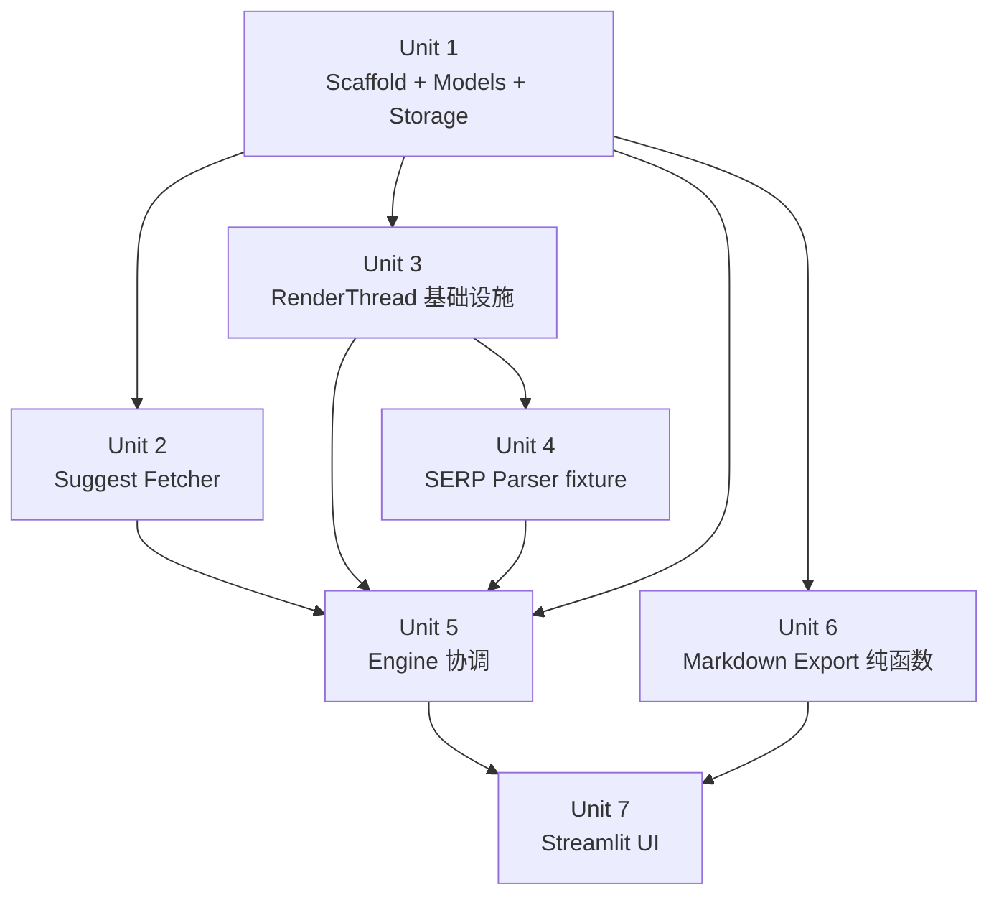

# Google SERP Analyzer MVP

## Overview

本地自用 SEO 工具。输入 1 个关键字 + lang/country → 并发拉取 Google 三个版位（Suggestions / PAA / Related Searches）→ UI 以独立状态 badge 渲染 → 一键导出 Markdown → SQLite 留档。以 workspace sibling `projects/tools/claude-crawler-clean` 的 RenderThread / WriterThread / storage 架构为基座，复用其已验证的线程模型、shutdown 协议和 fixture 测试范式。Phase 2 的批量 + 跨查询聚合留给独立 brainstorm。

## Problem Frame

见 origin 文档 `Problem Frame` 段落。手工扫 Google 3 版位慢、易漏、不可复用、不可留档；MVP 把"输入 1 词 → 10 秒内 3 版位结构化 + MD 导出"压缩成一个可重复动作。（see origin: `docs/brainstorms/2026-04-20-google-serp-analyzer-requirements.md`）

## Requirements Trace

**核心数据采集（origin R1-R5）**

- **R1**: 单 keyword + lang + country → 3 版位结构化数据 → Unit 5 engine 协调
- **R2**: Suggest 走 `suggestqueries.google.com/complete/search`（非公开契约）+ 形状异常 fail fast → Unit 2
- **R3**: PAA + Related 用 Playwright 渲染 Google 搜索页 → Unit 3（render）+ Unit 4（parser）+ Unit 5（engine）
- **R4**: 每条结果保留 rank → Unit 4（parser 提取）+ Unit 1（存储）
- **R5**: 每次 job 记录数据源层级标识 + job 抓取时间戳 → Unit 1（schema）+ Unit 5（engine 写入）+ Unit 6（MD 展示）

**状态与失败处理（origin R6-R9）**

- **R6**: 3 版位独立状态 `ok` / `failed` / `empty`；≥1 ok = completed → Unit 2 + Unit 6 engine
- **R7 + R7b**: UI badge（🟢 / 🔴 / ⚪）+ Idle→Loading→Progressive→Terminal 状态机 → Unit 8
- **R8**: 单按钮 "Retry"，engine 只重跑非 ok 的版位 → Unit 6 retry + Unit 8
- **R9**: captcha / consent / 反爬 → 明确报错 + 6 类细分 taxonomy（captcha/consent/rate_limit/selector_not_found/network_error/browser_crash）→ Unit 4 + Unit 5

**结果可操作性（origin R10-R12）**

- **R10**: 每行 copy 按钮（纯文本 / `Copied!` 1.5s 反馈 / 始终可见）→ Unit 8
- **R11**: 一键 MD 导出（H1 query / 3 section / 顶部 frontmatter / 文件名 `seoserper-{slug}-{lang}-{country}-{YYYYMMDD-HHmm}.md`）→ Unit 7
- **R12**: MD 生成纯函数 `render_analysis_to_md(analysis) -> str`，不提前抽象 → Unit 7

**历史与留档（origin R13-R15）**

- **R13**: 自动落盘 SQLite → Unit 2
- **R14**: 侧栏最近 50 条，Today / This week / Older 分组，2 行/条 + 3 mini-dots，点击恢复 snapshot → Unit 2 + Unit 8
- **R15**: 同 (query, lang, country) 多次 = 新 job（不覆盖）→ Unit 2

**Selector 健壮性（origin R16）**

- **R16**: 冻结 en-US / zh-CN / ja-JP 的 PAA + Related HTML fixture 作 *代码回归测试*（不是 live drift 监测）→ Unit 5 tests

**Outcome indicators（post-launch 自评）**

- SQLite observable：任意 5 工作日窗口内 ≥ 15 completed job、≥ 3 distinct query/工作日 → Unit 2 的 `count_recent_jobs` helper（供后续分析）
- Kill-trigger：3 周 research-active 内每周 < 15 条 → 默认动作为 ship Suggest-only CLI 变体（超 MVP，文档记录即可）

## Scope Boundaries

**明确不做（此 plan 不涉及）：**

- 批量查询 / CSV 输入 / 跨关键字聚合（Phase 2 独立 brainstorm）
- Featured snippet / top organic / knowledge panel 抓取（Phase 2）
- 周期性 SERP diff 监测（Phase 3）
- Proxy / residential IP / captcha 破解
- Bing / 其他搜索引擎 fallback 或 parallel source
- Live DOM drift 监测（R16 仅是代码回归；live canary 是 post-launch 运维，非 MVP 范围）
- 移动端 / 无障碍适配

**明确包括（MVP 范围）：**

- 单查询端到端：Suggest HTTP + Playwright 渲染 + 解析 + 状态标记 + 本地持久化 + MD 导出
- Streamlit 桌面 UI + 侧栏历史（Today/This week/Older 分组）
- 完整 fixture-based 回归测试（en-US / zh-CN / ja-JP）
- Preflight `playwright install chromium` 检查

## Context & Research

### Relevant Code and Patterns

| Pattern | File | 备注 |
|---|---|---|
| RenderThread（Playwright 线程所有者 + queue + Future + atexit watchdog） | `projects/tools/claude-crawler-clean/crawler/core/render.py` | **复制为 `seoserper/core/render.py` 的起点**；保留 subprocess.Popen + PID ownership + SIGKILL watchdog + `_is_browser_dead_error` + preflight |
| WriterThread（SQLite 单长连接 + BEGIN IMMEDIATE + Future reply） | `projects/tools/claude-crawler-clean/crawler/core/writer.py` | **参考但简化**：SEOSERPER 是单 job（非批量爬），不需要完整 WriterThread；直接 `@contextmanager get_connection()` + 短连接 UPDATE 即可，WAL + `busy_timeout=5000` 足以处理 UI 读 / engine 写的并发 |
| SQLite storage（`@contextmanager get_connection`、`_INIT_LOCK`、WAL PRAGMAs、`sqlite3.Row`→dataclass）| `projects/tools/claude-crawler-clean/crawler/storage.py` (lines 87-209) | **直接仿写**，将 schema 改为 SEOSERPER 的 4 张表 |
| Dataclass 模型 + Future-based 跨线程消息 | `projects/tools/claude-crawler-clean/crawler/models.py` | **直接仿写**，替换 entity 类型 |
| Streamlit 主线程 + queue + `st.rerun()` 轮询 | `projects/tools/claude-crawler-clean/app.py` | **UI 骨架直接借鉴**；特别是 `st.session_state._progress_queue` drain loop + sidebar history "Load/Delete" 两步交互 |
| Fake-driven RenderThread 测试（`launch_fn` / `render_fn` / `teardown_fn` 依赖注入） | `projects/tools/claude-crawler-clean/tests/test_render.py` | **复用**，让 CI 不依赖 Chromium |
| PAA 容器选择器 `.related-question-pair` | `seo-content-system/backend/src/services/playwrightSerpProvider.ts:235` | **仅取容器定位**；文本提取、Related 选择器、consent/captcha 全部是 greenfield |
| Fixture 目录惯例 `tests/fixtures/<category>/...` | `projects/tools/claude-crawler-clean/tests/fixtures/structured/` | **镜像**：`tests/fixtures/serp/{en-us,zh-cn,ja-jp}.html` + `tests/fixtures/suggest/*.json` |
| pyproject.toml 模板（Python ≥ 3.10、setuptools flat package、pytest + coverage） | `projects/tools/claude-crawler-clean/pyproject.toml` | **仿写**，name `seoserper`，package `seoserper*` |

### Institutional Learnings

1. **同步 Playwright 必须在独立 `threading.Thread`** — Streamlit 主线程直接调用 sync_api 会 "event loop already running"（ref: crawler Phase 2 plan + render.py 整套实现）
2. **Streamlit reload 会丢 greenlet 上下文** — 必须 `daemon=True` + atexit cleanup（ref: crawler remediation plan §Problem Frame finding 4）
3. **`networkidle` 是 latency tax** — 带 WebSocket/analytics 的页面永远不 idle；`domcontentloaded` 就够（ref: render.py:247）
4. **单 writer 线程消除 `SQLITE_BUSY`** — 通过架构解决，而非 `busy_timeout` 调参（SEOSERPER 写并发低，`busy_timeout=5000` + WAL 足够，不用完整 WriterThread）
5. **Inverted shutdown 顺序**：render 先 shutdown(5s) → 主执行池 cancel_futures → writer 最后 → 避免 worker 卡在 render Future 上拖慢 shutdown（ref: crawler Phase 2 remediation R5/R6）
6. **冻结 HTML fixture = 代码回归**，不等于 live drift 监测（ref: origin R16 + 原则已对齐）
7. **N+1 查询可用 `LEFT JOIN ... GROUP_CONCAT(...)` 单查询收敛**（ref: crawler R14 + Unit 9 fix）——SEOSERPER 侧栏加载 50 条历史时同样适用

### External References

未调用外部研究（Phase 1.2 决策：本地 patterns 强且 canonical，Google-specific 未知走 pre-plan spike）。Playwright 官方文档和 Google Suggest 端点的 contract fixture 将在 pre-plan spike 中就地捕获，不在 plan 阶段拉取。

## Key Technical Decisions

| 决策 | 理由 |
|---|---|
| 项目保持独立仓库（未移入 workspace 子目录） | 显式创建于独立路径；MVP 后若稳定再评估整合策略，不在 MVP 范围 |
| 复用 claude-crawler 的 **RenderThread 整套架构**（subprocess.Popen + PID + SIGKILL watchdog + atexit + preflight + fake-driven tests） | 已验证 production-ready；SEOSERPER 重写等于重复付学费；origin R9 + warm-resident browser 决策与此范式完全兼容 |
| **不**使用 WriterThread，改用 `@contextmanager get_connection()` + 短连接 UPDATE | SEOSERPER 单 job 写并发低（1 engine worker × 3 次 UPDATE），WAL + `busy_timeout=5000` 足够；完整 WriterThread 增加线程数和 shutdown 复杂度却不解决实际问题 |
| `wait_until="domcontentloaded"` + 可选短 wait，**不**用 `networkidle` | claude-crawler 已换过一轮，networkidle 对 Google 这种持续 network 流的页面是 latency tax；R1 要求 ~10 秒 P50 |
| PAA + Related 在**同一次** `page.goto()` + `page.evaluate()` 中抓取 | 两个版位在同一 Google 搜索页；单次渲染省一半时间；也符合 R3 "Playwright 渲染 Google 搜索页"（一页一次） |
| Suggest 走 **pure `requests`** 不经 Playwright | Google autocomplete JSON endpoint 返回 JSON，不需要浏览器；速度快（200ms vs 5-10s）、独立于 Playwright 故障隔离、独立于 browser restart policy |
| **PRAGMA user_version** + idempotent `ALTER TABLE ADD COLUMN IF NOT EXISTS` 做 schema 迁移 | Phase 2 加 `batch_id` / `parent_job_id` 时零运维（see origin Key Decisions "MVP SQLite schema"）；app 启动时自动迁移，不手工 SQL |
| **Orphan `running` row reaper**：启动时 `UPDATE jobs SET status='failed', failure_category='browser_crash' WHERE status='running' AND started_at < now() - 30 min` | 防 process crash 留下幽灵行；R14 虽然过滤 `running`，但不清理会导致 DB 无界累积 + 历史侧栏查询变慢 |
| Progressive reveal 用 **`queue.Queue` + `st.rerun()` 轮询**，不用 fragments | claude-crawler 已验证；Streamlit fragments API 不稳定 + 需要 Streamlit 1.36+；rerun 轮询在 1.30+ 即可，兼容面宽 |
| 复制按钮用 **`st.components.v1.html` + `navigator.clipboard.writeText`** 自定义组件 | workspace 无现成 clipboard 组件；不引第三方依赖减少供应链面；有 "Copy blocked — select manually" 兜底 |
| Sidebar 状态点使用 **3 mini-dots**（per-surface），不是单点 | 保留 R6 partial-success 信号；单点会把 partial 坍缩成二元，用户看不出 "suggest ok + PAA failed" 是常见混合态 |
| engine job 判定：`ok_count ≥ 1` → completed；否则 `failed` | origin R6 原话 "≥1 ok = completed"，隐含 "0 ok = not completed"。`empty` 不算 ok；3 版位全 empty 也算 failed（极少发生，但边界明确） |
| 测试不依赖真 Chromium（claude-crawler 的 fake-driven 模式） | CI 无 Chromium；pre-plan spike 才跑真 Chromium 采 fixture |
| Playwright 浏览器 warm-resident 的 **restart policy**：每 50 query 或 1 h（whichever first）重启 chromium | origin Key Decisions 要求；防 RSS 无界增长 + 减少 Google 把整个 session 当单一 fingerprint 的效应 |

## Open Questions

### Resolved During Planning

- **Q: 项目结构是 flat 还是 src/?** A: flat（`seoserper/` 直接在 repo root），与 claude-crawler-clean 一致。
- **Q: WriterThread 是否需要?** A: 不需要，短连接 UPDATE + WAL 足够（见 Key Decisions）。
- **Q: Suggest 调哪个 `client` 参数?** A: 初始用 `client=firefox`（返回 `[str, list[str], ...]` 稳定形状，社区广泛使用），pre-plan spike 会冻结 1 份 contract fixture；若发现 chrome client 有更丰富字段再权衡。
- **Q: Clipboard 组件选型?** A: 自写 `st.components.v1.html`（见 Key Decisions）。
- **Q: 侧栏 50 条读取防 N+1?** A: 单查询 `LEFT JOIN ... GROUP_CONCAT(surface, '|')` 一次性载入（Unit 2 实现）。
- **Q: MD 导出 `status=failed` 的 section 怎么渲染?** A: `_[surface] 获取失败: {failure_category} ({user-facing hint})_`（Unit 7 有具体模板）。
- **Q: Sidebar 每行状态点是 1 个还是 3 个?** A: 3 mini-dots（见 Key Decisions）。
- **Q: engine 判 job 为 `completed` 的规则?** A: `ok_count ≥ 1`（见 Key Decisions）。

### Deferred to Implementation

- **Related Searches 的具体 selector**：spike 阶段对真 HTML 采样后冻结为 fixture；候选：`div[data-ved] a[href*="/search?q="]` 过滤尾部区，或 `div.EIaa9b` 类似，或 `g-scrolling-carousel a`。Plan 不强定，实现基于 fixture 选稳定的。
- **PAA expand-more 点击**：spike 测真页面；若初始 4 条即足够且点击 lazy-load 不稳定，不实现（降级到"初始 4 条"），不影响 R3。
- **Streamlit rerun 节流**：progressive reveal 可能每 200ms rerun 一次，实现时测量并加节流（250ms coalesce 或类似），仿 crawler 的 `ProgressCoalescer` 思路。
- **`st.components.v1.html` 复制组件的跨浏览器测试**：Safari/Chrome/Firefox 的 `navigator.clipboard.writeText` 权限 prompt 行为；实现时测，必要时在 UI 上加"点击后请允许剪贴板权限"提示。
- **Chromium 重启的具体触发点**：query 计数和时间戳的维护位置（RenderThread 内部 vs engine 侧）——实现时按 claude-crawler 的内部计数器模式即可。
- **Preflight 失败时的 UI 文案**：实现阶段按 Streamlit 惯例写中文友好提示。

## High-Level Technical Design

> *以下示意"方案的形状"，是 review 用的方向性指引，非实现规范。实现时按各 Unit 的 Files / Approach / Test scenarios 进行。*

### 线程与数据流拓扑

```mermaid
flowchart TB
    subgraph StMain["Streamlit 主线程（UI）"]
        UI[keyword+lang+country 输入]
        Badges[3 版位 badge + 结果]
        Sidebar[历史侧栏]
        PQ{progress_queue}
    end

    subgraph EngineWorker["Engine worker 线程<br/>（per Submit 启动、daemon）"]
        Orch[engine.run_analysis]
        SuggestHttp[requests.get<br/>suggestqueries.google.com]
    end

    subgraph RenderThread["RenderThread（常驻、单例）"]
        RT_Q{render_queue}
        RT_Browser[chromium subprocess<br/>每 50 query 或 1h 重启]
        Parser[parse_serp(html)<br/>PAA + Related]
    end

    subgraph Storage["SQLite（WAL + busy_timeout=5000）"]
        Jobs[(jobs)]
        Surfaces[(surfaces)]
    end

    UI -->|Submit| Orch
    Orch -->|INSERT running| Jobs
    Orch -->|submit_render Future| RT_Q
    Orch -->|HTTP| SuggestHttp
    SuggestHttp -->|result| Orch
    Orch -->|UPDATE suggest| Surfaces
    Orch -->|progress event| PQ
    RT_Q --> RT_Browser
    RT_Browser -->|html| Parser
    Parser -->|paa + related| Orch
    Orch -->|UPDATE paa + related| Surfaces
    Orch -->|progress event| PQ
    PQ -->|drain + st.rerun| Badges
    Sidebar -.query.-> Jobs
    Sidebar -.query.-> Surfaces
```

### 数据流的关键不变量

- **引擎 worker 永不直接持 Playwright handle**。所有渲染走 `render_thread.submit(url) -> Future[html]`。
- **SQLite UPDATE 分 3 次**（每版位一次），让 UI 能在中间态读取部分数据。写是短连接，依赖 WAL 并发。
- **progress_queue 是单向**：engine → UI。UI 不反向通知 engine 任何东西（用户 Retry 会触发新 job，不是消息）。
- **Shutdown 顺序**：Streamlit session 终止时，RenderThread 先 `shutdown(5s)`（取消未完成 render Future，kill chromium），engine worker daemon 随之退出。

### Implementation Units 依赖图



## Implementation Units

**Pre-plan gate（非本 plan 的 Unit，但是启动 `/ce:work` 的前置条件）**：按 origin doc `Next Steps > Pre-plan gate` 执行 3-day / ≥60 query captcha baseline spike + fixture 冻结（en-US / zh-CN / ja-JP PAA + Related HTML + 2 份 Suggest JSON snapshot）。阻断率 ≥ 10% → 回 `/ce:brainstorm`。**通过后**才开 Unit 1。

---

- [x] **Unit 1: Package scaffolding + models + SQLite storage** (shipped da77bd7, 25/25 tests ✓)

**Goal:** 项目骨架就位——pyproject、package 结构、数据模型、SQLite schema + CRUD + orphan reaper。非功能性（为后续 unit 提供底座），但 storage 部分是 feature-bearing。

**Requirements:** R13, R14, R15（历史留档 + 侧栏）+ 所有 unit 的前置依赖

**Dependencies:** 无（本 plan 第一个 unit）+ Pre-plan spike 通过（外部前置）

**Files:**
- Create: `pyproject.toml`
- Create: `seoserper/__init__.py`
- Create: `seoserper/config.py` — DB 路径、超时、MVP-scope locales（en-US / zh-CN / ja-JP）、restart thresholds、rate limits
- Create: `seoserper/models.py` — `@dataclass` AnalysisJob / Suggestion / PAAQuestion / RelatedSearch + `Enum` SurfaceName (suggest/paa/related)、SurfaceStatus (ok/failed/empty/running)、FailureCategory (blocked_by_captcha/blocked_by_consent/blocked_rate_limit/selector_not_found/network_error/browser_crash)
- Create: `seoserper/storage.py` — `@contextmanager get_connection()`、`init_db()` + schema_v1（jobs + surfaces 两张表 + `PRAGMA user_version`）、CRUD（`create_job`、`update_surface`、`complete_job`、`get_job`、`list_recent_jobs`、`reap_orphaned`）、LEFT JOIN + GROUP_CONCAT 反 N+1 的 `list_recent_jobs`
- Create: `tests/__init__.py`、`tests/conftest.py`（tmp_path-based fresh DB fixture）
- Create: `tests/test_models.py`、`tests/test_storage.py`

**Approach:**
- **Schema（v1）**：
  - `jobs(id, query, language, country, status, overall_status, started_at, completed_at, source_suggest, source_serp)` — `status` ∈ `running/completed/failed`
  - `surfaces(job_id, surface, status, failure_category, data_json, rank_count, updated_at)` — 3 行/job；`data_json` 是 serialized items
  - 索引：`idx_jobs_created` on `started_at DESC`、`idx_jobs_query` on `(query, language, country)`
- **PRAGMA**：`journal_mode=WAL`、`busy_timeout=5000`、`synchronous=NORMAL`、`foreign_keys=ON`、`row_factory=sqlite3.Row`
- **init 幂等**：`threading.Lock` 包住 `executescript(CREATE IF NOT EXISTS)` + `PRAGMA user_version` 检查 → 未来版本补 `ALTER TABLE ADD COLUMN`
- **reap_orphaned(threshold_minutes=30)**：启动时 `UPDATE jobs SET status='failed', overall_status='failed' WHERE status='running' AND started_at < datetime('now','-30 minutes')` + 同时写 `surfaces` 标记为 `failed + browser_crash`
- **list_recent_jobs(limit=50)** 返回 `list[AnalysisJob]`，每个 job 已填充 3 surface summary（via LEFT JOIN + GROUP_CONCAT），一次查询

**Patterns to follow:**
- `projects/tools/claude-crawler-clean/crawler/storage.py` 的 `get_connection` / `init_db` / `_INIT_LOCK` / 行→dataclass 模式
- `projects/tools/claude-crawler-clean/crawler/models.py` 的 dataclass 定义风格

**Test scenarios:**
- **Happy path**：`init_db` 两次无异常；`create_job(q, lang, country)` → `get_job(id)` 返回相同字段 + 3 个 surface=running
- **Happy path**：`create_job` → `update_surface(id, 'suggest', ok, items=[...])` → `get_job(id)` 看到 suggest.status=ok + data_json 解析正确
- **Happy path**：`complete_job(id)` 按 `ok_count ≥ 1` 规则设置 `overall_status`；3 版位 1 ok 2 failed → completed；0 ok 3 failed → failed
- **Edge case**：`list_recent_jobs()` 排除 `status='running'`
- **Edge case**：`list_recent_jobs()` 返回 50 条，同 (query, lang, country) 多次也都在（R15）
- **Edge case**：`list_recent_jobs()` 只触发 1 次查询（N+1 检查：在 test 里 `cursor.execute` 计数或用 sqlite3 的 `set_trace_callback`）
- **Edge case**：`reap_orphaned` 把 35 分钟前的 running 置为 failed，5 分钟前的保留
- **Integration**：schema_v0 → v1 迁移：预置旧库（无 source_suggest 列），启动时 `PRAGMA user_version` 发现落后 → `ALTER TABLE ADD COLUMN`，之后查询不报错
- **Integration**：两个线程并发 `update_surface` 同一 job 的不同 surface → 无 `SQLITE_BUSY`（WAL + busy_timeout）

**Verification:**
- `pytest tests/test_storage.py tests/test_models.py` 全绿
- 手动 `python -c "from seoserper.storage import init_db; init_db()"` 成功，产出 WAL 文件

---

- [x] **Unit 2: Suggest fetcher（HTTP，pure `requests`）** (19/19 tests ✓; plan 修正：CT 检查下掉，真实 CT 是 text/javascript，改走 body 前缀 `<` 检测)

**Goal:** Google autocomplete JSON endpoint 获取 10 条建议，严格形状验证，异常全部映射到 SurfaceStatus + FailureCategory。

**Requirements:** R1（三版位之一）、R2（Google JSON 端点 + fail fast 不静默返回空）、R4（rank）、R5（source 标识）、R9（taxonomy）

**Dependencies:** Unit 1（models / config）

**Files:**
- Create: `seoserper/fetchers/__init__.py`
- Create: `seoserper/fetchers/suggest.py`
- Create: `tests/test_suggest.py`
- Create: `tests/fixtures/suggest/en-us-ok.json`（spike 捕获的真实响应）
- Create: `tests/fixtures/suggest/empty.json`
- Create: `tests/fixtures/suggest/malformed-html.html`（模拟被 captive portal 拦截）
- Create: `tests/fixtures/suggest/sorry.html`（模拟 Google "sorry" 页）

**Approach:**
- 函数签名：`fetch_suggestions(query, lang, country, timeout=5.0) -> SuggestResult`，`SuggestResult` = `@dataclass (status, items, failure_category, raw_text)`
- 端点：`https://suggestqueries.google.com/complete/search` + params `{client='firefox', q=query, hl=lang, gl=country}`
- User-Agent：模仿 Firefox（spike 捕获的实际值，放到 config）
- 形状验证（**anomaly = failed, 不是 empty**）：
  - `response.json()` 必须是 list 且长度 ≥ 2
  - `response[0]` 是 str 且等于 query（或 query 的小写 normalized 版）
  - `response[1]` 是 list[str]
  - 否则 → `status=failed`、`failure_category=selector_not_found`
- HTTP 状态映射：
  - 200 + 合法 JSON + 非空 list[1] → `status=ok`，items=[Suggestion(text, rank) for rank, text in enumerate(response[1][:10], 1)]
  - 200 + 合法 JSON + 空 list[1] → `status=empty`
  - 200 + JSONDecodeError → `status=failed`、category=selector_not_found（可能 Google 返回 HTML）
  - 200 + HTML 响应（Content-Type 非 JSON 或 body 以 `<` 开头） → 同上
  - 429 / 403 → `status=failed`、category=blocked_rate_limit
  - 302 到 `sorry/index` → `status=failed`、category=blocked_rate_limit
  - Timeout / ConnectionError → `status=failed`、category=network_error
- 不做重试（fail fast 原则，用户可点 Retry 触发整体重跑）

**Execution note:** Test-first — fixtures 就位后先写测试再实现。

**Patterns to follow:**
- requests + timeout + 显式 try/except 分支（claude-crawler 的 `crawler/core/fetcher.py` 即使用 Playwright 也有相同模式）

**Test scenarios:**
- **Happy path**：fixture `en-us-ok.json` → 10 条 Suggestion，rank 1-10
- **Happy path**：query 经过 URL quoting（带空格 / 中文 / 特殊字符）
- **Edge case**：`empty.json`（response[1] = []）→ status=empty
- **Edge case**：只返回 8 条（Google 偶尔少于 10）→ status=ok，items 共 8 条
- **Error path**：HTML 响应（Content-Type `text/html`）→ failed + selector_not_found
- **Error path**：HTTP 429 → failed + blocked_rate_limit
- **Error path**：HTTP 302 → `sorry.html` → failed + blocked_rate_limit
- **Error path**：`ConnectionTimeout` → failed + network_error
- **Error path**：JSONDecodeError on malformed JSON → failed + selector_not_found
- **Edge case**：response 是 dict 不是 list（Google shape drift）→ failed + selector_not_found
- **Edge case**：response[0] != query（奇怪的 echo）→ failed + selector_not_found
- **Integration**：fetch 真实 URL 被 mocked 为 fixture（用 `requests-mock` 或 `responses` 库）

**Verification:**
- `pytest tests/test_suggest.py` 全绿（不依赖网络）
- 本地跑一次 `python -c "from seoserper.fetchers.suggest import fetch_suggestions; print(fetch_suggestions('coffee', 'en', 'us'))"` 确认 live 端点能拿到 10 条（仅开发期手动验证）

---

- [x] **Unit 3: Playwright RenderThread 基础设施** (42/42 tests ✓; ported from claude-crawler-clean + 5-class typed exception hierarchy + consent/captcha/rate-limit DOM probes + restart-by-count and restart-by-time policy)

**Goal:** 移植 claude-crawler 的 RenderThread 到 SEOSERPER，负责浏览器生命周期、submit/Future、consent+captcha 检测、crash recovery、restart policy、atexit watchdog、preflight。

**Requirements:** R3（Playwright 渲染）、R9（captcha + consent + taxonomy）、Key Decision "warm-resident + threading + restart"

**Dependencies:** Unit 1（models / FailureCategory enum）

**Files:**
- Create: `seoserper/core/__init__.py`
- Create: `seoserper/core/render.py` — 从 `projects/tools/claude-crawler-clean/crawler/core/render.py` 复制 + 改造
- Create: `tests/test_render.py` — 使用 `launch_fn` / `render_fn` / `teardown_fn` fake 注入（参考 `claude-crawler-clean/tests/test_render.py`）

**Approach:**
- **RenderRequest 形状**：`@dataclass RenderRequest(url: str, future: Future[str])` — future 解析为 HTML str 或 typed exception
- **Queue**：`queue.Queue(maxsize=16)`，submit 超时 60s；溢出 → `RenderQueueFullError`
- **Sentinel shutdown**：`None` 入队终止 worker
- **Browser lifecycle**：
  - **Lazy launch** — 首个 submit 时 `_ensure_browser_or_disable()`；没用时不启
  - **subprocess.Popen Chromium** + `--remote-debugging-port=0 --user-data-dir=<tmpdir> --headless=new --disable-blink-features=AutomationControlled` + 监听 `DevToolsActivePort` 文件 → `playwright.chromium.connect_over_cdp(...)` —— **本项目持 PID**，不让 Playwright 间接管理
  - **Context reuse**：一个 `browser.new_context()` 复用 + `clear_cookies()` + `clear_permissions()` 每次之间
  - **Restart policy**：内部计数器 + 时间戳；`_queries_since_restart >= 50` 或 `time.monotonic() - _browser_started_at >= 3600` → 下次 submit 前先 `_restart_browser()`
  - **Crash recovery**：`_is_browser_dead_error(exc)` 识别 TargetClosedError / "target closed" 等字符串；连续 3 次 dead → `_disabled=True`，后续 submit 立即 fail
- **`_real_render(url)`**：
  - `page.goto(url, timeout=30000, wait_until="domcontentloaded")`
  - **不**走 networkidle
  - Consent probe：`page.url().startswith('https://consent.google.com')` 或 `page.locator("form[action*='consent']").count() > 0` → raise `BlockedByConsentError`
  - Captcha probe：URL 含 `/sorry/index`，或 DOM 含 `#recaptcha` / `#captcha-form`，或 title 为 "Before you continue" → raise `BlockedByCaptchaError`
  - 若所有 probe 通过 → 返回 `page.content()` 给调用方
- **Typed exceptions**（都是 `RenderError` 的子类，对应 FailureCategory 枚举）：`BlockedByCaptchaError`、`BlockedByConsentError`、`BlockedRateLimitError`、`SelectorNotFoundError`（解析阶段抛）、`BrowserCrashError`
- **atexit watchdog**：注册 `_atexit_kill_chromium()`，在 session 退出时按 PID `subprocess.Popen.kill()`——即使 teardown 路径挂了也有 SIGKILL 兜底
- **Testability hook**：`RenderThread.__init__(launch_fn, render_fn, teardown_fn)` 全部默认为真实实现；tests 注入 fake
- **preflight() -> (bool, str)**：运行 `playwright --version` 或 import `playwright.sync_api`，失败 → 返回 `(False, "请运行 `playwright install chromium`")`；Streamlit 启动时调用

**Execution note:** Characterization-first — 先把 claude-crawler 的 `tests/test_render.py` 整包移植成 SEOSERPER 版（替换 submit 的 URL 构造、异常类型），然后按 adapter diff 再补 SEOSERPER 特有测试。

**Patterns to follow:**
- `projects/tools/claude-crawler-clean/crawler/core/render.py` 整体
- `projects/tools/claude-crawler-clean/tests/test_render.py` fake-driven 测试风格

**Test scenarios:**
- **Happy path**：submit(url) 返回 Future；fake `render_fn` 模拟 2s 延迟返回 html → `future.result()` 拿到 html
- **Happy path**：lazy launch — 未 submit 时 `_browser_process` 是 None
- **Edge case**：consent URL → Future 解析时 raise `BlockedByConsentError`
- **Edge case**：captcha DOM / URL / title → Future 解析时 raise `BlockedByCaptchaError`
- **Edge case**：queue 满 → submit 立即 raise `RenderQueueFullError`
- **Error path**：`fake_render_fn` 连续 3 次抛 `BrowserCrashError` → RenderThread `_disabled=True`；第 4 次 submit 立即 fail
- **Error path**：timeout → `BlockedRateLimitError`（如果同 IP 频繁）vs `network_error`（普通超时）——plan 决定：plain timeout 算 network_error
- **Integration**：shutdown 协议 — `shutdown(timeout=5)` → 未完成 Future cancel → atexit watchdog 触发 SIGKILL → 无 Chromium 进程遗留
- **Integration**：preflight 未装 Playwright → `(False, 提示文案)`；装好 → `(True, "")`
- **Integration**：restart policy — 用 monkeypatch 把 `_queries_since_restart` 推到 50 → 下次 submit 先 teardown + launch（验证 `teardown_fn` + `launch_fn` 各被调 1 次）
- **Integration**：restart policy by time — monkeypatch `time.monotonic` 推进 1h → 同上
- **Edge case**：shutdown 时 queue 里还有 pending → 它们的 Future 都被 set_exception 为 `ShutdownError`

**Verification:**
- `pytest tests/test_render.py` 全绿（不需要真 Chromium）
- 开发期手动 `python -c "from seoserper.core.render import RenderThread; rt = RenderThread(); f = rt.submit('https://www.google.com/search?q=coffee'); print(f.result(timeout=30)[:200]); rt.shutdown(5)"` 看到合理的 HTML 前 200 字节

---

- [ ] **Unit 4: SERP parser（fixture-based 回归）**

**Goal:** 从 Google 搜索页 HTML 中单次提取 PAA + Related Searches，按 R16 用冻结 fixture 做代码回归。

**Requirements:** R1（结构化数据）、R3（PAA + Related 来自 Playwright 渲染）、R4（rank）、R16（fixture 回归）

**Dependencies:** Unit 3（RenderThread 提供 HTML；但 parser 本身不依赖 RenderThread，可独立测）、Unit 1（models）

**Files:**
- Create: `seoserper/parsers/__init__.py`
- Create: `seoserper/parsers/serp.py`
- Create: `tests/test_serp_parser.py`
- Create: `tests/fixtures/serp/en-us.html`（spike 冻结）
- Create: `tests/fixtures/serp/zh-cn.html`（spike 冻结）
- Create: `tests/fixtures/serp/ja-jp.html`（spike 冻结）
- Create: `tests/fixtures/serp/empty-paa.html`（合成：结构完整但无 PAA 条目）
- Create: `tests/fixtures/serp/selector-broken.html`（合成：PAA 容器全丢失，模拟 DOM drift）

**Approach:**
- 函数签名：`parse_serp(html: str, locale: str) -> dict[SurfaceName, ParseResult]`，返回 `{SurfaceName.PAA: ParseResult(...), SurfaceName.RELATED: ParseResult(...)}`
- `ParseResult = @dataclass (status, items, failure_category)`
- **PAA 提取**：
  - 容器：`soup.select('.related-question-pair')`
  - 每个容器内 question：`container.select_one("div[role='heading'] span")` 或 fallback 到 `.q` 类（具体以 spike fixture 为准）
  - rank = 显示顺序（1-based）
  - 空容器（文本 strip 后空）→ 不入结果；若全空 → empty
- **Related Searches 提取**（候选 selector，spike 确定最终值）：
  - 首选：`soup.select('div[data-async-context] a[href*="/search?q="]')` 过滤尾部 region（排除 "People also searched" 以外的其他链接）
  - 回退：`soup.select('g-scrolling-carousel a')` / `soup.select('div.EIaa9b a')`
  - rank = 呈现顺序
  - Query 文本从 `<span>` 或 `aria-label` 取；去重（相同 query 不重复入）
  - 过滤掉与输入 query 相同的文本
- **R16 selector 命中率检查**：每个 fixture 对应一个 expected count（例：en-us.html 期望 PAA=4、Related=8）；parse 返回的 count / expected < 0.5 → pytest 失败并输出 "possible selector drift"——这是 **test assertion**，不是运行时降级
- 传入 `locale` 只用于选择适配的 selector variant（若将来 ja-JP 需要特殊处理）；MVP 初版 locale 不影响 parser 逻辑
- `status=failed / category=selector_not_found` 当连 PAA 容器都找不到（0 个 `.related-question-pair`）

**Execution note:** Test-first — fixture 必须先于实现就位（由 pre-plan spike 产出），然后红→绿→refactor。

**Patterns to follow:**
- `projects/tools/claude-crawler-clean/crawler/parser.py` 的 BeautifulSoup + select + 结构化提取风格
- `projects/tools/claude-crawler-clean/tests/` 的 fixture-based 测试——每个 fixture 对应一个具名 pytest 函数 + 明确 expected values

**Test scenarios:**
- **Happy path**：en-us.html → PAA ≥ 3 条、Related ≥ 6 条（expected 硬编码来自 spike 观察值）；每条 question 非空；rank 1..N 递增无空洞
- **Happy path**：zh-cn.html → 同上但含中文
- **Happy path**：ja-jp.html → PAA 有值；Related 可能为空（日本市场常见）→ status=empty 不是 failed
- **Edge case**：empty-paa.html（有 SERP 主体但无 PAA）→ PAA status=empty，Related 正常
- **Edge case**：PAA 容器有 10+ 条（>10 也接受，不截断）
- **Edge case**：Related 中含 query 本身 → 过滤掉
- **Edge case**：Related 中有重复 → dedup 保留首个
- **Error path**：selector-broken.html（无 `.related-question-pair` 且 Related selector 全空）→ 两版位 status=failed / selector_not_found
- **Integration (R16 drift gate)**：命中率低于 50% 的 fixture → pytest assertion 失败 + 告警信息含 "possible selector drift"（测试自己验证这个断言存在）
- **Edge case**：HTML 是空字符串 → 两版位 failed / selector_not_found
- **Edge case**：Related 条目带特殊字符（引号、emoji）→ 字符串保真（不多重转义）

**Verification:**
- `pytest tests/test_serp_parser.py` 全绿
- 对真实 live Google URL 抓一份 HTML 跑一次 parser，抽查前 5 条 PAA / Related 内容与浏览器肉眼一致

---

- [x] **Unit 5: Analysis Engine 协调** (18/18 tests ✓; DI-style parse_fn + ProgressEvent queue + retry 保留 ok surface + typed exception → FailureCategory mapping)

**Goal:** 把 Unit 2 / 3 / 4 / 1 串起来。主线程 submit → engine worker 线程跑 Suggest HTTP + 提交 Playwright render + parse + 逐版位 UPDATE storage + 推送 progress 事件。单按钮 Retry 重跑非 ok 版位。

**Requirements:** R1（3 版位协调）、R5（source + timestamp 记录）、R6（3 版位独立状态 + ≥1 ok = completed）、R7b（progressive reveal 事件时序）、R8（Retry 单按钮）、R9（失败类别映射）

**Dependencies:** Unit 1（storage / models）、Unit 2（suggest fetcher）、Unit 3（RenderThread）、Unit 4（parser）

**Files:**
- Create: `seoserper/core/engine.py`
- Create: `tests/test_engine.py`

**Approach:**
- **Engine 类**：`AnalysisEngine(render_thread, storage_path)` — 构造时不 start 任何线程；`submit(query, lang, country) -> int (job_id)` 同步 INSERT job 然后 `threading.Thread(target=self._run_analysis, args=(job_id,), daemon=True).start()`；返回 job_id
- **`_run_analysis(job_id)` 的时序**（engine worker 内部）：
  1. `start_event = ProgressEvent(job_id, "start", timestamp)` → 入 progress_queue
  2. 先跑 Suggest（快、同步、不需要 browser）：`suggest_result = fetch_suggestions(...)`
  3. `storage.update_surface(job_id, SUGGEST, suggest_result)` + 推 `ProgressEvent(job_id, SUGGEST, ok/empty/failed)`
  4. 并行（实际上顺序，因 Playwright 单线程队列）：提交 Playwright render Future
  5. `html = render_future.result(timeout=RENDER_TIMEOUT)` —— 捕获 `BlockedByCaptchaError` / `BlockedByConsentError` / `BlockedRateLimitError` / `BrowserCrashError`，每种映射到对应 FailureCategory；若异常 → 两版位同时 failed + 同 category，跳过 parser
  6. 若拿到 html → `parse_serp(html, locale)` → 得到 PAA + Related ParseResult
  7. `storage.update_surface(job_id, PAA, paa_result)` + 推 `ProgressEvent(job_id, PAA, ...)`
  8. `storage.update_surface(job_id, RELATED, related_result)` + 推 `ProgressEvent(job_id, RELATED, ...)`
  9. `storage.complete_job(job_id)` 按 `ok_count ≥ 1` 规则决定 `overall_status`
  10. 推 `ProgressEvent(job_id, "complete", overall_status)`
- **progress_queue**：`queue.Queue` 实例化在 AnalysisEngine 构造时；UI 层读 `engine.progress_queue`
- **`retry_failed_surfaces(job_id)`**：
  - 读 `get_job(job_id)` → 找出 `status != ok` 的 surfaces
  - 重新把 job status 设为 `running`
  - 对 failed 的 Suggest → 重跑 `fetch_suggestions`
  - 对 failed 的 PAA/Related → 重新提交 render → parse；若只 PAA 失败但 Related ok，仍然重跑整个 render（同一 page.goto 必然同时覆盖两者）——但更新时只 UPDATE failed 的那个 surface
  - 注意：R8 是 "只重跑失败版位"，实现上 Playwright 必然一次抓两个，写入时只覆盖未 ok 的（避免改动 ok 的 data_json）
- **ok_count ≥ 1 judge**（参考 Key Decisions）：`sum(1 for s in surfaces if s.status == ok) >= 1` → completed，else failed

**Patterns to follow:**
- `projects/tools/claude-crawler-clean/crawler/core/engine.py` 的 orchestration 风格（尽管规模不同）
- Future + queue 跨线程通信模式

**Test scenarios:**
- **Happy path**：全 3 版位 ok — Suggest 返回 10、parser 返回 PAA 4 + Related 8 → overall=completed、DB 有 3 个 ok surface
- **Happy path**：progressive 事件次序 — 收到 start → suggest (ok) → paa (ok) → related (ok) → complete；5 个事件
- **Edge case**：Suggest empty + PAA ok + Related ok → completed（ok_count=2）
- **Edge case**：Suggest ok + Playwright `BlockedByCaptchaError` → PAA 和 Related 都 failed + blocked_by_captcha；Suggest ok；overall=completed（ok_count=1）
- **Error path**：全 3 版位 failed（Suggest network_error + Playwright captcha）→ overall=failed
- **Error path**：Suggest timeout → failed + network_error；Playwright ok → PAA+Related ok → overall=completed
- **Integration**：retry — 初始 job 有 Suggest=ok + PAA=failed/captcha + Related=failed/captcha → 调 `retry_failed_surfaces(id)`；第二次 render 成功 → PAA 和 Related 都 UPDATE 为 ok；Suggest 不重跑（已 ok）
- **Integration**：retry 不 overwrite ok — Suggest 起初 ok；retry 只跑 Playwright；DB 里 Suggest 的 data_json 未变（用时间戳或 checksum 验证）
- **Edge case**：render Future timeout → 映射为 `network_error`（不是 captcha / consent）
- **Edge case**：engine 内部 unhandled exception → 所有 surfaces 标 failed/browser_crash + job overall=failed，progress_queue 推 error 事件（不让 engine 静默挂掉）
- **Integration**：同一个 AnalysisEngine 并发 submit 两个 query（用户连点两次）→ 两个独立 worker thread + 两个 job_id + progress_queue 事件互不串扰（job_id 作为唯一性标记）

**Verification:**
- `pytest tests/test_engine.py` 全绿（fake RenderThread 注入）
- 手动集成：真 RenderThread + 真 Suggest + 真 storage → live run 一次 `coffee` 看 3 版位都 ok 且 DB 正确

---

- [x] **Unit 6: Markdown export 纯函数** (19/19 tests ✓; 3 golden fixture + 市场化中文 failure diagnostic + minimal markdown escape)

**Goal:** `render_analysis_to_md(analysis) -> str` 纯函数 + `build_filename(analysis) -> str`。

**Requirements:** R11（MD 导出格式）、R12（纯函数不抽象）、Design Principles（失败状态内含诊断）

**Dependencies:** Unit 1（models）

**Files:**
- Create: `seoserper/export.py`
- Create: `tests/test_export.py`
- Create: `tests/fixtures/export/expected_all_ok.md`
- Create: `tests/fixtures/export/expected_partial.md`
- Create: `tests/fixtures/export/expected_all_failed.md`

**Approach:**
- **`render_analysis_to_md(analysis: AnalysisJob) -> str`**：按 origin Appendix A 的模板
  - Frontmatter：query / language / country / timestamp（ISO 8601 UTC）/ source_suggest / source_serp / status_suggestions / status_paa / status_related
  - `# {query}`
  - `## Suggestions ({count})` 或 `## Suggestions` + `_No suggestions returned._` / `_Suggestions 获取失败: {category}（建议稍候几分钟重试 / 刷新重试）_`
  - 同理 `## People Also Ask` 和 `## Related Searches`
  - 失败时展示的文案按 `failure_category` 映射到一行斜体 `_<中文友好提示>_`（初始文案 plan 给一版，实现可微调）
  - 尾部 `_Generated by SEOSERPER · {timestamp}_`
- **`build_filename(analysis) -> str`**：
  - 模板 `seoserper-{slug}-{lang}-{country}-{YYYYMMDD-HHmm}.md`
  - `slug = slugify(query, max_len=60)`：lowercase → 非 alnum→`-` → 连续 `-` 合并 → strip 头尾 `-` → 截断 60 字符
  - 空 slug（query 全特殊字符如 "!@#$"）→ 回退 `query` literal（base64 编码 6 字符）或 `query-empty`
- 不做 I/O；调用方负责落盘

**Patterns to follow:**
- 纯函数 + fixture expected comparison（无 claude-crawler 直接对应，但 tests/fixtures/structured 的 "expected" 文件对齐风格可仿）

**Test scenarios:**
- **Happy path**：3 版位全 ok → `render_analysis_to_md` 输出字节级等于 `expected_all_ok.md`
- **Happy path**：3 版位各 1 种状态（ok + failed/captcha + empty）→ 等于 `expected_partial.md`
- **Happy path**：3 版位全 failed（各 category 不同）→ 等于 `expected_all_failed.md`
- **Edge case**：query = "最佳跑鞋"（非 ASCII）→ slugify 产生拉丁字符 fallback（转拼音/base64 二选一，plan 用：拉丁化失败则用 utf-8 bytes 的 base64 前 8 位，保证文件名 ASCII-safe）
- **Edge case**：query 过长（100 字符）→ slug 截断 60
- **Edge case**：query 全特殊字符 "???" → slug 非空（走回退）
- **Edge case**：timestamp 跨时区 → frontmatter 用 UTC ISO8601（不留 timezone 歧义）
- **Edge case**：PAA 问题文本含 markdown 元字符（`*`、`` ` ``、`#`）→ 输出中转义或包裹为代码，避免下游渲染被污染
- **Integration**：导出 MD 粘贴到测试环境的 Notion / 飞书 / VS Code 验证视觉——这是手动 SC 而非 unit test

**Verification:**
- `pytest tests/test_export.py` 全绿（逐字节等于 expected fixture）
- 手动：真 AnalysisJob → 导出 MD → 贴到 Notion / VS Code 预览，确认 SC 5 项全过（H1/H2/H3 正常、frontmatter、list 编号、无散字符、中文编码）

---

- [x] **Unit 7: Streamlit UI（`app.py`）** (4/4 smoke tests ✓; 垂直 3 版位 + 侧栏历史 + preflight + progressive reveal + export MD + retry；parser 缺席时用 stub fallback 让 Suggest 仍可跑)

**Goal:** 完整 UI：输入行 + 3 版位 stack + 侧栏历史 + progressive reveal + copy 按钮 + export + 历史回看 banner + preflight。

**Requirements:** R1（输入）、R7 + R7b（badge + 状态机）、R8（Retry 按钮）、R10（每行 copy）、R11（export）、R14（侧栏历史 + 点击恢复）、Design Principles（3 版位垂直 stack + copy 始终可见 + 失败内含诊断）

**Dependencies:** Unit 1-6（所有后端）

**Files:**
- Create: `app.py` 项目根目录（Streamlit 入口）
- Create: `seoserper/ui/__init__.py`（如果拆子模块）
- Create: `seoserper/ui/clipboard.py`（自定义复制组件）
- Create: `seoserper/ui/components.py`（可复用渲染函数）
- Create: `tests/test_ui_smoke.py`（可选：用 `streamlit.testing.v1.AppTest` 做轻量 smoke）

**Approach:**
- **Session state init**（仿 claude-crawler `app.py`）：
  - `_engine: AnalysisEngine | None`（lazy init）
  - `_render_thread: RenderThread | None`
  - `_current_job_id: int | None`
  - `_viewing_historical: bool = False`（是否处于历史回看模式）
  - `_historical_job_id: int | None`（回看中的 job）
  - `_pending_confirmations: dict` —— Load-while-running confirm 用
- **启动时 preflight**：
  - 调 `RenderThread.preflight()`，失败 → 显示 red banner "请运行 `playwright install chromium`"；保留 UI 其他部分可用（能浏览历史）但 Submit 按钮 disabled
  - 调 `storage.init_db()` + `storage.reap_orphaned()`
- **主列布局**（垂直顺序）：
  1. 顶部输入行：`st.text_input("关键字")` + `st.text_input("语言", default='en')` + `st.text_input("地区", default='us')` + `st.button("Submit")`
  2. Metadata 条（只在有 current_job 时显示）：`Suggest: Google API · PAA+Related: Playwright · fetched 2 min ago`
  3. Historical banner（只在 `_viewing_historical=True`）：黄条 `正在回看 {ts} 的历史结果` + `[重新运行]` + `[返回当前]`
  4. Retry 按钮（只在 current_job 有 failed surface 时显示）：`st.button("重跑失败版位")`
  5. 3 版位 section（vertical stack）：每个 section 带 badge + count + rows
  6. 底部：`st.download_button("Export MD", data=render_analysis_to_md(job), file_name=build_filename(job))`（只在 current_job 完成时显示）
- **侧栏**（`with st.sidebar`）：
  - 分组 `Today / This week / Older`（Python `datetime` 桶）
  - 每项 2 行：第 1 行 `{query}` 截 40；第 2 行灰字 `{lang}-{country}  {relative_time}  [🟢⚪🔴]` 3 mini-dots（分别对应 suggest/paa/related status）
  - 点击 → 如 `current_job_running` → `st.modal` 或 `st.dialog` 弹确认 `有查询进行中——放弃并回看？[取消] [仍要回看]`；否则直接 restore snapshot
  - 恢复 snapshot：`_viewing_historical = True`；`_historical_job_id = clicked`；输入框预填
- **Progressive reveal 机制**：
  - 主 render loop 中：while not `engine.progress_queue.empty()`: drain event → update `st.session_state`
  - 若 `_current_job_running` → `time.sleep(0.25)`（coalescing）+ `st.rerun()`
- **Copy 按钮**（`seoserper/ui/clipboard.py`）：
  - `components.v1.html(<button + script>)` 生成一个 copy button；script 用 `navigator.clipboard.writeText(text)` + 1.5s 显示 "Copied!" CSS class 切换
  - 失败（无 clipboard API / 权限拒绝）→ 显示 "Copy blocked — select text manually" + 同时该行 text 自动 select
  - height 固定小 inline（避免 Streamlit components iframe 撑高）
- **3 版位 section 渲染**（仿 Design Principles）：
  - Suggestions：`st.markdown` 列表密集排列；每行 `1. {text}  [复制]`
  - PAA：`st.container` per question，宽松行距；question 粗体；下方若有 answer_preview 则灰字
  - Related：`st.columns` 或自定义 flex-wrap HTML；chip-like 小按钮样式
  - 每 section 顶部 `{badge}  {surface_name} ({count})`
  - 失败 section：红 badge + 一行斜体 `{category 对应中文文案}` + 单独 retry 按钮（实际点击会触发 engine.retry，但 UI 层是同一个 global Retry 按钮——这里只是视觉反馈）。实际：按 R8 决策只有一个 global Retry 按钮，不是 per-surface
- **不做**：pagination、search history、settings page、导出 CSV、导出 PDF

**Execution note:** Plan 阶段 POC — 在实现 full UI 前，先用 stub engine（返回 hardcoded 数据）验证 progressive reveal 在 Streamlit 里真能按预期展现（见 Deferred to Implementation "rerun 节流"）。

**Patterns to follow:**
- `projects/tools/claude-crawler-clean/app.py` 整个文件的结构 + state init + queue drain + sidebar pattern
- Streamlit `st.components.v1.html` + `st.markdown(..., unsafe_allow_html=True)` 用法

**Test scenarios:**
- **Smoke（AppTest）**：app 能启动无异常；preflight 成功时 Submit 按钮 enabled
- **Smoke**：preflight 失败 → 显示 playwright 安装提示 banner
- **Integration（AppTest）**：输入 "coffee" + 点击 Submit → `_current_job_id` 填充 + engine 生成 progress 事件（用 fake engine 注入）
- **Integration**：historical click + current_job_running → 出现确认 dialog
- **Integration**：historical view 下点击 "重新运行" → 退出 historical mode，发起新 submit
- **Edge case**：侧栏 0 条历史 → 不崩，显示 "暂无历史"
- **Edge case**：侧栏 > 50 条（DB 有 60）→ 只展示最近 50；其他仍在 DB
- **Edge case**：preflight 后用户点 Submit，但 render 失败 → 显示 error banner + Retry 按钮
- **Edge case**：Export MD 按钮 — 数据准备好后按一下，`st.download_button` 输出正确文件名 + 内容
- **Manual**：跨浏览器 clipboard — Chrome / Safari / Firefox 各点一次 copy 按钮确认交互

**Verification:**
- `pytest tests/test_ui_smoke.py` 全绿（AppTest）
- 手动 `streamlit run app.py` 端到端：输入 "best running shoes" / en / us → Submit → 见 3 版位逐步出现（<10s P50）→ 点每行 copy 看到 "Copied!" → 点 Export MD 获得正确文件名的下载
- 视觉检查：3 版位垂直 stack 一屏可见（1440×900 常规分辨率），不必滚动
- 端到端跑 3 locale（en-US / zh-CN / ja-JP）各一次，确认 status badge 和内容正确

## System-Wide Impact

- **Interaction graph**：
  - Streamlit 主线程 ← progress_queue ← Engine worker 线程 ← render Future ← RenderThread ← subprocess Chromium
  - Storage 被 engine worker (写) 和主线程 (读 sidebar) 同时访问，靠 SQLite WAL + `busy_timeout=5000` 化解
  - atexit hook 链：Streamlit session 退出（tab 关 / reload）→ atexit watchdog → SIGKILL Chromium PID
- **Error propagation**：
  - RenderThread 内部异常 → typed exception（BlockedBy*Error）→ Engine 捕获并映射到 FailureCategory → 存 DB + 推 progress event → UI 显示 red badge + 诊断文案
  - Suggest 异常 → 同上（但不经 RenderThread）
  - Parser 异常（selector miss）→ 映射为 selector_not_found
  - 引擎内 unhandled exception → 兜底为 `browser_crash` 并 overall=failed（安全失败）
- **State lifecycle risks**：
  - **Orphan `running` rows**：process crash 留下 —— reap_orphaned 在启动时清理（Unit 1）
  - **Chromium PID 泄漏**：Streamlit reload 可能丢线程 —— atexit watchdog + `daemon=True` 双保险
  - **Tmpdir 累积**：subprocess.Popen 用 `--user-data-dir=<tmpdir>` —— shutdown 路径删除，但 crash 会遗留 —— 接受为 noise（/tmp 系统周期清理）
  - **progress_queue 未 drain**：UI 反复 rerun 时不清 queue 会无界累积 —— drain 逻辑必须 exhaustively drain + drain 上限（防 UI 一次处理过多）
  - **SQLite WAL 文件**：journal 文件持久；正常关闭 `checkpoint`；崩溃恢复依赖 SQLite 自带 WAL recovery（可靠）
- **API surface parity**：MVP 无对外 API；不影响 workspace 其他项目
- **Integration coverage**：
  - Engine + RenderThread + Storage 的集成测试用 fake RenderThread（注入 render_fn）+ tmp_path DB + 真 engine
  - Streamlit AppTest 无法替代真 `streamlit run` 的手动端到端验证（尤其是 progressive reveal 和 clipboard）
- **Unchanged invariants**：
  - Workspace 其他项目（seo-content-system、claude-crawler-clean）完全不被动；SEOSERPER 是 sibling 不是 dependent
  - 全局 Python env 不影响：项目用独立 venv

## Risks & Dependencies

| 风险 | 缓解 |
|---|---|
| Google 选择器漂移（PAA / Related 结构变化）—— 最高频发 | R16 fixture-based 回归测试 + pre-plan spike 冻结 3 locale fixture；真发生时 CI 失败 + 人工介入更新 selector；MVP 阶段接受这个维护负担 |
| Google captcha 高频触发（pre-plan spike 基准过乐观） | pre-plan spike 的 Wilson CI 判定 + tiered gate（阻断率 ≥ 10% 回 brainstorm）；+ `blocked_rate_limit` 明确失败反馈而非静默 |
| Playwright Chromium 启动失败 / 环境未装 | RenderThread.preflight() 在 Streamlit 启动时运行 + 明确提示 `playwright install chromium`；Submit 按钮 disabled 到修复前 |
| 线程模型 bug（sync_api 被误用于主线程） | 整套移植 claude-crawler 的已验证 RenderThread + queue 模式；单元测试 + 集成测试覆盖 submit/Future/shutdown |
| RSS 无界增长（长 session Chromium 内存泄漏） | restart policy（每 50 query 或 1h）+ atexit watchdog SIGKILL 兜底 |
| SQLite 写并发（engine + 未来 UI 若也要写）导致 `SQLITE_BUSY` | WAL + `busy_timeout=5000` + 现阶段只有 engine 写（UI 纯读），低概率 |
| Streamlit clipboard 失败（权限 / 跨浏览器） | 自定义 `components.v1.html` + try/catch → "Copy blocked — select manually" 降级；文档说明 |
| Progressive reveal 节流不当导致 UI 卡顿 | 实现阶段 POC + 250ms coalesce 阈值；借鉴 claude-crawler ProgressCoalescer |
| MD 导出污染下游渲染（特殊字符） | 对 PAA / Related text 做 markdown escape（`*` → `\*` 等）；Unit 7 test 覆盖 |
| Kill trigger false positive（用户 vacation） | outcome indicators 已改为 SQLite observable + 3 周 research-active window + 1 次 ignore 规则 |
| 用户未来想移动项目到 `projects/tools/` 或改造为团队工具 | origin 接受 reversal cost；plan 保持 layout 简单，迁移是 `mv` + 改 `pyproject.toml` name（无跨项目依赖） |

## Dependencies / Operational Notes

**Pre-plan gate（阻塞 Unit 1 开始）：**

1. 3-day pattern-matched captcha spike（60 query）——按 origin doc Next Steps 执行
2. 冻结 en-US / zh-CN / ja-JP PAA+Related HTML fixture + 2 份 Suggest JSON snapshot 到 `tests/fixtures/`
3. Spike 判定按 Wilson CI tiered rule；阻断率 ≥ 10% → 回 `/ce:brainstorm`

**开发环境：**

- Python 3.10+
- `pip install -e .` 安装 package + deps
- `playwright install chromium` 首次运行
- venv 建议放 `.venv/`（不入 git，项目级不做全局）

**运行：**

- `streamlit run app.py`
- 默认端口 8501；可用 `streamlit run app.py --server.port=<N>` 改

**CI（MVP 范围内不做，先手动）：**

- `pytest tests/ -v`（无 Chromium）
- 未来加 GitHub Action：Python 3.10/3.11/3.12 矩阵 + `pytest` + ruff

**Post-launch 观测（非 MVP，但 plan 提示）：**

- Monthly manual `python -m seoserper.tools.count_jobs` 查 SQLite 实际 job 数 / 分布，判断 kill trigger
- Log Chromium RSS（可选）到 job metadata 便于诊断 slowness

## Sources & References

- **Origin document:** `docs/brainstorms/2026-04-20-google-serp-analyzer-requirements.md`
- **RenderThread canonical reference:** adjacent crawler project — `crawler/core/render.py` (subprocess.Popen + PID + SIGKILL watchdog + preflight pattern)
- **WriterThread reference:** adjacent crawler project — `crawler/core/writer.py` (short-connection UPDATE pattern; SEOSERPER does not adopt the full writer, only the pattern)
- **SQLite `@contextmanager` + PRAGMA + schema init pattern:** adjacent crawler project — `crawler/storage.py`
- **Streamlit main + sidebar + queue drain template:** adjacent crawler project — `app.py`
- **Fake-driven render tests:** adjacent crawler project — `tests/test_render.py`
- **Google PAA container selector reference:** adjacent SEO content system — `playwrightSerpProvider.ts`
- **pyproject.toml template:** adjacent crawler project — `pyproject.toml`
- **Institutional learnings source:** adjacent crawler project — prior perf / remediation plan docs
