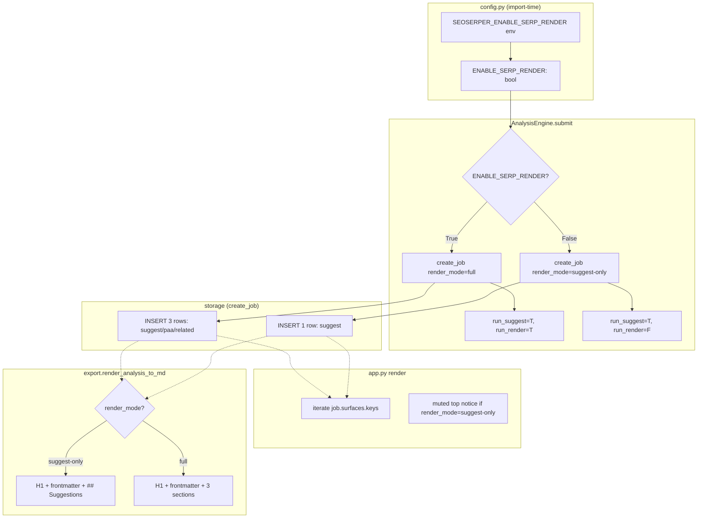
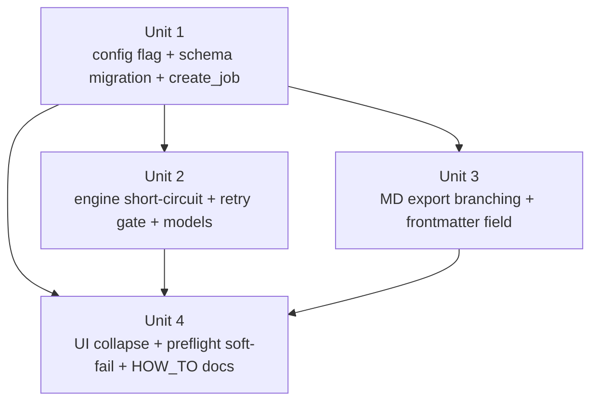

# Suggest-only Pivot

## Overview

Concretize the Suggest-only pivot agreed in the origin brainstorm. Adds one binary config surface (`ENABLE_SERP_RENDER`, default `False`) that collapses the live product to a single-surface Suggest experience while keeping Units 3 / 5 code in-tree for a potential flag-flip reactivation (bounded by the 2026-07-19 sunset reminder).

Total delta is small: **1 new column + 1 new config constant + 4 code files touched + 1 user-facing docs file**. No new modules. No architectural change.

## Problem Frame

Pre-plan spike (2026-04-20) showed 5/5 real Playwright `/search` queries from the user's home IP redirected to `/sorry/index` — 100% block rate against the plan's ≥10% kill threshold. Suggest endpoint baseline (30/30 ok) validated the SPOF assumption. Product rescopes to Suggest-only while keeping Playwright + engine + parser slot infrastructure dormant (see origin: `docs/brainstorms/2026-04-20-suggest-only-pivot-requirements.md`).

## Requirements Trace

- **R-S1** Single Suggest surface active per Submit (pivot §S1).
- **R-D1-D4** Unit 3/5 remain in-tree and tested; no Chromium subprocess under flag=False (pivot §D1-D4).
- **R-U1** UI collapses to one `## Suggestions` section + muted top notice under flag=False (pivot §U1, reviewer consensus).
- **R-U2** Notice is non-italic, non-dismissible, and does not embed the canonical flag identifier in user copy; links to a docs file instead (pivot §U2, adversarial ADV-4).
- **R-U3** `overall_status=completed` when Suggest returned ok (else `failed`); storage enum stays 3-value; the UI treats `render_mode=suggest-only + status=completed` as a normal success state (not "degraded" — that label is reserved for the full-mode N-of-3 partial-ok case, when and if the flag later flips).
- **R-E1** MD export emits one `## Suggestions` section + frontmatter `render_mode: suggest-only` under flag=False; 3-section layout returns under flag=True (pivot §E1).
- **R-E2** No dormant-section banners in MD; exports stay clean downstream (pivot §E2).
- **R-SC-kill** Suggest failure rate > 20% in any 20-query rolling window → tool unusable (pivot §Success Criteria, new kill criterion).
- **R-Retry** Retry reads `job.render_mode` (not the live flag) and re-runs only Suggest when `render_mode=suggest-only` (pivot §D3 + Deferred #2 resolution). Historical full-mode jobs interact with the dormant path — see ADV-1 under "Findings requiring judgment".
- **R-Preflight** Preflight failure is a soft warning when flag=False, hard block only when flag=True (pivot §D4 + Deferred #3).
- **R-Sunset** Sunset on 2026-07-19 is enforced by a failing pytest — `tests/test_sunset.py` asserts `today < 2026-07-19`. On that date CI turns red, forcing an explicit extend-or-delete decision instead of silent drift. The auto-memory calendar reminder remains as a soft heads-up.

## Scope Boundaries

- No deletion of Unit 3 / Unit 5 code paths in this plan — that's the 2026-07-19 sunset decision, not this one.
- No proxy / residential IP / Bing fallback — explicitly out of scope per pivot doc.
- No new `FailureCategory.DISABLED_BY_CONFIG` enum value (pivot Key Decisions, reviewer consensus).
- No Streamlit UI rewrite — change is additive conditional rendering on existing surfaces.
- No migration of pre-pivot job rows — they default to `render_mode='full'` (historically accurate, no retroactive rewrite).
- No proactive flag-flip probe (no `/search` HEAD check). Sunset reminder owns re-evaluation.

## Context & Research

### Relevant Code and Patterns

- **Config constant + env-var dual read**: follow existing `seoserper/config.py` pattern — e.g., `DB_PATH = os.environ.get("SEOSERPER_DB", str(ROOT / "seoserper.db"))`. Extend with a boolean helper that accepts `1`, `true`, `yes` (case-insensitive).
- **Idempotent ALTER TABLE migration**: `seoserper/storage.py::_migrate_jobs_add_source_columns` is the exact pattern to mirror — `PRAGMA table_info` check → `BEGIN IMMEDIATE` → `ALTER TABLE ADD COLUMN` with default → commit with duplicate-column swallow.
- **Dataclass extension**: `seoserper/models.py::AnalysisJob` already has source fields as string with defaults. `render_mode: str = "full"` follows the same style. No new enum needed (Key Decision).
- **Engine branching**: `seoserper/core/engine.py::AnalysisEngine._run_analysis` already has `run_suggest` / `run_render` parameters. Pivot uses the existing seam — set `run_render=False` when flag off. Add the `render_mode` stamp at `create_job` call site.
- **MD export pure function**: `seoserper/export.py::render_analysis_to_md` reads `AnalysisJob` only. Adding a `render_mode` branch inside the function keeps purity (feasibility F6 resolution).
- **UI preflight and surface rendering**: `app.py::_ensure_session_state` and `_render_current` are the two edit sites. Existing `_render_surface` skips `None` surfaces via `if surface is None or ...` — the Suggest-only path creates no PAA/Related surfaces, so those sections are naturally hidden if we switch rendering from "iterate over SurfaceName" to "iterate over job.surfaces.keys()".

### Institutional Learnings

- The workspace has no prior feature-flag rollout pattern that conflicts with this approach. `seoserper/config.py` is already the config module and nothing reads env vars elsewhere.
- Schema-migration pattern already proved green against a live v0→v1 test (`tests/test_storage.py::test_schema_v0_migration_adds_source_columns`). Replicate its shape.

### External References

None consulted. Local patterns are strong and the change is well-bounded.

## Key Technical Decisions

- **Dual env + constant for the flag.** `seoserper/config.py` exposes `ENABLE_SERP_RENDER: bool` populated at module import from `SEOSERPER_ENABLE_SERP_RENDER`. Rationale: env-var is consulted only once per process startup so Streamlit restarts (not live attribute changes) are the natural reload boundary. Reads of `config.ENABLE_SERP_RENDER` from the engine *do* go through module-attribute lookup — so tests can monkeypatch the attribute directly to flip behavior without restarting. This is a deployment convention (one process = one flag value), not a code-enforced invariant. Historical jobs are insulated from live mutation via `render_mode` stamping at submit time.
- **Flag consumed at the engine boundary, not inside each method.** `AnalysisEngine.submit` reads the flag once and sets both `run_render=False` and `render_mode='suggest-only'` on the job at creation. Downstream code (`_run_analysis`, `_do_serp`, `_apply_parsed_surface`) doesn't need to know about the flag. Rationale: single responsibility for flag consumption keeps the dormant code path cleanly bypassed.
- **`AnalysisEngine.__init__` accepts `render_thread: RenderThread | None = None`**, replacing the original "NoopRenderThread sentinel" plan. Rationale: 4-reviewer consensus flagged the sentinel as speculative abstraction — Unit 2 is already modifying the engine contract, so a type annotation change is strictly simpler than a new sentinel class defined "inline in app.py". `_do_serp` adds a defensive `assert self._render_thread is not None` at entry; the control flow guarantees this via `run_render=False`, but the assert makes the invariant machine-checked rather than convention.
- **Retry of pre-pivot full-mode jobs is gated by the live flag, not just by `render_mode`.** `retry_failed_surfaces` coerces retry to Suggest-only when `job.render_mode == 'full' AND config.ENABLE_SERP_RENDER is False` — otherwise the historical job's full-mode render_mode would drive `run_render=True` and call `.submit()` on a `None` render_thread. Reason: adversarial ADV-1 surfaced this as a concrete crash path. The coercion preserves Suggest retry on historical rows, leaves PAA/Related as whatever state they're in, and avoids the dormant-path invocation.
- **"Degraded" label is reserved for full-mode partial-failure only.** UI derivation table: `(render_mode, overall_status, ok_count)` → label. `suggest-only + completed + *` → "ok" (no special badge — the top-of-page mode notice already signals context). `full + completed + ok_count < 3` → "degraded". `* + failed + *` → "failed". Rationale: adversarial ADV-4 showed the original plan painted every normal suggest-only success as "degraded", destroying the warning signal.
- **`render_mode` is stored, not derived.** A job created under flag=False carries `render_mode='suggest-only'` in its jobs row forever, even if the flag later flips. Rationale: historical exports stay self-consistent; re-viewing an old job doesn't reinterpret under new flag state.
- **PAA / Related surfaces are not created when flag=False.** `storage.create_job` conditionally inserts only the Suggest surface row. Rationale: scope-guardian SC-4 — storage reflects what was attempted, not ghost rows with overloaded `blocked_rate_limit` category that would pollute the kill-criterion measurement.
- **Preflight soft-fail via UI branching.** `app.py` reads `config.ENABLE_SERP_RENDER` and changes the failed-preflight handling: render a muted banner + let Submit proceed vs. hard `st.error` + early return. Rationale: user running Suggest-only shouldn't need 170 MB of Chromium installed (feasibility F7).
- **Recovery instructions live in `seoserper/config.py` module docstring, not a separate docs file.** Reviewer consensus (scope-guardian F2 + adversarial ADV-5 + design-lens F1): a standalone HOW_TO.md for a solo-operator tool is ceremony, and the `docs/...` reference in the UI notice is a dead pointer (Streamlit can't navigate relative paths). Single source of truth: config.py docstring documents the flag, the env-var form, the "restart required" behavior, the caveat that Unit 4 parser is unshipped, and the kill criterion. UI notice drops the path reference entirely and reads just `Suggest-only 模式 · 当前网络限速中`. Rationale: minimizes artifact surface (no new file to maintain to the 2026-07-19 sunset), keeps the config identifier out of user copy (adversarial ADV-4), and trusts the solo operator to know config.py exists.
- **Retry gate uses `render_mode`, not flag.** `AnalysisEngine.retry_failed_surfaces` checks `job.render_mode == 'suggest-only'` rather than `config.ENABLE_SERP_RENDER`. Rationale: a retry on a historical suggest-only job stays suggest-only even if the flag has since flipped — prevents mixed-mode jobs.

## Open Questions

### Resolved During Planning

- **Flag location**: env `SEOSERPER_ENABLE_SERP_RENDER` + Python constant `seoserper.config.ENABLE_SERP_RENDER`. Both at once.
- **Storage enum**: stays 3-value (running / completed / failed). "Degraded" is UI-derived from `job.render_mode == 'suggest-only' and job.status == 'completed'`.
- **Notice placement**: top-of-page, single line, muted grey (not banner inside per-surface cards). Text is plain prose, not italic.
- **Preflight**: runs unconditionally at boot; branch on flag at the failure handler.
- **Retry scope**: gated by `job.render_mode`, not by live flag.
- **MD purity**: pure function of `AnalysisJob`; no flag lookup at render time.

### Deferred to Implementation

- **Exact bool coerce values for env var**: `1 / true / yes / on` (case-insensitive) → True; everything else → False. Pick the most forgiving reading at implementation time; document in config.py docstring.
- **Notice copy word-for-word**: draft given below; implementer may tune for tone. The constraints (non-italic, no config identifier, link to `docs/how-to-re-enable-serp.md`) are fixed.
- **Exact HOW_TO_RE_ENABLE.md content**: draft outline given in Unit 4 files; implementer writes the prose during that unit.

## High-Level Technical Design

> *This illustrates the intended approach and is directional guidance for review, not implementation specification. The implementing agent should treat it as context, not code to reproduce.*

The flag is read once at config import, consumed at `submit()`, stamped into the job row, and everything downstream keys off `job.render_mode`. No flag checks in export or in MD layer.

## Implementation Units

Unit 1 is foundational (schema + flag); Unit 2 and Unit 3 can land in either order after Unit 1; Unit 4 integrates everything.

---

- [x] **Unit 1: Config flag + schema migration + create_job branching** (2bcd2ee)

**Goal:** Introduce `ENABLE_SERP_RENDER` config + `jobs.render_mode` column + `create_job(..., render_mode=)` parameter. Foundation for every other unit.

**Requirements:** R-D2, R-U3 (storage enum unchanged), R-E1 (storage supports mode field), R-Sunset (no competing artifact)

**Dependencies:** None

**Files:**
- Modify: `seoserper/config.py` — add `ENABLE_SERP_RENDER: bool` (env-gated, default False)
- Modify: `seoserper/storage.py` — add `render_mode` column to `SCHEMA` jobs CREATE; add `_migrate_jobs_add_render_mode` idempotent migration (called from `init_db` right after `_migrate_jobs_add_source_columns`, before the `user_version` check/bump); update `create_job` signature to `create_job(query, language, country, db_path=None, *, render_mode="full")` — keep `db_path` positional-or-keyword to preserve every existing call site; `render_mode` is keyword-only; branch on it for surface row insertion; keep `"full"` as legacy default so pre-pivot rows read correctly. Also update `_hydrate_job` and `_hydrate_job_from_blob` to read the new column, and add `j.render_mode` to the SQL `SELECT` list in `list_recent_jobs`.
- Modify: `seoserper/models.py` — add `render_mode: str = "full"` to `AnalysisJob` dataclass (moved from Unit 2 so hydration works end-to-end within Unit 1; the Unit 2 dependency previously carried this but forward-dep would break Unit 1's own test scenarios)
- Test: `tests/test_storage.py` — add 5 scenarios per list below
- Test: `tests/test_config.py` — **create new file** — 3 scenarios for env-var coercion
- Test: `tests/test_sunset.py` — **create new file** — single assertion that `datetime.now(tz=UTC) < datetime(2026, 7, 19, tz=UTC)` so CI turns red on the sunset date and forces an explicit extend-or-delete decision

**Approach:**
- Config: `ENABLE_SERP_RENDER = os.environ.get("SEOSERPER_ENABLE_SERP_RENDER", "").strip().lower() in {"1", "true", "yes", "on"}`. Docstring notes forgiving coercion.
- Schema: add `render_mode TEXT NOT NULL DEFAULT 'full'` to the `CREATE TABLE jobs` statement in `SCHEMA`.
- Migration: new helper `_migrate_jobs_add_render_mode(conn)` — mirrors `_migrate_jobs_add_source_columns` verbatim with the column name swapped. Called from `init_db` inside `_INIT_LOCK`.
- `create_job(query, lang, country, *, render_mode="full", db_path=None) -> int` — inserts one jobs row carrying `render_mode`; then inserts surface rows based on mode: all 3 if `"full"`, only `SurfaceName.SUGGEST` if `"suggest-only"`.
- Backwards compat: existing callers of `create_job` don't pass `render_mode` → they get `"full"` implicitly → preserves all existing test behavior.

**Patterns to follow:**
- `seoserper/storage.py::_migrate_jobs_add_source_columns` (exact shape for new migration)
- `seoserper/config.py::DB_PATH` (env-var-with-default pattern)

**Test scenarios:**
- **Happy path** (config): `SEOSERPER_ENABLE_SERP_RENDER` unset → `config.ENABLE_SERP_RENDER is False`
- **Happy path** (config): env set to `"1"` → `True`; `"true"` → `True`; `"YES"` → `True`; `"on"` → `True`
- **Edge case** (config): env set to `"0"`, `"false"`, `""`, or arbitrary `"maybe"` → `False`
- **Happy path** (storage): `create_job("q", "en", "us")` (no render_mode) → jobs.render_mode == `"full"`; 3 surface rows created
- **Happy path** (storage): `create_job("q", "en", "us", render_mode="suggest-only")` → jobs.render_mode == `"suggest-only"`; only `suggest` surface row exists
- **Edge case** (storage): `get_job(id)` for a suggest-only job → `AnalysisJob.surfaces` dict has exactly one key (`SurfaceName.SUGGEST`); missing PAA / Related keys are absent, not present-with-RUNNING
- **Integration** (storage): migrate a v1 DB (created via pre-pivot schema string without `render_mode`) → `init_db` adds the column with default `"full"`; existing rows get `"full"`; `PRAGMA user_version` remains accurate
- **Integration** (storage): `list_recent_jobs` correctly hydrates `render_mode` on returned dataclasses (requires `AnalysisJob` field — folded into Unit 2)

**Verification:**
- `pytest tests/test_config.py tests/test_storage.py -q` all green
- `python3 -c "from seoserper import config; print(config.ENABLE_SERP_RENDER)"` prints `False`
- `SEOSERPER_ENABLE_SERP_RENDER=1 python3 -c "..."` prints `True`
- Fresh DB file written with `render_mode` column visible in `sqlite3 file.db '.schema jobs'`

---

- [x] **Unit 2: Engine short-circuit + retry gate + models field** (65a01af)

**Goal:** Engine reads the flag at submit time, sets `render_mode`, and skips the render path when suggest-only. Retry respects per-job mode.

**Requirements:** R-S1, R-D1 (Unit 3/5 stay in-tree), R-D3 (no PAA/Related ghost rows), R-D4 (no Chromium subprocess), R-Retry, R-U3 (ok_count≥1 rule operates on 1 surface)

**Dependencies:** Unit 1 (storage + create_job + config)

**Files:**
- Modify: `seoserper/core/engine.py` — `AnalysisEngine.submit` reads `config.ENABLE_SERP_RENDER`, picks render_mode, passes to `create_job`, sets `run_render` accordingly; `retry_failed_surfaces` keys off `job.render_mode`
- Test: `tests/test_engine.py` — add 6 scenarios per list below
- Test: `tests/test_models.py` — verify the new-field default already surfaced by Unit 1's models.py edit (confirmation only; no new assertion beyond Unit 1 coverage)

*(Note: the `render_mode` field on `AnalysisJob` and the storage hydration updates moved to Unit 1 so that Unit's own test scenarios about hydration pass. Unit 2 now touches only engine behavior.)*

**Approach:**
- `AnalysisEngine.__init__` signature: `render_thread: RenderThread | None = None` (changed from required positional). When `None`, `_do_serp` is never entered because `run_render=False` — an `assert self._render_thread is not None` at the top of `_do_serp` makes the invariant machine-checked.
- `AnalysisEngine.submit`:
  - Read `config.ENABLE_SERP_RENDER` once at the top
  - Pick `render_mode = "full" if config.ENABLE_SERP_RENDER else "suggest-only"`
  - Call `create_job(..., render_mode=render_mode, db_path=self._db_path)`
  - Spawn worker with `run_render = (render_mode == "full")`
- `_run_analysis` unchanged — it already respects `run_render`
- `retry_failed_surfaces(job_id)`:
  - Read `job.render_mode`
  - If `"suggest-only"`: only retry Suggest when `job.surfaces[SUGGEST].status != OK`; `run_render=False` unconditionally
  - If `"full"` **and** `config.ENABLE_SERP_RENDER is False`: **coerce to suggest-only retry semantics** — retry Suggest only if it's non-ok, leave PAA/Related surfaces as-is, do NOT attempt render. This is the ADV-1 crash-path guard: a historical full-mode job must not invoke `.submit()` on a `None` render_thread.
  - If `"full"` **and** `config.ENABLE_SERP_RENDER is True`: current full-mode retry behavior (retry any non-ok surface with render if needed)
- `complete_job` rule unchanged — it already counts ok surfaces; with 1 surface, ok_count ≥ 1 means the Suggest surface returned ok

**Patterns to follow:**
- `seoserper/core/engine.py::AnalysisEngine._spawn_worker` (existing DI + daemon thread pattern)
- `seoserper/storage.py::_hydrate_job` (row → dataclass lifting)

**Test scenarios:**
- **Happy path** (engine, flag=False via monkeypatch): `engine.submit("q", "en", "us")` → job created with `render_mode='suggest-only'`; only Suggest surface row exists; ProgressEvent sequence is `start → suggest → complete` (no paa/related events); `render_thread.submit` never called
- **Happy path** (engine, flag=True): current 3-surface behavior preserved end-to-end
- **Edge case** (engine): flag=False + Suggest returns failed → `complete_job` → `JobStatus.FAILED`; 1-surface ok_count rule honored
- **Integration** (engine, retry): create a suggest-only job, Suggest returns failed first → retry → only fetch_fn called again, render_thread.submit not called
- **Integration** (engine, retry ADV-1 guard): create a full-mode job (render_mode='full') with PAA failed under `ENABLE_SERP_RENDER=True`, then monkeypatch flag to False, instantiate engine with `render_thread=None`, invoke `retry_failed_surfaces(id)` → coerced to Suggest-only retry semantics; no AttributeError; PAA/Related left as-is in storage
- **Integration** (engine, retry flag=True): create a full-mode job with PAA failed, flag stays True → behavior unchanged from current tests (no regression)
- **Edge case** (engine): `retry_failed_surfaces` on a suggest-only job whose Suggest is already ok → no-op (no worker spawned; `progress_queue` stays empty)
- **Happy path** (models): `AnalysisJob()` default → `render_mode == "full"` (backward-compat default)
- **Integration** (hydration): suggest-only row round-trips through `get_job` → returned `AnalysisJob.render_mode == "suggest-only"`; `list_recent_jobs` also carries the field

**Verification:**
- `pytest tests/test_engine.py tests/test_models.py tests/test_storage.py -q` all green
- Existing 127-test baseline is at or above 127 (new tests add count; no regressions)
- Monkeypatching `seoserper.config.ENABLE_SERP_RENDER = True` in a test flips engine behavior without app restart

---

- [x] **Unit 3: MD export branching + render_mode frontmatter** (d066814)

**Goal:** Export renders one section for suggest-only jobs, three for full; frontmatter carries `render_mode`. Function stays pure.

**Requirements:** R-E1, R-E2, R-U3 (suggest-only isn't "incomplete")

**Dependencies:** Unit 1 (models field), Unit 2 (engine stamps the field — not strictly needed for the export change itself, but test fixtures will assert on realistic jobs)

**Files:**
- Modify: `seoserper/export.py` — `render_analysis_to_md` branches on `analysis.render_mode`; frontmatter adds one `render_mode: <value>` line
- Create: `tests/fixtures/export/expected_suggest_only.md` — new golden fixture
- Modify: `tests/fixtures/export/expected_all_ok.md`, `expected_partial.md`, `expected_all_failed.md` — add the `render_mode: full` line to frontmatter
- Modify: `tests/test_export.py` — adjust existing golden comparisons for the new frontmatter line; add 3 new scenarios for suggest-only rendering

**Approach:**
- Frontmatter list construction in `render_analysis_to_md` gains one line: `f"render_mode: {analysis.render_mode}"`, inserted **immediately after `country` and before `timestamp`**. This position is fixed (not an implementer choice) so the three existing golden fixtures receive the same diff shape and byte-equal comparison stays stable.
- Body construction branches:
  - If `analysis.render_mode == "suggest-only"`: only render the `## Suggestions` section + the bottom divider + footer. No PAA / Related iteration at all.
  - Else (`"full"` or any other value): current 3-section loop unchanged.
- Frontmatter's per-surface status triplet (`status_suggestions / status_paa / status_related`) under suggest-only: emit only `status_suggestions`; omit the paa / related lines entirely — they'd be meaningless with no surface rows. Document this in the Key Decisions ahead of time so reviewers aren't surprised.
- `build_filename` needs no change; filename is query+locale+timestamp, not mode-dependent.

**Patterns to follow:**
- `seoserper/export.py::_render_section` (current section rendering) — preserved for the "full" branch
- Golden-fixture comparison style already used in `tests/test_export.py::test_all_ok_matches_golden`

**Test scenarios:**
- **Happy path** (suggest-only): `render_analysis_to_md(job_suggest_only)` → equals new `expected_suggest_only.md` byte-for-byte. Frontmatter contains exactly `render_mode: suggest-only` and only `status_suggestions: ok` (no status_paa / status_related keys). Body has exactly one H2 (`## Suggestions (N)`).
- **Happy path** (full): `render_analysis_to_md(job_full_ok)` → equals updated `expected_all_ok.md`; frontmatter has `render_mode: full` and three status_ keys.
- **Edge case** (suggest-only empty): job with render_mode=suggest-only and Suggest returning empty → body has `## Suggestions` + the `_No suggestions returned._` one-liner, no other sections.
- **Edge case** (suggest-only failed): Suggest returns failed/network_error → body has `## Suggestions` + the failure-diagnostic one-liner.
- **Purity**: same `render_analysis_to_md(job)` call returns identical output twice; no filesystem I/O observed (existing `test_render_does_no_io` test still passes)
- **Integration**: snapshot of a real AnalysisJob round-tripped through storage with render_mode=suggest-only → exported MD renders correctly.

**Verification:**
- `pytest tests/test_export.py -q` all green (19 existing + 3 new + 4 updated = ~22-26 tests)
- Byte-equal golden fixture for suggest-only (no trailing-newline drift)
- Manual: paste a suggest-only MD into a plain markdown viewer → only 1 H2 renders

---

- [x] **Unit 4: UI collapse + preflight soft-fail + config.py docstring** (e83fa38)

**Goal:** app.py reflects the flag in every user-facing surface: top notice, single-section rendering, no RenderThread instantiation, preflight becomes soft for Suggest-only.

**Requirements:** R-U1, R-U2 (notice not italic, no config identifier, link to docs file), R-D4 (no Chromium subprocess), R-Preflight, R-SC-kill (surfaced via the kill criterion in docs)

**Dependencies:** Unit 1 (config flag), Unit 2 (engine/models), Unit 3 (export)

**Files:**
- Modify: `app.py` — add top-of-page notice when `config.ENABLE_SERP_RENDER is False`; change section rendering from "iterate SurfaceName" to "iterate job.surfaces.keys()"; guard `RenderThread()` instantiation; branch preflight failure handling on flag
- Modify: `seoserper/config.py` module docstring — document `ENABLE_SERP_RENDER`: env-var form `SEOSERPER_ENABLE_SERP_RENDER=1`, restart-required behavior, Unit 4 parser unshipped caveat, kill criterion (20%/20 Suggest failure → stop), 2026-07-19 sunset pointer. Replaces the previously-planned `docs/how-to-re-enable-serp.md` file (reviewer consensus dropped the standalone doc as ceremony)
- Modify: `tests/test_ui_smoke.py` — update existing smoke tests to pass under flag=False default; add 4 new smoke scenarios

**Approach:**
- `_ensure_session_state`:
  - Keep `preflight()` call (so a flag-on future flip has a clean readiness check)
  - Do not instantiate `RenderThread` unconditionally in `_boot_engine` anymore. Guard on `config.ENABLE_SERP_RENDER`
  - When flag is False and preflight failed, set `ss._preflight_soft_fail = True` instead of hard blocking; main() renders the notice and continues
- `_boot_engine`:
  - If flag is False: instantiate engine with `render_thread=None` (engine's Unit 2 signature accepts this; `_do_serp` is never entered under `run_render=False`, and asserts non-None defensively)
  - If flag is True: current code path (start RenderThread, wire engine)
- Top-of-page notice (flag=False):
  - `st.caption("Suggest-only 模式 · 当前网络限速中")` (plain prose; no path / config identifier; recovery info lives in `seoserper/config.py` docstring)
  - Muted grey (st.caption default). Not `st.error`, not `st.warning`, not italic
  - Placed between `st.title` and the input row
  - **Stacked-notice rule**: under flag=False AND preflight failed, render a single merged caption `"Suggest-only 模式 · 当前网络限速中 · Playwright 未安装但当前模式无需"` instead of two stacked messages (design-lens F2 resolution)
- Section rendering (`_render_current`):
  - Iterate over `job.surfaces` dict keys instead of hardcoded `(SUGGEST, PAA, RELATED)` loop
  - Under suggest-only, only Suggest is present → only one section renders
  - Divider between sections stays (1 section = 0 dividers; current code inserts N-1 dividers via `st.divider()` between sections — adjust accordingly)
- Sidebar history rendering (`_render_history_sidebar`):
  - Same iteration change: replace the hardcoded `(SUGGEST, PAA, RELATED)` badge loop with an iteration over `job.surfaces.keys()`, or with a fixed 3-slot loop that renders `·` (grey placeholder) for surfaces absent on the job. Pick the former for consistency with `_render_current` unless a per-row mode badge (see judgment item "sidebar mode distinguishability") is adopted.
- Session state additions in `_ensure_session_state`:
  - New key `_preflight_soft_fail: bool` (distinct from existing `_preflight_ok`). Set when `preflight()` fails AND `config.ENABLE_SERP_RENDER is False`; consumed by `main()` to render the muted soft-warning instead of the hard `st.error` early-return.
- `seoserper/config.py` module docstring content (same information, different container):
  - What `ENABLE_SERP_RENDER` does
  - How to flip: `export SEOSERPER_ENABLE_SERP_RENDER=1` in the shell before launching Streamlit, OR edit the constant directly; **Streamlit restart required** (env read is import-time one-shot per process)
  - What else is required: working network where /search isn't /sorry-redirected, and Unit 4 parser implementation landed (currently not shipped → PAA/Related will show stub failures even with flag on)
  - Kill criterion: if Suggest itself starts failing > 20% / 20-query window, stop using the tool
  - 2026-07-19 sunset pointer — see `tests/test_sunset.py`

**Execution note:** UI changes are hard to fully automate-test; smoke via AppTest catches the top-level structure only. Confirm manually with `streamlit run app.py` after Unit 4 lands — load under flag=False, submit a real query, inspect single-section rendering and notice text.

**Patterns to follow:**
- Existing `tests/test_ui_smoke.py::test_app_boots_and_renders_title` AppTest shape
- Streamlit's `st.caption` for muted inline prose

**Test scenarios:**
- **Happy path** (flag=False, preflight ok): AppTest renders title + top caption containing "Suggest-only 模式" + input row + no surface sections until a job exists + no Chromium preflight banner
- **Happy path** (flag=False, preflight fails): soft notice about Chromium missing is rendered, but Submit button is still enabled; main flow not blocked
- **Happy path** (flag=True, preflight ok): current 3-section behavior preserved (existing tests must still pass)
- **Happy path** (flag=True, preflight fails): hard-block `st.error` path preserved (existing test `test_app_shows_preflight_failure_banner` still passes unchanged)
- **Edge case**: sidebar shows a suggest-only historical job → Load brings it back → single-section render + no missing-data error
- **Integration** (AppTest smoke): under flag=False monkeypatched True, the app's preflight path behaves as current code; under monkeypatched False, the new soft path triggers

**Verification:**
- `pytest tests/test_ui_smoke.py -q` all green; 4 existing + 4 new = 8 scenarios
- Full suite `pytest tests/ -q` ≥ 127 + (Unit 1/2/3/4 new tests) green
- Manual: `SEOSERPER_ENABLE_SERP_RENDER=0 streamlit run app.py` — one section, muted top notice, Submit works, Suggest pulls live
- Manual: `SEOSERPER_ENABLE_SERP_RENDER=1 streamlit run app.py` — 3 sections, PAA/Related show parser-stub failure (Unit 4 parser doesn't exist yet), Suggest still works
- `docs/how-to-re-enable-serp.md` exists, renders cleanly in VS Code / GitHub preview, links are accurate

## System-Wide Impact

- **Interaction graph:** `config.ENABLE_SERP_RENDER` (read once at import) → `AnalysisEngine.submit` (flag consumer) → `storage.create_job` (mode stamp + row count) → every downstream reader (`get_job`, `list_recent_jobs`, `render_analysis_to_md`, `app.py._render_current`) consumes `render_mode` off the hydrated `AnalysisJob`. No other entry points read the flag.
- **Error propagation:** Unchanged. Suggest-only path has the same failure-category mapping through `FailureCategory.NETWORK_ERROR` / `BLOCKED_RATE_LIMIT` etc. Kill criterion (20% / 20-query) is a user-level observation; no automated tripwire in this plan.
- **State lifecycle risks:**
  - *Partial writes*: suggest-only job writes one surface row; `complete_job` reads from surfaces and the "≥1 ok" rule correctly operates on 1 surface. Confirmed via test.
  - *Historical rows*: pre-pivot jobs (render_mode=full) keep working; suggest-only jobs created under flag=False stay suggest-only even after a later flag flip (render_mode is stored, not derived).
  - *Sidebar history*: `list_recent_jobs` returns both modes; `_render_current` handles both.
- **API surface parity:** No public API. Streamlit is the only interface. CLI is out of scope (parent plan excluded it).
- **Integration coverage:** Engine + storage + export need one end-to-end test per mode. AppTest smoke covers UI wiring but not the full submit → storage → export round-trip; a manual verification post-implementation is the acceptance gate.
- **Unchanged invariants:** FailureCategory enum (no new value), SurfaceName enum (still 3 values), SurfaceStatus enum (still 4 values), JobStatus enum (still 3 values), storage primary-key structure on surfaces, all Unit 1/2/3/5/6/7 existing tests must remain green.

## Risks & Dependencies

| Risk | Mitigation |
|------|------------|
| Historical full-mode job retried while live flag=False would invoke `.submit()` on `None` render_thread | Engine's `retry_failed_surfaces` coerces `render_mode='full' + flag=False` to Suggest-only retry semantics — never enters `_do_serp`. Test scenario in Unit 2 asserts this. |
| Schema migration runs on a DB that has a partial render_mode column from an interrupted earlier migration | `_migrate_jobs_add_render_mode` uses `PRAGMA table_info` check + `BEGIN IMMEDIATE` + duplicate-column swallow — race-safe by construction (mirrors proven `_migrate_jobs_add_source_columns`) |
| Golden fixture drift during Unit 3 test updates introduces hidden regressions | Treat fixture updates as review-gate; diff must be clean (only new `render_mode:` line added or new file added); no behavior drift |
| User flips flag manually without reading docs/how-to-re-enable-serp.md, misses that Unit 4 parser is not implemented | HOW_TO doc leads with the caveat; UI under flag=True still shows the current selector_not_found stub failure, which is itself diagnostic |
| Suggest kill criterion is observer-only; tool drifts into unusable state silently | Accepted per pivot Key Decisions; user-owned monitoring via manual SQLite query on `jobs.overall_status`. No automated alarm in MVP. |
| Env-var coercion is too lenient and accidentally enables render for a user who typed `"off"` into their shell | Coercion list is strict whitelist (`1 / true / yes / on` case-insensitive); everything else → False. Documented. |

## Documentation / Operational Notes

- No new docs file created; recovery info lives in `seoserper/config.py` module docstring (Unit 4 edit).
- Plan file itself is the operational record for the pivot — no CHANGELOG.md convention in this repo.
- Memory entry for 2026-07-19 sunset reminder already persisted in this session's auto-memory; no further action in this plan.
- Post-implementation: manual run of `streamlit run app.py` under both flag states is the acceptance ritual. No CI.

## Sources & References

- **Origin document:** `docs/brainstorms/2026-04-20-suggest-only-pivot-requirements.md`
- **Parent brainstorm:** `docs/brainstorms/2026-04-20-google-serp-analyzer-requirements.md`
- **Parent plan (partially executed, now supplanted for gated path):** `docs/plans/2026-04-20-001-feat-google-serp-analyzer-mvp-plan.md`
- **Canonical migration pattern:** `seoserper/storage.py::_migrate_jobs_add_source_columns`
- **Canonical env-var constant pattern:** `seoserper/config.py::DB_PATH`
- **Canonical engine DI seam:** `seoserper/core/engine.py::AnalysisEngine._spawn_worker`
- **Canonical MD pure-function pattern:** `seoserper/export.py::render_analysis_to_md`
- **Suggest baseline (empirical):** `scripts/suggest_baseline.jsonl` (30/30 ok on 2026-04-20)
- **Spike record (empirical):** `scripts/spike_results.jsonl` (5/5 /sorry-redirected on 2026-04-20)
