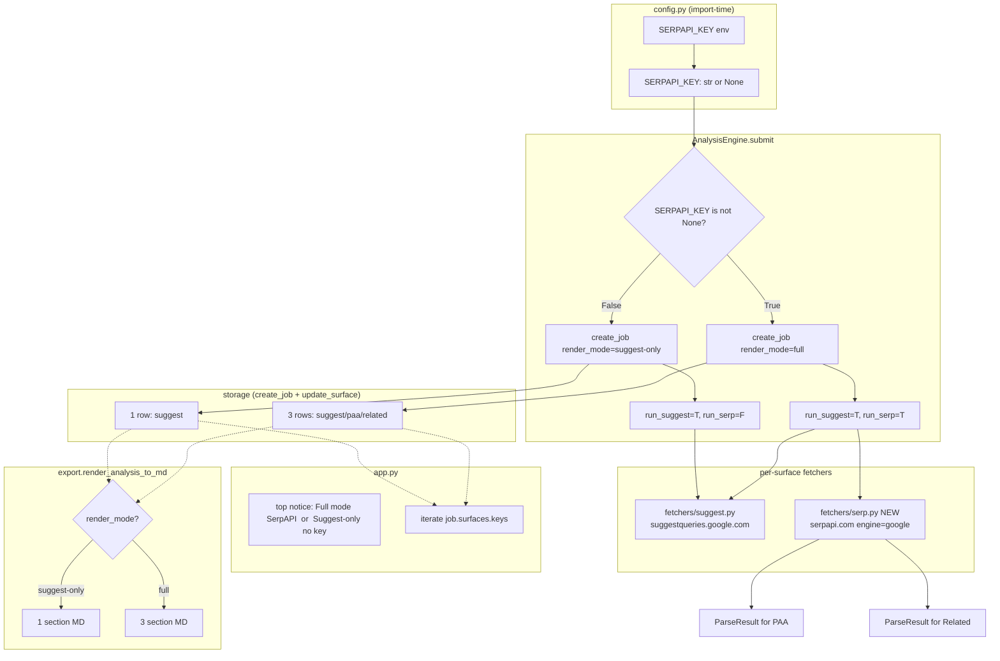
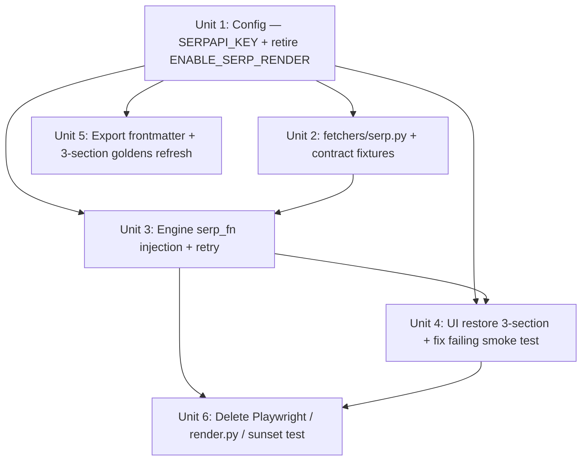

# SerpAPI Integration

## Overview

Restore the parent brainstorm's 3-surface product (Suggestions + PAA + Related Searches) by replacing the dormant Playwright `/search` scraping path with **SerpAPI** (https://serpapi.com — `google-search-results` Python SDK or direct HTTPS). Suggest continues to use the already-shipped `suggestqueries.google.com` free endpoint. PAA + Related come from a single SerpAPI `engine=google` call which returns both surfaces in one JSON response.

SerpAPI's free tier is 100 searches/month, no credit card — adequate for a solo SEO operator running ≤3 full analyses/day. Each full analysis bills 1 SerpAPI search (PAA + Related bundled); Suggest stays free via the autocomplete endpoint.

This plan also retires the Playwright infrastructure (`seoserper/core/render.py`, preflight, sunset test, `ENABLE_SERP_RENDER` flag) because the SerpAPI path obsoletes the reason the pivot kept them dormant. Unit 4 parser (DOM extraction) from plan 001 — never implemented — is formally dropped from scope; SerpAPI returns structured JSON.

## Problem Frame

Plan 002 (Suggest-only pivot) was correct at the time: Pre-plan spike showed 100% `/sorry/index` redirect on the user's home IP, and headless Chromium scraping of Google `/search` was not viable. User research in this session confirmed Google offers no official API returning PAA/Related (Custom Search JSON API = organic only, closed to new customers, sunsets 2027-01-01). The realistic path to the parent brainstorm's 3-surface product is a third-party SERP API.

SerpAPI selected over DataForSEO / Bright Data because:
1. 100 searches/month **forever-free** tier — zero cost for self-use volume.
2. Single `engine=google` call returns `organic_results` + `related_questions` (== PAA) + `related_searches` — no multi-endpoint stitching.
3. Official Python SDK; clean JSON schema documented.
4. Locale params (`hl`, `gl`, `google_domain`) cover en-US / zh-CN / zh-TW / ja-JP cleanly.

## Requirements Trace

Requirements below are a delta against plan 002. Suggest-layer requirements (R2 contract, R4 rank, R5 source+timestamp) from the parent brainstorm carry forward unchanged and are already shipped.

- **R-F1** SerpAPI `engine=google` call populates PAA + Related surfaces when `SERPAPI_KEY` is configured (parent brainstorm F1/F2).
- **R-F2** Suggest surface continues to pull from `suggestqueries.google.com` — unchanged fetcher (parent brainstorm R2).
- **R-F3** Under `SERPAPI_KEY` set, one Submit yields 3 surface rows populated; under `SERPAPI_KEY` unset, behavior equals current Suggest-only (1 surface row). No partial-provider mixing.
- **R-F4** Locale mapping: `(en, us) → hl=en&gl=us&google_domain=google.com`; `(zh-CN, cn) → hl=zh-CN&gl=cn&google_domain=google.com.hk` (mainland-google is redirected, docs confirm); `(ja, jp) → hl=ja&gl=jp&google_domain=google.co.jp`; `(zh-TW, tw) → hl=zh-TW&gl=tw&google_domain=google.com.tw`.
- **R-E1** SerpAPI failure modes map to existing `FailureCategory` values: 401/403 (bad key) → `NETWORK_ERROR`; 429 / "ran out of searches" body → `BLOCKED_RATE_LIMIT`; 5xx → `NETWORK_ERROR`; malformed JSON / unexpected shape → `SELECTOR_NOT_FOUND` (semantically = "response contract broke"). No new enum value.
- **R-E2** Storage enum unchanged (3-value JobStatus). Surface-level `render_mode='full'` now semantically means "Suggest via suggestqueries + PAA/Related via SerpAPI". Historical rows with `render_mode='full'` from before this plan (if any exist in user's DB — likely zero) still hydrate; their provider identity is ambiguous but inert.
- **R-U1** UI restores the 3-section layout when `SERPAPI_KEY` is set. Top-of-page notice reads `"Full mode · SerpAPI"` (muted grey). When key is unset, notice reads `"Suggest-only · SERPAPI_KEY 未设置"` with instruction pointer to `seoserper/config.py` docstring.
- **R-U2** Retry button reappears on any failed surface; SerpAPI retry hits the same endpoint with no special logic.
- **R-U3** `overall_status=completed` when ≥1 surface is `ok` (existing rule — unchanged, operates on 3 surfaces under full mode).
- **R-X1** Export MD renders 3 sections when `render_mode='full'`, 1 section when `suggest-only`. Frontmatter `source_serp: "serpapi"` (was `"playwright"` in plan 001 draft, never shipped).
- **R-C1 (cleanup)** `seoserper/core/render.py`, `tests/test_render.py`, `tests/test_sunset.py`, `preflight()`, `RenderThread`, and any `playwright` / `chromium` import reference are deleted from the tree. `ENABLE_SERP_RENDER` constant is deleted; availability is derived from `SERPAPI_KEY is not None`.
- **R-T1 (test-fix)** `tests/test_ui_smoke.py::test_app_shows_empty_history_message` currently fails (169/170 green). Fix included — root cause investigation in Unit 4.

## Scope Boundaries

- **Not adding paid-tier SerpAPI billing UX.** The free tier is sufficient; over-quota just shows as a failure surface with clear message. No Stripe integration, no usage meter in UI.
- **Not adding DataForSEO or other providers as fallback.** Single-provider simplicity; if SerpAPI quota is exhausted, user waits until next month or funds a paid tier manually.
- **Not supporting multi-key rotation.** One key per deployment.
- **Not building a SerpAPI response cache layer.** Self-use cadence is low; SerpAPI's own caching is fine.
- **Not migrating historical `render_mode='full'` rows** (unlikely to exist — full mode was never shipped end-to-end via Playwright).
- **Not building a CLI.** Streamlit stays the only interface.
- **Not adding a pre-flight live smoke to CI.** Live SerpAPI hits require a real key; guard behind an opt-in script (see Unit 2).

## Context & Research

### Relevant Code and Patterns

- **Existing fetcher pattern to mirror**: `seoserper/fetchers/suggest.py::fetch_suggestions`. Shape — pure function, takes `(query, lang, country)`, returns a result dataclass carrying `status: SurfaceStatus` + `items` + `failure_category`. SerpAPI fetcher should follow the same shape, return `dict[SurfaceName, ParseResult]` (matching what the engine's `_do_serp` expects from the old `parse_fn`).
- **Engine DI seam**: `AnalysisEngine.__init__` currently accepts `render_thread` + `parse_fn`. Replace with a single `serp_fn: Callable[[str, str, str], dict[SurfaceName, ParseResult]]`. Existing `_spawn_worker` + `_run_analysis` + retry logic unchanged.
- **Config env-var + constant**: `seoserper/config.py::DB_PATH` is the canonical pattern. `SERPAPI_KEY: str | None` at module import; `None` when unset.
- **Storage migration not required**: existing `render_mode` column added in plan 002 Unit 1 is reused with semantics updated (full = SerpAPI, suggest-only = no-key or explicitly opted-out).
- **MD export branching**: `seoserper/export.py::render_analysis_to_md` already branches on `render_mode`. Only change: frontmatter `source_serp` value string.
- **UI preflight hook**: `app.py::_ensure_session_state` currently calls `preflight()` from `seoserper.core.render`. This becomes dead code in Unit 6 — remove along with `render.py`.
- **Existing AppTest smoke pattern**: `tests/test_ui_smoke.py` — new SerpAPI-aware UI states (full mode notice vs Suggest-only notice) extend this file.

### Institutional Learnings

- **Schema migration idempotency**: proven pattern at `seoserper/storage.py::_migrate_jobs_add_render_mode`. No new migration is needed in this plan, but any future column addition must follow this pattern.
- **Fixture-based contract tests** (Suggest): `tests/fixtures/suggest/` — capture-and-replay approach. SerpAPI fetcher tests should mirror this style: capture one real response per locale to `tests/fixtures/serp/` + several synthetic fixtures for error modes.
- **Engine-level DI** lets the live Playwright path and the test-time stub coexist. Same mechanism applies to SerpAPI: tests inject a fake `serp_fn`, production wires the real one.

### External References

- SerpAPI `engine=google` documentation: https://serpapi.com/search-api — response schema (`organic_results`, `related_questions`, `related_searches`), parameters (`hl`, `gl`, `google_domain`, `q`, `api_key`).
- SerpAPI pricing (2026): https://serpapi.com/pricing — free 100 searches/month, no credit card, rolls over monthly (new-month counter resets).
- SerpAPI Python SDK: `google-search-results` on PyPI — thin wrapper; direct `requests` against `https://serpapi.com/search.json` is equally viable and adds no new dependency (project already uses `requests` for Suggest).
- SerpAPI locale notes for zh-CN: https://serpapi.com/google-domains — `google.com.hk` is the correct domain (mainland `google.cn` has been redirected for years).
- Parent brainstorm: `docs/brainstorms/2026-04-20-google-serp-analyzer-requirements.md` — original 3-surface product intent.
- Prior pivot record (context for why Playwright is being retired now): `docs/brainstorms/2026-04-20-suggest-only-pivot-requirements.md`.

## Key Technical Decisions

- **Use `requests` directly, not the `google-search-results` SDK.** Rationale: the project already depends on `requests` for the Suggest fetcher; the SDK is a thin convenience wrapper that adds a transitive dep and offers no error-handling value we can't replicate inline. One `requests.get("https://serpapi.com/search.json", params={...})` call is simpler than adopting an SDK.
- **Single `fetch_serp_data` function, not a class.** Matches `fetch_suggestions` shape. Purity + DI-friendly for testing. Engine composes, doesn't inherit.
- **Return `dict[SurfaceName, ParseResult]` from the SerpAPI fetcher.** Rationale: the engine's `_do_serp` already consumes this exact shape from the old `parse_fn` contract. Substituting `serp_fn` preserves the engine's downstream code (`_apply_parsed_surface`) unchanged. No new surface-write path.
- **Consolidate into one engine injection slot (`serp_fn`), not two (`render_thread + parse_fn`).** Rationale: the render+parse split existed because Playwright's HTML had to be rendered first, then parsed. SerpAPI returns parsed JSON — the split is no longer meaningful. Single callable is simpler to reason about.
- **Drop `ENABLE_SERP_RENDER`; derive full-mode availability from `SERPAPI_KEY`.** Rationale: two env vars for the same on/off decision is accidental complexity. `SERPAPI_KEY is not None` is the natural gate — unset → Suggest-only; set → full.
- **Map SerpAPI "ran out of searches" to `BLOCKED_RATE_LIMIT`.** Rationale: existing failure-category enum covers the semantic ("request blocked by rate constraint") without a new value. UI message swap on this category specifically can read "SerpAPI 月度免费配额用尽" when provider=serpapi.
- **`source_serp` frontmatter becomes `"serpapi"` for jobs created after this plan.** Historical `"playwright"`-stamped rows (unlikely to exist in user's DB) stay readable — string field, no enum constraint.
- **Delete Playwright code outright, don't deprecate-and-wait.** Rationale: the pivot doc justified keeping render.py dormant as a "flag-flip reactivation" path. SerpAPI is now the reactivation path. The dormant code is now dead — deleting it removes the 2026-07-19 sunset pressure + dependency-bump tax + test-drift risk outlined in pivot Key Decisions.
- **No SerpAPI response caching in this plan.** Rationale: self-use volume is ~3 queries/day. Network latency + 100/month quota both tolerate direct calls. A cache would be premature and the invalidation rules are non-trivial (PAA changes on Google's side over hours).
- **Restarting Streamlit is the canonical way to pick up a new `SERPAPI_KEY`.** Env-var is read once at config module import. Documented in config.py docstring.
- **Secrets handling: `SERPAPI_KEY` only via environment variable.** Not read from any file, not stored in SQLite, not logged. UI never displays the key value — only boolean "configured / not configured" derived state.

## Open Questions

### Resolved During Planning

- **Provider choice**: SerpAPI, not DataForSEO / Bright Data / Oxylabs. Rationale: free 100/month tier matches self-use volume; single call bundles PAA + Related.
- **SDK vs direct `requests`**: direct `requests`. No new dep.
- **Locale `google_domain` mapping**: hardcoded table in `seoserper/fetchers/serp.py`. Covers en-US, zh-CN, zh-TW, ja-JP. Unknown locale falls back to `google.com`.
- **Quota-exhausted UX**: fails the PAA + Related surfaces with `BLOCKED_RATE_LIMIT` category, UI message "SerpAPI 配额用尽 · 下月重置 或 升级付费"; Suggest surface still succeeds on the same Submit.
- **Playwright cleanup timing**: inside this plan (Unit 6), not a follow-up plan. The user deserves one coherent landing rather than two.
- **The 1 failing UI test** (`test_app_shows_empty_history_message`): root-caused in Unit 4. Likely cause is that the sidebar's "暂无历史" caption is conditioned on a code path that doesn't execute under flag=False default (or was removed during plan 002 rendering changes). Full root-cause investigation deferred to Unit 4 execution — this plan commits to the fix being in-scope, not to the exact diff.

### Deferred to Implementation

- **Exact SerpAPI error-body shape for quota exhaustion**: SerpAPI docs describe the response but live payload wording may vary. Implementer captures the first real quota-exhausted response to a fixture and matches on the `error` field shape, not a literal string.
- **HTTP client timeout for SerpAPI**: start at `SUGGEST_TIMEOUT_SECONDS` (same pattern as Suggest). Tune down if live calls prove too slow on a retry-loop.
- **AppTest assertion for 3-section rendering under full mode**: depends on how Streamlit's AppTest exposes expander vs. section elements; pick the shape that survives Streamlit version drift.

## High-Level Technical Design

> *This illustrates the intended approach and is directional guidance for review, not implementation specification. The implementing agent should treat it as context, not code to reproduce.*

The SerpAPI fetcher returns the same `dict[SurfaceName, ParseResult]` shape that the old Playwright `parse_fn` did — the engine's downstream code (`_apply_parsed_surface`, `complete_job`, progress events) needs no structural changes.

## Implementation Units

Unit 1 is foundational. Units 2 and 3 build the fetch path. Unit 4 is UI restoration + test fix. Unit 5 updates export. Unit 6 is the Playwright cleanup — intentionally last so earlier units don't have to navigate half-deleted imports.

---

- [ ] **Unit 1: Config — add `SERPAPI_KEY`, retire `ENABLE_SERP_RENDER`**

**Goal:** Replace the Playwright-era flag with a SerpAPI-key-derived availability signal. No storage schema change (the `render_mode` column from plan 002 is reused with updated semantics).

**Requirements:** R-F3, R-E1, R-C1 (partial — flag removal)

**Dependencies:** None

**Files:**
- Modify: `seoserper/config.py` — add `SERPAPI_KEY: str | None = os.environ.get("SERPAPI_KEY") or None` (empty string collapses to None); delete `ENABLE_SERP_RENDER`. Update module docstring: remove Playwright / preflight / Chromium language; add SerpAPI key setup, locale mapping overview, quota note, "restart required to pick up new key" caveat.
- Modify: `seoserper/config.py` — add `SERPAPI_URL = "https://serpapi.com/search.json"` constant.
- Test: `tests/test_config.py` — rewrite the 3 existing env-var tests for the new constant; add one negative test for empty-string coercion.

**Approach:**
- `SERPAPI_KEY`: read from env once at import. Empty string → `None` (prevents a blank `SERPAPI_KEY=` line in `.env` from looking like a configured key).
- Docstring becomes the single source of truth for setup (mirrors plan 002 decision to keep recovery info in config.py, not a separate doc file).
- `ENABLE_SERP_RENDER` removal cascades to `engine.py` (Unit 3), `app.py` (Unit 4), and `tests/test_ui_smoke.py` (Unit 4). Unit 1 only touches config; the cascade is tracked but lands in the referenced units.

**Patterns to follow:**
- `seoserper/config.py::DB_PATH` — env-with-default pattern.

**Test scenarios:**
- **Happy path**: env `SERPAPI_KEY=abc123` → `config.SERPAPI_KEY == "abc123"`.
- **Edge case**: env unset → `config.SERPAPI_KEY is None`.
- **Edge case**: env set to empty string → `config.SERPAPI_KEY is None` (not `""`).
- **Edge case** (whitespace): env set to `"  "` (whitespace only) → resolves to `None` (strip-then-coerce).
- **Verification**: module-level `ENABLE_SERP_RENDER` no longer exists → `from seoserper import config; config.ENABLE_SERP_RENDER` raises `AttributeError`. This deliberately breaks any residual caller and forces Unit 3/4 cleanup to be complete.

**Verification:**
- `pytest tests/test_config.py -q` all green.
- `python3 -c "from seoserper import config; print(hasattr(config, 'ENABLE_SERP_RENDER'))"` prints `False`.
- Test suite shows expected breakage in engine/UI tests that still reference `ENABLE_SERP_RENDER` — these are Unit 3/4's to fix.

---

- [ ] **Unit 2: `seoserper/fetchers/serp.py` — SerpAPI fetcher with contract fixtures**

**Goal:** New pure function that hits SerpAPI's `engine=google` endpoint, maps `related_questions` → PAA `ParseResult`, `related_searches` → Related `ParseResult`, and returns `dict[SurfaceName, ParseResult]` usable directly by the engine.

**Requirements:** R-F1, R-F4, R-E1

**Dependencies:** Unit 1 (config constants)

**Files:**
- Create: `seoserper/fetchers/serp.py` — `fetch_serp_data(query, lang, country, *, api_key, http_get, timeout) -> dict[SurfaceName, ParseResult]`. `http_get` is a DI seam defaulting to `requests.get` for testability.
- Create: `tests/fixtures/serp/` — directory for captured + synthetic response fixtures.
- Create: `tests/fixtures/serp/ok_en_us_coffee.json` — real response captured from one live call (requires `SERPAPI_KEY` at fixture-capture time; gated by `scripts/capture_serp_fixture.py`).
- Create: `tests/fixtures/serp/ok_zh_cn_sample.json` — synthetic or captured zh-CN response.
- Create: `tests/fixtures/serp/ok_ja_jp_sample.json` — synthetic or captured ja-JP response.
- Create: `tests/fixtures/serp/empty_no_paa.json` — real Google result where PAA block is absent (many tail queries).
- Create: `tests/fixtures/serp/error_quota_exhausted.json` — captured or synthetic error payload.
- Create: `tests/fixtures/serp/error_bad_key.json` — 401/403 payload.
- Create: `scripts/capture_serp_fixture.py` — opt-in script (user runs manually with a real key) that writes a live response to the fixtures directory. Not part of CI.
- Create: `tests/test_serp_fetcher.py` — full scenario set below.

**Approach:**
- Build params: `{"engine": "google", "q": query, "hl": lang, "gl": country, "google_domain": <locale-lookup>, "api_key": api_key, "no_cache": "false"}`. Locale-to-domain map is a module-level dict at the top of `serp.py`.
- Call via injected `http_get`. Check HTTP status first (401/403 → `NETWORK_ERROR` / bad key; 429 → `BLOCKED_RATE_LIMIT`; 5xx → `NETWORK_ERROR`; timeouts/connection errors → `NETWORK_ERROR`).
- Parse JSON. If malformed → `SELECTOR_NOT_FOUND` (semantic = "response contract broke").
- Extract `related_questions[]` → PAA items (shape: `{question, snippet}` → `PAAQuestion(question=..., rank=i, answer_preview=snippet[:200])`). Empty/missing list → `status=EMPTY`.
- Extract `related_searches[]` → Related items (shape: `{query}` → `RelatedSearch(query=..., rank=i)`). Empty/missing list → `status=EMPTY`.
- Detect SerpAPI-level error surfaced inside a 200 response (`response["error"]` key). SerpAPI sometimes returns 200 with an error field on quota exhaustion — match on "ran out of searches" or similar → `BLOCKED_RATE_LIMIT`.
- Both surfaces share the same failure category on top-level call errors (quota-exhausted fails BOTH PAA and Related; a partial-success where only PAA comes back is possible and preserved).
- Return dict with exactly two keys: `SurfaceName.PAA` and `SurfaceName.RELATED`. Never includes `SurfaceName.SUGGEST` (that stays with `fetchers/suggest.py`).

**Patterns to follow:**
- `seoserper/fetchers/suggest.py` — function shape, failure-category mapping, DI'd HTTP call, fixture-based tests.
- `seoserper/fetchers/suggest.py::SUGGEST_URL` → same style for SerpAPI URL constant.

**Test scenarios:**
- **Happy path**: fixture `ok_en_us_coffee.json` → PAA `ParseResult(status=OK, items=[...])` with ≥3 items ranked 1..N; Related `ParseResult(status=OK, items=[...])` with ≥4 items.
- **Happy path (zh-CN locale)**: fixture `ok_zh_cn_sample.json` → Chinese-character text in PAA items preserved byte-correct; no mojibake.
- **Happy path (ja-JP locale)**: fixture `ok_ja_jp_sample.json` → Japanese text preserved byte-correct.
- **Edge case** (empty PAA block): fixture `empty_no_paa.json` → PAA `status=EMPTY`; Related still `status=OK`.
- **Edge case** (both absent): synthetic fixture with neither `related_questions` nor `related_searches` → both surfaces `EMPTY`.
- **Error path** (bad key, 401): mocked `http_get` returns 401 + `error_bad_key.json` body → both surfaces `FAILED` + `NETWORK_ERROR`.
- **Error path** (rate limit, 429): mocked 429 → both `FAILED` + `BLOCKED_RATE_LIMIT`.
- **Error path** (quota exhausted via 200 + error field): mocked 200 + `error_quota_exhausted.json` → both `FAILED` + `BLOCKED_RATE_LIMIT`.
- **Error path** (malformed JSON): mocked 200 + HTML body (Cloudflare interstitial) → both `FAILED` + `SELECTOR_NOT_FOUND`.
- **Error path** (network timeout): mocked `http_get` raises `requests.Timeout` → both `FAILED` + `NETWORK_ERROR`.
- **Edge case** (unknown locale): called with `(lang="fr", country="fr")` → falls back to `google_domain=google.com`; no exception.
- **Integration** (locale-domain mapping): `(zh-CN, cn)` call → captured params include `google_domain=google.com.hk`; `(ja, jp)` → `google.co.jp`; `(zh-TW, tw)` → `google.com.tw`.
- **Purity**: same fixture → same output on repeated calls; no filesystem or network side effects beyond the injected `http_get`.

**Verification:**
- `pytest tests/test_serp_fetcher.py -q` all green.
- Manual: `SERPAPI_KEY=... python3 scripts/capture_serp_fixture.py "coffee" en us` writes a real response to `tests/fixtures/serp/` without crashing.

---

- [ ] **Unit 3: Engine integration — replace `render_thread + parse_fn` with `serp_fn`**

**Goal:** `AnalysisEngine` uses a single `serp_fn` injection for the PAA+Related pair. Retry logic preserved. Derive full-mode availability from `config.SERPAPI_KEY`.

**Requirements:** R-F1, R-F3, R-E1, R-E2, R-U3, R-C1 (engine-side Playwright removal)

**Dependencies:** Unit 1 (config), Unit 2 (serp fetcher)

**Files:**
- Modify: `seoserper/core/engine.py` —
  - Signature change: `AnalysisEngine.__init__(..., serp_fn: Callable[[str, str, str], dict[SurfaceName, ParseResult]] | None = None)`; remove `render_thread` and `parse_fn` params.
  - Remove imports of `RenderThread` + render exceptions; remove `_RENDER_EXC_MAP`, `_render_exc_to_category`.
  - `submit`: read `config.SERPAPI_KEY` instead of `config.ENABLE_SERP_RENDER`; `render_mode = "full" if config.SERPAPI_KEY else "suggest-only"`; `run_render` is renamed `run_serp` internally (or stays `run_render` if churn is too loud — implementer discretion; the public contract is `submit()`, no caller cares about the kwarg name).
  - `retry_failed_surfaces`: ADV-1 guard rephrased — `job.render_mode == 'full' AND config.SERPAPI_KEY is None` → coerce to Suggest-only retry semantics (same behavior class as plan 002, different trigger).
  - `_do_serp` replaces the render-thread-submit + timeout + parse-call choreography with one call: `parsed = self._serp_fn(query, lang, country)`. Assert preserved: `assert self._serp_fn is not None, "serp_fn required under full mode"`.
  - Delete `_build_serp_url` (Playwright-era helper, not used for SerpAPI).
- Modify: `tests/test_engine.py` —
  - Update every test that instantiated `AnalysisEngine(render_thread=..., parse_fn=...)` to use `serp_fn=...`.
  - Keep the ADV-1 retry-crash-guard test, rephrased for SerpAPI-key-missing scenario.
  - Add scenarios listed below for SerpAPI-specific paths.

**Approach:**
- The seam `_do_serp` previously: `render_thread.submit(url).result(timeout) → parse_fn(html, locale) → dict`. New: `serp_fn(query, lang, country) → dict`. Fewer moving parts; same output contract; `_apply_parsed_surface` completely unchanged.
- Error handling in `_do_serp`: wrap the `serp_fn` call in try/except; any exception → `_write_render_failure` with `FailureCategory.NETWORK_ERROR` (defensive only — Unit 2's fetcher converts all known error classes to ParseResults already).
- `complete_job` rule unchanged — still `overall_status=completed` when ≥1 surface OK.

**Patterns to follow:**
- `seoserper/core/engine.py::_apply_parsed_surface` — keep as-is; reused verbatim.
- The pre-existing R8 "don't overwrite ok surface on retry" rule stays intact.

**Test scenarios:**
- **Happy path** (SERPAPI_KEY set): `engine.submit("q", "en", "us")` with mocked `serp_fn` returning ok/ok → 3 surface rows all `ok`; ProgressEvent sequence `start → suggest → paa → related → complete`.
- **Happy path** (SERPAPI_KEY unset): `engine.submit(...)` with `serp_fn=None` → 1 surface row (suggest only); no `paa`/`related` progress events.
- **Edge case**: SERPAPI_KEY set, mocked `serp_fn` returns `{PAA: OK, RELATED: FAILED(BLOCKED_RATE_LIMIT)}` → both surfaces persisted; overall_status `completed` (≥1 ok including suggest).
- **Edge case** (quota exhausted for SerpAPI, but Suggest OK): mocked `serp_fn` returns both FAILED+BLOCKED_RATE_LIMIT, Suggest OK → overall_status `completed` (Suggest rescues); UI later renders the rate-limit message.
- **Error path** (serp_fn raises): mocked `serp_fn` raises `RuntimeError` → both PAA/Related surfaces FAILED with `NETWORK_ERROR`; overall_status honors ≥1 ok rule.
- **Integration** (retry ADV-1 guard for SerpAPI era): create a `render_mode='full'` job (simulated — any row with that mode in DB), unset SERPAPI_KEY at test time, instantiate engine with `serp_fn=None`, call `retry_failed_surfaces(id)` → coerced to Suggest-only retry; no AssertionError; no crash.
- **Integration** (retry ADV-1 guard when SerpAPI is available): create `render_mode='full'` job with PAA failed, SERPAPI_KEY set, serp_fn injected → retry re-runs both Suggest (if non-ok) and SERP; ok PAA/Related preserved by R8 rule.
- **Edge case**: historical `render_mode='suggest-only'` job retry → run_serp=False regardless of SERPAPI_KEY.

**Verification:**
- `pytest tests/test_engine.py -q` all green.
- No remaining import of `seoserper.core.render` in `engine.py` (grep check; becomes a Unit 6 precondition).
- Full suite `pytest tests/ -q` — Unit 4/5/6 tests may still fail at this point; acceptable mid-sequence.

---

- [ ] **Unit 4: UI restore 3-section layout + fix `test_app_shows_empty_history_message`**

**Goal:** `app.py` surfaces the 3-section layout under full mode, top notice reflects provider state, and the long-failing empty-history smoke test passes.

**Requirements:** R-U1, R-U2, R-U3, R-T1, R-C1 (UI-side Playwright removal)

**Dependencies:** Unit 1 (config), Unit 3 (engine signature)

**Files:**
- Modify: `app.py` —
  - Replace `ENABLE_SERP_RENDER` references with `SERPAPI_KEY is not None` derivation. Store as a local `full_mode_available` boolean.
  - Top-of-page notice: full-mode → `st.caption("Full mode · SerpAPI")`; no-key → `st.caption("Suggest-only · SERPAPI_KEY 未设置 · 见 config.py 启用")`.
  - Delete `preflight()` import + call; delete `_preflight_ok` / `_preflight_soft_fail` session-state keys and the branches consuming them.
  - `_boot_engine`: wire `serp_fn=fetch_serp_data` when `SERPAPI_KEY` is set, else `serp_fn=None`. Curry the `api_key` so the engine calls `serp_fn(query, lang, country)` (a partial/lambda that closes over the key + default `http_get`).
  - Sidebar history rendering: investigate why "暂无历史" caption isn't rendering (likely because the branch guarding it depends on a code path that moved during plan 002). Restore the empty-state caption so `test_app_shows_empty_history_message` passes.
  - Remove any dead references to `RenderThread`, `preflight`, `render.py`.
- Modify: `seoserper/config.py` docstring (started in Unit 1) — append an operator-facing block describing: "how to check if SerpAPI is configured (restart streamlit, look at top notice)"; "quota: 100/mo free"; "restart required to pick up new key".
- Modify: `tests/test_ui_smoke.py` —
  - Replace `_set_flag(monkeypatch, True/False)` with `_set_key(monkeypatch, "abc"/None)` (or equivalent helper that monkeypatches `seoserper.config.SERPAPI_KEY`).
  - Preserve all existing scenario names; the test logic just needs the new trigger.
  - Fix `test_app_shows_empty_history_message` — this lands here (the root cause is in `app.py` rendering, not the test).
  - Add 2 new smoke scenarios per below.

**Approach:**
- Full-mode notice placement: between `st.title(...)` and the input row (same slot as plan 002's Suggest-only notice).
- Sidebar "empty history" caption: when `list_recent_jobs(DB_PATH)` returns `[]`, render `st.caption("暂无历史 — 提交第一个关键字")` inside the sidebar before the jobs loop. Current code likely has the loop but not the empty-state fallback.
- `_boot_engine` construction of `serp_fn`:
  - Pseudo-shape: `serp_fn = lambda q, l, c: fetch_serp_data(q, l, c, api_key=config.SERPAPI_KEY, http_get=requests.get, timeout=config.SUGGEST_TIMEOUT_SECONDS)` when key is set; `None` otherwise.
  - Directional — implementer chooses `functools.partial` vs lambda vs inline closure per style.
- Stacked-notice rule inherited from plan 002: one caption, not two. Only relevant when both conditions combine (full mode active + some other condition) — in this plan there's no second degraded path, so a single caption suffices.

**Execution note:** Manual acceptance gate lives here. After Unit 4 lands: `SERPAPI_KEY=<real-key> streamlit run app.py`, submit "coffee" in en-US, confirm 3 sections render with non-empty PAA + Related. Also run with `SERPAPI_KEY` unset and confirm Suggest-only single-section behavior still works. This is the plan's primary user-facing acceptance signal — AppTest alone can't prove live SerpAPI integration.

**Patterns to follow:**
- `tests/test_ui_smoke.py` existing AppTest shape.
- Streamlit `st.caption` + `st.divider` as currently used.
- `_render_current` iteration over `job.surfaces.keys()` (pattern from plan 002 Unit 4).

**Test scenarios:**
- **Happy path** (key set): AppTest run → top caption contains "Full mode · SerpAPI"; submit form present; no preflight block.
- **Happy path** (key unset): AppTest → top caption contains "Suggest-only"; Submit still enabled.
- **Edge case** (empty history, key unset): AppTest → sidebar contains a caption with "暂无历史" text. **This is the `test_app_shows_empty_history_message` fix.**
- **Edge case** (empty history, key set): same empty-history caption renders.
- **Integration** (full-mode job rendering): inject a job with 3 ok surfaces into a temp DB → AppTest loads it → 3 `st.expander` or `st.subheader` blocks render (exact widget depends on current `_render_current` shape).
- **Integration** (suggest-only job under key-set env): historical suggest-only job loaded in full-mode session → still renders with only 1 section (render_mode is stored on the row, UI honors it).
- **Error path** (quota-exhausted surface): stub a job with Suggest=OK, PAA=FAILED+BLOCKED_RATE_LIMIT, Related=FAILED+BLOCKED_RATE_LIMIT → UI shows Suggest section with data + 2 failure cards with "配额用尽" message.

**Verification:**
- `pytest tests/test_ui_smoke.py -q` all green — including `test_app_shows_empty_history_message` now passing.
- Full suite `pytest tests/ -q` — 170/170 green (Unit 5 + Unit 6 may still have work but tests unaffected by those units pass now).
- Manual: the two-state streamlit run described in Execution note above produces the expected UI.

---

- [ ] **Unit 5: Export — update frontmatter `source_serp` + refresh 3-section goldens**

**Goal:** MD export correctly stamps `source_serp: serpapi` for new full-mode jobs; existing suggest-only export path untouched; 3-section golden fixtures refreshed.

**Requirements:** R-X1

**Dependencies:** Unit 1 (config — provider string is hardcoded, not from config, but aligns with plan)

**Files:**
- Modify: `seoserper/export.py` — where frontmatter is assembled, the `source_serp` line should read `"serpapi"` under `render_mode='full'`. Suggest-only jobs don't emit this field (plan 002 already omits per-surface status keys under suggest-only).
- Modify: `tests/fixtures/export/expected_all_ok.md` — `source_serp: serpapi` replaces whatever placeholder was there (likely `"playwright"` if any, or blank).
- Modify: `tests/fixtures/export/expected_partial.md` — same update.
- Modify: `tests/fixtures/export/expected_all_failed.md` — same update.
- Modify: `tests/test_export.py` — existing full-mode tests assert the new frontmatter value; no new scenario file, just assertion updates.

**Approach:**
- The export function is pure; it reads `analysis.source_serp` from the `AnalysisJob` dataclass. The actual stamping of `source_serp="serpapi"` onto the job row happens in `engine.py` — add one line in `submit()` (or wherever source fields are populated; check `storage.create_job` signature) when `render_mode="full"`.
- If `source_serp` is already stamped as an empty string (plan 002 default) and the engine never wrote to it in full mode: this unit wires the write. Verify against current engine code during implementation.
- Suggest path stamps `source_suggest="suggestqueries.google.com"` — already in place per plan 001; no change.

**Patterns to follow:**
- `seoserper/storage.py::_hydrate_job` — source fields round-trip as-is.
- Golden fixture update pattern from plan 002 Unit 3.

**Test scenarios:**
- **Happy path**: `render_analysis_to_md(job_full_ok_serpapi)` where `job.source_serp == "serpapi"` → equals updated `expected_all_ok.md` byte-for-byte.
- **Happy path**: `expected_partial.md` golden byte-equal with new frontmatter.
- **Happy path**: `expected_all_failed.md` golden byte-equal.
- **Edge case** (suggest-only unchanged): `expected_suggest_only.md` fixture remains byte-equal to plan 002's (no `source_serp` field emitted).
- **Integration** (round-trip): engine creates a full-mode job with mocked SerpAPI → storage row has `source_serp="serpapi"` → export MD frontmatter reflects.

**Verification:**
- `pytest tests/test_export.py -q` all green.
- Full suite green (should be 170+N/170+N at this point).

---

- [ ] **Unit 6: Delete Playwright / render.py / sunset test**

**Goal:** Remove all dormant Playwright infrastructure. The codebase no longer depends on `playwright` the package; `seoserper/core/render.py` is gone; `tests/test_render.py` is gone; `tests/test_sunset.py` is gone; `app.py` has no preflight import.

**Requirements:** R-C1

**Dependencies:** Unit 3 (engine no longer imports render), Unit 4 (UI no longer imports preflight)

**Files:**
- Delete: `seoserper/core/render.py`
- Delete: `tests/test_render.py`
- Delete: `tests/test_sunset.py`
- Delete: `seoserper/core/__init__.py` if it only re-exports render symbols (inspect before deleting; more likely it's empty or just marks the package — keep if so).
- Modify: `pyproject.toml` — remove `playwright` from dependencies if listed. (Inspect first; it may already be absent if dev-only.)
- Modify: any remaining imports found via grep (`grep -rn "from seoserper.core.render" seoserper/ tests/ app.py` should return zero hits before this unit is considered done).

**Approach:**
- Straight deletion; no soft-deprecate path. The sunset test (asserting `today < 2026-07-19`) loses its purpose because the code it was forcing attention to is being removed now.
- `pyproject.toml` check: the original plan 001 added Playwright; subsequent tidying may have moved it to a dev-only group. Verify state before editing.
- Audit: run a final grep for `render_thread`, `RenderThread`, `preflight`, `playwright`, `chromium` across the entire codebase. All hits should be in this plan file or other plan docs — not in source or test code.
- Update the workspace `.claude/` memory entry for SEOSERPER after landing to reflect that Playwright is gone.

**Patterns to follow:**
- n/a — pure deletion.

**Test scenarios:**
- **Verification** (not a unit test — a structural assertion): `grep -rn "seoserper.core.render" seoserper/ tests/ app.py` returns zero hits.
- **Verification**: `grep -rn "playwright\|chromium\|RenderThread\|preflight" seoserper/ app.py` returns zero hits.
- **Verification**: `pytest tests/ -q` full suite green; test count lower than pre-Unit-6 baseline by exactly the count removed with `test_render.py` + `test_sunset.py`.
- **Verification**: `python3 -c "import seoserper.core.render"` raises `ModuleNotFoundError`.

**Verification:**
- Full test suite green.
- `pip install -e .` works from a fresh venv without Playwright installed. No `ImportError` on startup.
- Manual: `streamlit run app.py` in both `SERPAPI_KEY` states still produces expected UI (regression check).

## System-Wide Impact

- **Interaction graph:** `SERPAPI_KEY` (env, read at `config.py` import) → `AnalysisEngine.submit` (chooses render_mode) → `fetchers/serp.py::fetch_serp_data` (one call per full-mode submit) → `_apply_parsed_surface` (unchanged from plan 002) → `storage.update_surface` → UI via `ProgressEvent`. No other entry point reads the key.
- **Error propagation:** SerpAPI-layer errors mapped to existing `FailureCategory` values at the fetcher boundary — engine sees only ParseResults, no SerpAPI exception types bleed upward. UI's existing `_FAILURE_MSG` dict gets one new entry or a message swap for `BLOCKED_RATE_LIMIT` under provider=serpapi (handled in Unit 4).
- **State lifecycle risks:**
  - *Partial writes*: full-mode job under quota exhaustion → Suggest ok, PAA+Related both FAILED — correctly handled by existing `complete_job` rule (≥1 ok → overall completed).
  - *Historical rows*: pre-plan-003 rows with `render_mode='full'` (virtually none, since full path never shipped) stay readable. `source_serp` may be empty string on those; display layer handles gracefully.
  - *Pre-plan-002 rows*: plan 002's migration already added `render_mode` with default `'full'`. No new migration needed here.
- **API surface parity:** No public API. Streamlit is the only interface. `scripts/capture_serp_fixture.py` is a developer-only utility, not a product surface.
- **Integration coverage:** Unit 3 mocks `serp_fn`; Unit 4's execution note requires one manual live-key end-to-end run. No CI hits SerpAPI (no secret stored in CI).
- **Unchanged invariants:** `FailureCategory` enum (no new value), `SurfaceName` enum (still 3 values), `SurfaceStatus` enum (still 4 values), `JobStatus` enum (still 3 values), storage primary-key structure, `render_mode` column vocabulary (`'full' | 'suggest-only'`), the plan 002 Unit 2 ADV-1 retry-crash-guard semantic class (trigger rephrased, behavior identical).
- **Removed invariants**: plan 002's `ENABLE_SERP_RENDER` flag, the 2026-07-19 sunset deadline, and any code that depended on the Playwright surface area.

## Risks & Dependencies

| Risk | Mitigation |
|------|------------|
| SerpAPI response schema changes mid-2026 (e.g. `related_questions` renamed) | Fixture-based contract tests (Unit 2) catch the drift on the first failed real call. Failure surfaces as `SELECTOR_NOT_FOUND` with raw body in logs for diagnosis. |
| Free tier quota (100/mo) insufficient once user scales | Quota-exhausted surface fails cleanly with a readable message. User can either wait for monthly reset or upgrade to a paid tier (doc pointer in `config.py` docstring). |
| `SERPAPI_KEY` accidentally committed to git | Key lives only in environment variable; never written to any file by this code. `.env` files are already in `.gitignore`. Docstring explicitly warns. |
| Historical pre-plan-003 `render_mode='full'` job (if any exists) has no `source_serp` and renders with blank provider field in MD | Display layer tolerates empty string (already does for suggest-only `source_serp`). Zero user-visible impact; edge-case note only. |
| Deleting Playwright (Unit 6) before confirming SerpAPI works end-to-end leaves no fallback | Manual live-key acceptance gate at Unit 4 precedes Unit 6. If the live gate fails, Unit 6 doesn't land. |
| SerpAPI has a minor outage during user's session | Failure maps to `NETWORK_ERROR`; Retry button available. User may still manually switch to a different keyword or wait. No auto-fallback to Playwright — that path is gone by end of plan. Accept as a rare-event degrade. |
| `google-search-results` Python SDK chosen accidentally (bringing transitive deps) | Key Decision explicitly picks direct `requests` over SDK. Dep list audit in Unit 6 catches regression. |
| Test fixtures from captured live responses leak the captured key or PII | `scripts/capture_serp_fixture.py` strips `search_parameters.api_key` from the payload before writing; fixture review gate checks. |
| Quota counter resets unexpectedly mid-month due to SerpAPI policy drift | Observer-only; user sees surprise availability. No action needed. |

## Documentation / Operational Notes

- **No new top-level docs file created** (same philosophy as plan 002 — config.py docstring is the single source).
- **Memory update post-landing**: the workspace auto-memory entries referring to "Suggest-only shipped, Units 1-4 of plan 002" should be updated to reflect the SerpAPI restoration. Add a new session entry after Unit 6 lands.
- **Secrets hygiene note**: the user's shell config (`~/.zshrc` or `.env` sourced by Streamlit launcher) is where `SERPAPI_KEY` lives. Not this plan's responsibility to wire into a secret manager — self-use scope.
- **No CI**: repo has no CI currently; manual pytest run is the bar.
- **Rollback**: if SerpAPI turns out to be unusable (quota, cost, reliability), reverting this plan restores the plan 002 Suggest-only end state. Git-level revert of the 6 unit commits is the plan. No DB rollback needed (the `render_mode` column persists fine).

## Sources & References

- **Origin document (parent brainstorm):** `docs/brainstorms/2026-04-20-google-serp-analyzer-requirements.md`
- **Superseded plan (context for what's being reversed):** `docs/plans/2026-04-20-002-feat-suggest-only-pivot-plan.md`
- **Superseded plan (initial 3-surface MVP, Playwright-based):** `docs/plans/2026-04-20-001-feat-google-serp-analyzer-mvp-plan.md`
- **SerpAPI Google engine docs:** https://serpapi.com/search-api
- **SerpAPI pricing (2026 free-tier confirmation):** https://serpapi.com/pricing
- **SerpAPI Python SDK (considered, rejected):** https://pypi.org/project/google-search-results/
- **Locale-to-google_domain mapping:** https://serpapi.com/google-domains
- **Canonical fetcher pattern:** `seoserper/fetchers/suggest.py::fetch_suggestions`
- **Canonical engine DI seam:** `seoserper/core/engine.py::AnalysisEngine._do_serp`
- **Canonical env-var constant pattern:** `seoserper/config.py::DB_PATH`
- **Suggest baseline (empirical, still valid):** `scripts/suggest_baseline.jsonl` (30/30 ok on 2026-04-20)
- **Research conducted in this session (SerpAPI vs official Google APIs, 2026 market):** confirmed no Google first-party API returns PAA + Related; Custom Search JSON API closed to new customers; SerpAPI selected over DataForSEO / Bright Data / Oxylabs on free-tier fit.
