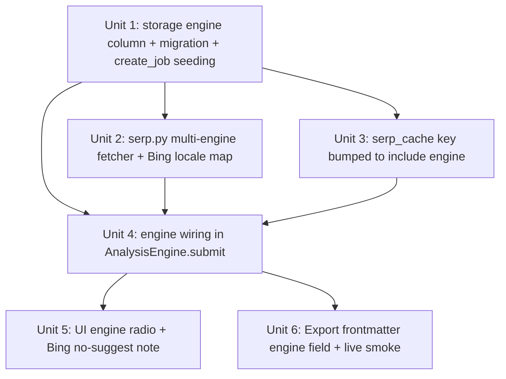

# Bing Engine Support

## Overview

Add **Bing** as a second SERP provider alongside Google. Both engines go through the same SerpAPI vendor (1 credit per call, shared 250/mo pool). Yandex **explicitly skipped** per research — 0/3 parity (no PAA, no Related, no zh/ja) makes it a scope tax with zero user value.

## Problem Frame

User wants engine diversity for SEO research — Bing has ~4-8% market share in US/JP and surfaces different query intent signals than Google. Research confirmed SerpAPI's `engine=bing` returns `related_searches` reliably and `related_questions` opportunistically (~20-40% of queries). Bing has no blessed free autocomplete endpoint, so the Suggest surface is omitted for Bing jobs — user gets 2 surfaces (PAA + Related), not 3.

## Requirements Trace

- **R-B1** New `engine` dimension on jobs. Values: `"google"` (default, covers pre-plan-005 rows) and `"bing"`.
- **R-B2** Engine is orthogonal to `render_mode` (Google-only concept). Bing jobs never have `render_mode="suggest-only"` — they always have 2 surfaces (PAA + RELATED) and no Suggest.
- **R-B3** SerpAPI call params differ per engine: Google uses `hl`+`gl`+`google_domain`; Bing uses `mkt`. Single fetcher dispatches.
- **R-B4** Response shape is similar enough that `extract_surfaces` handles both with no engine-specific branching (both use `related_questions` + `related_searches` keys).
- **R-B5** Cache key gains engine dimension: `{engine}|{query}|{lang}|{country}`. Pre-plan-005 keys (3-part) become orphans and age out via TTL.
- **R-B6** UI adds horizontal engine radio (Google / Bing) above the input row. Bing-mode jobs render 2 sections in the main view + MD + CSV.
- **R-B7** For Bing jobs the UI shows a one-line note explaining no Suggest surface: "Bing 未提供公开 autocomplete 端点 — 如需 Bing 建议可切至 Google 或使用付费 Azure Autosuggest".
- **R-B8** Historical Google jobs (all pre-plan-005 rows) stay readable + exportable with `engine="google"` defaulted by migration.
- **R-B9** Retry semantics unchanged — retry re-runs whatever surfaces are failed on the stored job, keyed by its stored engine.

## Scope Boundaries

- **No Yandex.** Research showed 0/3 parity. Drop permanently.
- **No Bing autocomplete.** `api.bing.com/osjson.aspx` is undocumented / unreliable; paid Azure Cognitive is out-of-scope for a self-use tool.
- **No cross-engine comparison view.** One engine per submit. User runs the same query twice (once per engine) if they want a side-by-side — each is its own job in history.
- **No multi-engine cache warming.** Each engine has its own cache rows; invalidating one doesn't touch the other.
- **No PAA confidence indicator.** Bing PAA is opportunistic (~20-40% query coverage) but we won't flag this in the UI — user experiences it naturally.

## Context & Research

### Relevant Code + Patterns

- `seoserper/fetchers/serp.py::fetch_serp_raw` + `extract_surfaces`: already split (plan 004 Unit B). Extend to accept `engine` param; add Bing locale mapping.
- `seoserper/fetchers/serp_cache.py::_cache_key`: single place to add engine dimension.
- `seoserper/storage.py::_migrate_jobs_add_render_mode`: canonical idempotent migration pattern — mirror for `engine`.
- `seoserper/storage.py::create_job`: surface-seeding branch on `render_mode`. Add engine branch for Bing (seeds PAA + RELATED, skips SUGGEST).
- `seoserper/core/engine.py::AnalysisEngine.submit`: stamps render_mode today. Extend to also stamp engine.
- `app.py` input row: add `st.radio` for engine selector. Already has locale selectbox.

### Institutional Learnings

- Plan 003 schema migration pattern (render_mode) is proven against v0 DB — mirror for engine column.
- Plan 004 cache TTL pruning on put keeps table bounded — no new infra needed.
- Plan 003 render_mode=suggest-only taught us: omit rows for absent surfaces, don't create FAILED placeholder rows. Apply same pattern for Bing-no-suggest.

### External References

- SerpAPI Bing engine: https://serpapi.com/bing-search-api
- Bing market codes: https://learn.microsoft.com/en-us/bing/search-apis/bing-web-search/reference/market-codes
- Research report (this session): confirmed `related_searches` always present, `related_questions` ~20-40% coverage.

## Key Technical Decisions

- **Single `fetchers/serp.py` module handles both engines via `engine` param.** No new `bing.py` sibling. Rationale: 85% of code is shared (URL, auth, HTTP errors, JSON parse, quota detection). Diverging locale param construction is a 10-line dict lookup.
- **Bing query param is `q`** (same as Google). Research flagged Yandex uses `text`; since we're dropping Yandex, no query-param switch needed.
- **`engine` column defaults to `"google"`** — all pre-plan-005 rows auto-tag as Google. Idempotent migration adds the column with default; existing rows get it backfilled by SQLite.
- **Engine + render_mode are orthogonal, both stored, both immutable after job creation.** A Bing job always has `render_mode="full"` in storage (semantic: full-Bing mode = 2 surfaces). This avoids inventing a new `render_mode` value like `"bing"` that would overload existing logic.
- **Bing no-Suggest note is a UI-level caption**, not a new SurfaceResult with a specific FailureCategory. Storage simply doesn't have a SUGGEST row for Bing jobs — symmetric with Google suggest-only not having PAA/RELATED rows. UI prose explains.
- **Cache key schema bump without cleanup.** Old 3-part keys become unreadable (miss on lookup), age out via TTL. Acceptable: cache is opportunistic, not authoritative data.
- **Engine selector in UI is horizontal radio (2 options).** Dropdown would be over-engineered for binary choice; radio signals "pick one of these two" clearly.
- **Default engine in UI: Google.** Existing behavior preserved — user who ignores the radio submits Google as before.
- **Bing locale mapping table lives next to Google's.** `{(lang, country): mkt}` dict at module level, unknown locales fall back to `mkt=en-US` (Bing's default).

## Open Questions

### Resolved During Planning

- **New module vs extend**: extend `serp.py` (shared code ~85%).
- **Query param**: Google and Bing both use `q` on SerpAPI — no normalization layer needed.
- **Cache key migration**: no active migration; legacy rows age out (low-risk because cache TTL is 24h).
- **Engine column default**: `"google"` in SCHEMA + migration.
- **Bing no-Suggest UX**: single caption inside the Bing job's section list, not a ghost row.
- **Engine in MD/CSV export**: new frontmatter line `engine: google|bing` under render_mode; CSV unchanged (per-surface rows, no meta).

### Deferred to Implementation

- **Exact Bing MKT fallback for unknown locales**: `en-US` is the Bing-docs default. Consider just returning `None` and letting SerpAPI pick — implementer decides based on live test behavior.
- **Whether to pre-clear the existing cache table during the plan-005 rollout** or let stale rows silently miss: default is let them miss; CLI `scripts/reset_serp_cache.py --prune-only` is available if user wants.

## Implementation Units

### Unit 1: storage — `engine` column + migration + create_job seeding

**Files:**
- `seoserper/storage.py` — SCHEMA adds `engine TEXT NOT NULL DEFAULT 'google'`; new `_migrate_jobs_add_engine` helper; `create_job(..., *, engine="google")` param; surface-seeding branch for Bing (PAA + RELATED only); hydrate reads `engine`; `list_recent_jobs` SELECT includes `engine`.
- `seoserper/models.py` — `AnalysisJob.engine: str = "google"` dataclass field.
- `tests/test_storage.py` — 5 scenarios: default engine, explicit bing, v1→v2 migration, bing seeds 2 surfaces, hydrate round-trip.

**Acceptance:** `create_job(..., engine="bing")` → DB row with `engine='bing'`, exactly 2 surface rows (PAA, RELATED), no SUGGEST row. Migration on pre-plan-005 DB adds column with `'google'` default.

### Unit 2: fetcher — `engine` param on `fetch_serp_raw` + Bing locale map

**Files:**
- `seoserper/fetchers/serp.py` — new `_BING_MKT: dict[(lang, country), str]`; `fetch_serp_raw(..., engine="google")` constructs params based on engine; `extract_surfaces` unchanged (both engines use `related_questions`/`related_searches`); `fetch_serp_data(..., engine="google")` threads through.
- `tests/test_serp_fetcher.py` — 6 scenarios: Bing happy path (synthetic fixture), Bing locale mapping (en/zh/ja map to correct mkt), Bing missing PAA (empty, not failed), Bing 429, unknown Bing locale fallback, engine=google regression.
- `tests/fixtures/serp/ok_bing_en_us_coffee.json` — new synthetic fixture.

**Acceptance:** `fetch_serp_data("coffee", "en", "us", engine="bing", api_key=...)` hits `serpapi.com/search.json?engine=bing&q=coffee&mkt=en-US&api_key=...` and returns `dict[PAA,RELATED]` (no SUGGEST key).

### Unit 3: cache — key includes engine

**Files:**
- `seoserper/fetchers/serp_cache.py` — `_cache_key(query, lang, country, engine)` → `"{engine}|{query}|{lang}|{country}"`; `fetch_serp_data_cached(..., engine="google")` threads through.
- `tests/test_serp_cache.py` — 3 new scenarios: same query different engines map to different keys, legacy 3-part key rows are readable but miss (don't crash), cache_invalidate signature change tolerant.

**Acceptance:** Google and Bing calls for `"coffee" en-US` never share a cache row.

### Unit 4: engine wiring — `AnalysisEngine.submit(engine=...)`

**Files:**
- `seoserper/core/engine.py` — `submit(query, lang, country, *, engine="google")` passes to `create_job`; `_do_serp` calls `self._serp_fn(query, lang, country, engine=job.engine)` (serp_fn must accept engine kwarg).
- `app.py` `_boot_engine` — `partial(fetch_serp_data_cached, api_key=key, db_path=db_path)` already positional; add `engine` as runtime kwarg per submit.
- `tests/test_engine.py` — 4 scenarios: submit with engine=bing creates Bing job, Bing retry re-uses stored engine (not live arg), Bing job with mocked serp_fn returns OK, concurrent Google + Bing submits don't cross-contaminate.

**Acceptance:** After submit with engine=bing, job row has `engine='bing'` + 2 surfaces; serp_fn received `engine="bing"` as kwarg.

### Unit 5: UI — engine radio + Bing no-suggest note + render loop

**Files:**
- `app.py` — above input row, add `st.radio("引擎", ["Google", "Bing"], horizontal=True, key="_engine_input")`; translate display label to enum value; pass to `engine.submit()`; `_render_current` renders a Bing-specific caption at top of sections if `job.engine == "bing"`; existing surface iteration already tolerates missing SUGGEST (plan 003 Unit 4).
- `tests/test_ui_smoke.py` — 4 scenarios: radio present with 2 options, Google default selected, Bing submit creates bing job (AppTest can monkeypatch engine.submit), Bing-mode rendering shows the no-suggest caption.

**Acceptance:** Clicking Bing + Submit produces a 2-section job view; Google radio + Submit behaves identically to pre-plan-005 behavior.

### Unit 6: export — frontmatter + live smoke + docs

**Files:**
- `seoserper/export.py` — MD frontmatter gains `engine: google|bing` line right after `render_mode`; CSV unchanged (no meta).
- 3 golden MD fixtures updated: `expected_all_ok.md` adds `engine: google` line; `expected_partial.md`, `expected_all_failed.md`, `expected_suggest_only.md` same.
- `README.md` — engines section added: current Google (3 surfaces) + Bing (2 surfaces, no suggest).
- `seoserper/config.py` docstring — mention Bing shares the same SERPAPI_KEY + quota pool.
- Live smoke: one real Bing query (`coffee` en-US) via the manual tour DB + verify 2 sections populate.

**Acceptance:** All golden fixtures byte-equal. Live smoke shows real Bing PAA or Related data.

## System-Wide Impact

- **Interaction graph**: `engine` flows config → UI radio → engine.submit → create_job → storage row → engine.retry_failed_surfaces → serp_fn(engine=...). No other reader of the column.
- **Error propagation**: Same FailureCategory enum covers Bing failures (no new category). Bing quota exhaustion shares Google's `BLOCKED_RATE_LIMIT` path (same SerpAPI account, same exhaustion signal).
- **State lifecycle risks**:
  - Historical pre-plan-005 jobs auto-tag as `engine='google'`. No visible change.
  - Cache key bump creates orphan rows; TTL prunes within 24h.
  - Retry on a historical Bing job reads the stored engine, not the live radio state — prevents mode confusion.
- **API surface parity**: No external APIs exposed. Streamlit remains the only entry.
- **Integration coverage**: Unit 4 (engine wiring) mocks serp_fn; Unit 6 live smoke covers the real Bing path. Engine → fetcher integration is smoke-verified on the actual user DB.
- **Unchanged invariants**: SurfaceName enum (still 3 values; Bing just doesn't use SUGGEST), SurfaceStatus enum, JobStatus enum, render_mode column vocabulary (`"full"` | `"suggest-only"`), R8 "don't overwrite ok surface on retry" rule.

## Risks & Mitigations

| Risk | Mitigation |
|------|------------|
| SerpAPI's Bing response schema drifts and our extractor silently treats it as empty | fixture-based contract tests (Unit 2); any drift fails loudly at next live Bing smoke |
| Bing PAA opportunistic behavior confuses the user ("why is PAA empty?") | the plan-004 per-surface EMPTY copy already names "Google" as the upstream — for Bing we'll use the same pattern naming Bing |
| Existing Google test fixture `ok_en_us_coffee.json` inadvertently gets tagged as Bing | test file paths and engine params explicit; fixture filename includes `bing` prefix |
| Cache row explosion (Google + Bing rows doubles size) | SQLite handles millions of rows fine; `cache_prune` keeps stale rows out |
| Shared 250/mo pool drains faster when user mixes engines | UI quota caption from Unit D already covers this — user sees depletion in real time |
| User submits "zh-TW" on Bing and no results come back (Bing has limited zh-TW) | UI doesn't gate this; user gets empty surfaces + clear per-surface copy explaining upstream |

## Documentation / Operational Notes

- `README.md` engines table + plan-005 note (post-landing).
- `seoserper/config.py` docstring: SERPAPI_KEY powers both Google AND Bing; credit pool is shared.
- No CI; verification is pytest + one manual Bing smoke on user DB.
- Rollback: reverting 6 unit commits restores plan-004 state. DB `engine` column stays but defaults all new jobs to `'google'` — inert.

## Sources

- Research output (in session, 2026-04-20): confirmed SerpAPI Bing parity at 1.5/3 surfaces + Yandex at 0/3. Dropped Yandex.
- Plan 004 (completed): cache infra + parallel fetch + dead-code sweep.
- Plan 003 (completed): SerpAPI integration foundation.
- https://serpapi.com/bing-search-api — Bing engine docs.
- https://learn.microsoft.com/en-us/bing/search-apis/bing-web-search/reference/market-codes — market code reference.
