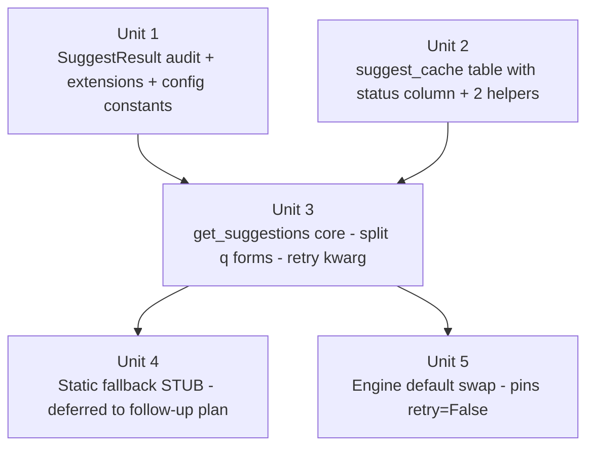

# feat: Suggest shared library (`seoserper.suggest.get_suggestions`)

## Overview

Introduce a small stable Python library — `seoserper.suggest.get_suggestions(q, hl, gl, limit, fresh, retry) -> SuggestResult` — inside the existing SEOSERPER package. The library wraps the existing raw fetcher (`seoserper.fetchers.suggest.fetch_suggestions`) with query normalization, a SQLite-backed cache (new `suggest_cache` table with a `status` column, parallel to `serp_cache`), one transient-only retry gated by a `retry` kwarg, and structured logging with privacy-aware query hashing. The Streamlit engine migrates to call the library with `retry=False` so the engine's own `retry_failed_surfaces` is the sole retry layer — preventing the amplification that a naive layered-retry design would create. Static fallback ships as a stubbed no-op code path, with the real implementation deferred to a follow-up plan triggered by concrete operational signal. No HTTP surface, no new runtime dependencies, no service process.

This plan realizes the library-first framing locked in by the origin brainstorm (see origin). It was strengthened via multi-persona document review; integrated findings touch the upstream wire contract (do not lowercase on the wire), retry layering (engine-context disables library-retry), scope cuts (static fallback stub, no separate tracer-bullet unit, fewer config constants and helpers), and storage design (explicit `status` column instead of JSON-extract TTL).

## Problem Frame

SEOSERPER's raw fetcher (`seoserper/fetchers/suggest.py`) is a single-call, no-retry function that converts all failure modes to a `SuggestResult` with `status=FAILED`. Today's only caller is the Streamlit engine, which uses dependency injection at `AnalysisEngine(fetch_fn=...)` but always accepts the default. Future Python callers (agents, scripts, notebooks) would either re-import the raw fetcher and reinvent normalization/cache/retry, or hit `suggestqueries.google.com` directly.

The library codifies the protection layer once, on top of the existing fetcher, at `seoserper.suggest.get_suggestions` as the stable public API. Streamlit migrates to it; future Python callers import it. The existing raw fetcher stays in place as an implementation detail.

## Requirements Trace

The origin doc has 14 numbered requirements (R1–R14) plus 4 success criteria (SC1–SC4). Every R/SC maps into this plan:

**Public API**
- R1. `get_suggestions(q, hl, gl, limit, fresh, retry)` signature; 1–128 char NFKC-normalized `q` for cache+echo; stripped-but-unlowercased `q` sent upstream → Unit 1 (constants) + Unit 3 (function + validation + split forms)
- R2. `SuggestResult` extended with `provider_used / from_cache / latency_ms / normalized_query / warnings` (plain dataclass; origin's `frozen=True` text is reconciled here as a plain extension) → Unit 1
- R3. Never raises on upstream failure; `ValueError` only on programmer errors → Unit 3

**Core resolution**
- R4. Normalize → cache-read (unless `fresh`) → `_google_fetch_with_retry` bounded by `retry` kwarg → synthesized safe-degrade on FAILED → Unit 3
- R5. EMPTY preserved as a success status (cached with short TTL; not collapsed into error) → Unit 3

**Caching**
- R6. Cache key = `(normalized_q, hl, gl)` (no `limit` — Google returns a fixed list; `limit` is a client-side slice); parallel `suggest_cache` table with explicit `status` column → Unit 2
- R7. 12h TTL OK, 5min TTL EMPTY enforced via SQL on `status` column; never cache FAILED → Unit 2 (storage) + Unit 3 (write-decision)
- R8. `fresh=True` skips read, still writes on success → Unit 3

**Static fallback (stubbed)**
- R9. Flag `config.SUGGEST_STATIC_FALLBACK=False` exists; code path is a stub that synthesizes degraded-empty when reached → Unit 4
- R10. Full implementation (SQL join + dedup + locale filter) deferred to a follow-up plan triggered by concrete signal. Outstanding Questions carry the design seed forward.

**Observability**
- R11. One structured log line per call; `q_hash` (sha256 prefix), never raw `q` → Unit 3

**Integration**
- R12. No metric registry → (non-goal, no unit)
- R13. Streamlit engine migrates to `get_suggestions(retry=False)` → Unit 5 (default swap + retry-kwarg propagation)
- R14. No HTTP surface → (non-goal)

**Success criteria**
- SC1. Streamlit migration preserves the 30/30 live-smoke baseline (`scripts/suggest_baseline.jsonl`, 2026-04-20) → Unit 5 verification step
- SC2. ≥1 Python caller outside Streamlit uses library in first implementation → satisfied by Unit 3's own importability / usage tests running inside `tests/test_suggest_library.py`; no separate script edit needed (feasibility review showed `scripts/suggest_baseline.py` does not exist — SC2 is reframed around the test suite itself as the outside-Streamlit caller)
- SC3. Degraded path raises no exception end-to-end → Unit 3 tests + Unit 5 integration
- SC4. Cache hit ratio ≥ 40% log-grep-able over a 20-call mixed test → Unit 3 logging + verification in Unit 5

## Scope Boundaries

- **In scope**: library module, `suggest_cache` table + 2 helpers, `SuggestResult` extension (with pre-unit audit step), engine default swap with `retry=False` injection, static fallback stub (no real implementation).
- **Out of scope** (explicit from origin doc): FastAPI/uvicorn/HTTP, circuit breaker, rate limiter, coalescing, `SuggestProvider` Protocol, 8-signal metric hooks, `/healthz`, `CallerIdentity`, Redis, new runtime deps.
- **Deferred to follow-up** (cut via review): Full static-fallback implementation (SQL over `jobs` ⋈ `surfaces`, dedup, rank sort) — fires a separate plan when operational logs show a repeat-with-Google-down window worth filling. Also deferred: tracer-bullet consumer script edit (target file does not exist in repo).
- **Deliberately not touched**: raw fetcher parse logic (`seoserper/fetchers/suggest.py` body); `serp_cache` table/helpers; engine's `SerpFn` path.

## Context & Research

### Relevant Code and Patterns

- **Existing fetcher** `seoserper/fetchers/suggest.py:38-128` — `fetch_suggestions(query, lang, country, timeout)` returns `SuggestResult` with `status ∈ {OK, EMPTY, FAILED}` and `failure_category ∈ {NETWORK_ERROR, BLOCKED_RATE_LIMIT, SELECTOR_NOT_FOUND}`. Defensive parse handles HTML redirect, shape drift, echo mismatch, JSON decode failure. Echo compare at line 113 is already case-insensitive (`parsed[0].strip().lower() != query.strip().lower()`) — so sending raw-case `q` upstream is safe even when cache-key form is lowercased.
- **Cache wrapper pattern** `seoserper/fetchers/serp_cache.py:24-84` — wrap-around-fetcher + storage-delegation split; cache-if-all-surfaces-OK-or-EMPTY. Library follows the same shape.
- **Storage migration idiom** `seoserper/storage.py:83-139` — `SCHEMA` block with `CREATE TABLE IF NOT EXISTS`; idempotent `_migrate_*` helpers with `PRAGMA table_info` + `BEGIN IMMEDIATE` + duplicate-column swallow. New tables only need inclusion in `SCHEMA`.
- **SQLite connection conventions** `seoserper/storage.py:142-159` — WAL, `busy_timeout=5000`, `synchronous=NORMAL`, `foreign_keys=ON`, `row_factory=Row`; short-lived `get_connection` context manager.
- **Engine injection seam** `seoserper/core/engine.py:57, 76-84, 207-214` — `FetchFn = Callable[[str, str, str], SuggestResult]`; `_do_suggest` reads `result.status / result.items / result.failure_category`. Library must preserve this call shape; the new `retry` kwarg gets defaulted in the engine's call site.
- **Test pattern** `tests/test_suggest.py:17-38`, `tests/test_serp_cache.py`, `tests/conftest.py:12-17` — `patch("seoserper.fetchers.suggest.requests.get", ...)` + `_response()` helper + `db_path` fixture from `tmp_path`.

### Institutional Learnings

- No `docs/solutions/` artifacts. Parent brainstorm `docs/brainstorms/2026-04-20-suggest-only-pivot-requirements.md` establishes the 30/30 suggest baseline and the kill criterion this library inherits.
- Verified during feasibility review: SQLite json1 extension is available on this host, but the plan now uses a plain `status` column regardless — simpler SQL, portable, no JSON parse per row.

### External References

No external research needed. Python stdlib + `requests` only.

## Key Technical Decisions

- **Split query forms on the wire.** The library normalizes `q` to NFKC + lowercase + whitespace-collapsed form for the cache key, echo-matching, and log `q_hash` — but sends the caller's **stripped-but-unlowercased** `q` to the upstream fetcher. Google Suggest's ranking is case-sensitive for proper nouns / acronyms / fullwidth inputs (`iPhone` ≠ `iphone`, `NASA` ≠ `nasa`, `ＡＢＣ` ≠ `abc`). Lowercasing on the wire would silently change result quality; lowercasing only in the cache key is safe because the fetcher's echo compare is already case-insensitive (`suggest.py:113`).
- **Engine disables library-retry via `retry=False` kwarg.** Engine's `retry_failed_surfaces` is the operator-facing retry layer; it re-invokes the library, which would otherwise do its own 1-retry — compounding to up to 4 upstream hits per failing surface on one Submit + one operator retry. The library accepts a `retry: bool = True` kwarg (default preserves resilience for non-engine callers); the engine's `fetch_fn` closure pins it to `False`.
- **Extend `SuggestResult` in place *after* an audit step.** Unit 1 begins with a mandatory audit (`git grep 'SuggestResult('` for positional constructors, `git grep '== SuggestResult'` for whole-object equality compares). If both are empty, extension is mechanical (the assumed case from the review's verified claims). If either is non-empty, the unit falls back to introducing a parallel `SuggestLibResult` type + a one-line adapter in Unit 5. The audit is cheap; the branch keeps Unit 1 safe.
- **`suggest_cache` uses an explicit `status` column**, not `json_extract`. Status-aware TTL becomes a plain `WHERE status = ? AND created_at >= datetime('now', '-{ttl}s')` — clearer, portable (no json1 dependency), no JSON parse per read. Single indexable column beats JSON-field extraction for a hot path.
- **Drop `limit` from the cache key.** Google Suggest returns a fixed list (≤10–20 items). `limit` is client-side truncation; partitioning cache on it doubles upstream hits when callers vary the parameter. Cache stores the full upstream item list; library slices to `limit` after read. SC4 (≥40% hit ratio) becomes reachable against mixed-limit callers.
- **Parallel `suggest_cache` table, not a `source` discriminator on `serp_cache`.** Existing `serp_cache` helpers are unnamespaced (`cache_get / cache_put`); retrofitting a namespace is a breaking change across call sites. Additive parallel table is cleaner and isolated.
- **Static fallback ships as a stub.** Unit 4 reduces to a no-op `_static_fallback(...)` function that always returns empty-items (degraded). The SQL over `jobs` ⋈ `surfaces`, dedup, rank sort, locale filter, and 6+ test scenarios are deferred to a follow-up plan triggered by observable logs showing a fallback opportunity. Building + testing a gated-off feature with no trigger criterion is speculative scope.
- **No tracer-bullet script.** `scripts/suggest_baseline.py` does not exist in the repo (only the `.jsonl` output artifact). SC2 is reframed: the `tests/test_suggest_library.py` suite — invoked by `pytest` outside any Streamlit context — is itself the first non-Streamlit Python caller. No script edit required.
- **Retry policy = 1 attempt, 200ms fixed delay, transient-only, gated by `retry` kwarg**. Transient = `failure_category == NETWORK_ERROR`. Not on `BLOCKED_RATE_LIMIT` (won't heal in 200ms) or `SELECTOR_NOT_FOUND` (upstream shape issue). `_MAX_RETRIES = 1` is a module-level constant in `suggest.py`, not a `config.py` surface — there is no consumer tuning the count.
- **Only two cache helpers: `suggest_cache_get` and `suggest_cache_put`.** `prune` happens opportunistically inside `put` via the existing `ttl_seconds` pattern. `invalidate` is not needed for MVP (no caller); add later when a concrete invalidation trigger appears.
- **`provider_used` default = `""`**. Explicit "library did not populate this field" for fetcher-direct callers. Library populates the value; non-library callers see empty string.
- **Logging uses stdlib `logging` with `extra=`**. Matches `seoserper/core/engine.py:54`. Library logger name: `seoserper.suggest`. No new dependency.

## Open Questions

### Resolved During Planning

- **Module placement** → New `seoserper/suggest.py`; raw fetcher stays at `seoserper/fetchers/suggest.py`.
- **Cache table design** → Parallel `suggest_cache` with explicit `status TEXT NOT NULL CHECK(status IN ('ok','empty'))` column; `cache_key TEXT PRIMARY KEY`; two helpers.
- **Retry backoff** → 1 attempt, 200ms fixed delay, NETWORK_ERROR only; hardcoded `_MAX_RETRIES = 1` in module. Engine context disables via `retry=False`.
- **Log field alignment** → `logging.getLogger("seoserper.suggest")` + `extra=`. Fields: `q_hash`, `hl`, `gl`, `limit`, `fresh`, `retry`, `provider_used`, `status`, `latency_ms`, `from_cache`.
- **Upstream wire contract** → Library sends caller's stripped-but-unlowercased `q`; normalized form used only for cache key + echo + `q_hash`.
- **Layered retry** → Engine calls `get_suggestions(..., retry=False)`; library-retry is disabled whenever the engine is the caller.
- **`provider_used` default** → `""`.
- **`frozen=True` in origin R2** → Reconciled: plan ships a plain dataclass (not frozen). The origin requirements doc's "frozen dataclass" line is noted as an editorial drift; the plan authoritatively resolves this for implementation.

### Deferred to Implementation

- **Audit outcome branch**: if Unit 1's `git grep` finds whole-object equality compares or positional `SuggestResult(` constructors, fall back to the `SuggestLibResult` parallel type. The branch is spelled out in Unit 1.
- **`init_db` migration helper** — not needed for MVP (new `CREATE TABLE IF NOT EXISTS` covers fresh + existing DBs). Add only if a future column change requires it.
- **Static fallback design details** — deferred to a follow-up plan. Seeds in Outstanding Questions below.

### Deferred to Follow-up Plan

- [Static fallback design] When `SUGGEST_STATIC_FALLBACK` flips on: source = `surfaces.data_json` (past Google outputs) vs `jobs.query` (past user inputs) vs both; dedup strategy (collapse by text, min rank); sort order (recency vs frequency); locale-filter zero-match behavior.
- [Static fallback trigger criterion] What observable signal justifies flipping the flag? Candidates: cache-miss rate > N% on a rolling window, or a count threshold of completed suggest jobs in `surfaces` that could serve fallback queries.

## High-Level Technical Design

> *This illustrates the intended shape and is directional guidance for review, not implementation specification. The implementing agent should treat it as context, not code to reproduce.*

**Module layout after this plan lands:**

```
seoserper/
├── suggest.py              # NEW — get_suggestions(...), the library
├── fetchers/
│   ├── suggest.py          # MODIFIED — SuggestResult dataclass extended with optional library-populated fields (if Unit 1 audit clears extension path)
│   ├── serp.py             # unchanged
│   └── serp_cache.py       # unchanged
├── core/
│   └── engine.py           # MODIFIED — default fetch_fn swap; pins retry=False
├── storage.py              # MODIFIED — new suggest_cache table (with status column) + 2 helpers (get, put)
├── config.py               # MODIFIED — 4 new constants (Q_MAX_LENGTH, CACHE_TTL, EMPTY_TTL, RETRY_DELAY, STATIC_FALLBACK)
└── models.py               # unchanged
```

**Library control flow:**

```text
get_suggestions(q, hl, gl, limit=10, fresh=False, retry=True):
    validate hl in SUPPORTED_LOCALES (else ValueError)
    gl_norm = gl.lower()
    upstream_q = q.strip()                                  # wire form
    validate 1 <= len(upstream_q) <= SUGGEST_Q_MAX_LENGTH
    reject if upstream_q contains control chars
    normalized_q = NFKC(upstream_q.lower()).whitespace_collapsed()
    cache_key = f"google|{normalized_q}|{hl}|{gl_norm}"     # no limit in key
    start = monotonic()

    if not fresh:
        hit = suggest_cache_get(cache_key, SUGGEST_CACHE_TTL, SUGGEST_EMPTY_TTL)
        if hit:
            items_full = deserialize_items(hit["items"])
            return SuggestResult(
                status=hit["status_enum"],                  # OK or EMPTY
                items=items_full[:limit],                   # post-read slice
                provider_used="cache",
                from_cache=True,
                normalized_query=normalized_q,
                latency_ms=elapsed(start),
            )

    raw_result = _google_fetch_with_retry(upstream_q, hl, gl, retry)

    if raw_result.status is OK:
        suggest_cache_put(cache_key, status="ok", items=asdict_list(raw_result.items),
                          ttl_seconds=SUGGEST_CACHE_TTL)
        return SuggestResult(
            status=OK,
            items=raw_result.items[:limit],
            provider_used="google",
            from_cache=False,
            normalized_query=normalized_q,
            latency_ms=elapsed(start),
        )
    if raw_result.status is EMPTY:
        suggest_cache_put(cache_key, status="empty", items=[],
                          ttl_seconds=SUGGEST_EMPTY_TTL)
        return SuggestResult(
            status=EMPTY, items=[], provider_used="google",
            from_cache=False, normalized_query=normalized_q,
            latency_ms=elapsed(start),
        )
    # FAILED path:
    if config.SUGGEST_STATIC_FALLBACK:
        static = _static_fallback(normalized_q, hl, gl_norm, limit)   # stub returns empty
        if static.items:
            return SuggestResult(
                status=OK, items=static.items, provider_used="static",
                from_cache=False, normalized_query=normalized_q,
                latency_ms=elapsed(start),
            )
    # FAILED and no fallback: synthesize degraded
    return SuggestResult(
        status=FAILED, items=[], provider_used="none",
        failure_category=raw_result.failure_category,
        from_cache=False, normalized_query=normalized_q,
        latency_ms=elapsed(start),
        warnings=["upstream_unavailable"],
    )
    # NOTE: FAILED is never cached.

_google_fetch_with_retry(upstream_q, hl, gl, retry):
    result = fetch_suggestions(upstream_q, hl, gl)
    if retry and result.status is FAILED and result.failure_category is NETWORK_ERROR:
        time.sleep(SUGGEST_RETRY_DELAY_SECONDS)
        result = fetch_suggestions(upstream_q, hl, gl)
    return result
```

**Cache row shape:** `cache_key TEXT PK | response_json TEXT | status TEXT CHECK(...) | created_at TIMESTAMP`. `response_json` stores `{"items": [{"text": ..., "rank": ...}, ...]}` only — status lives in its own column so TTL filtering is pure SQL.

## Implementation Units



Unit 4 is a no-op stub — the real static-fallback implementation is deferred to a follow-up plan. Full implementation plus verification logic come back when observable signal justifies.

- [ ] **Unit 1: `SuggestResult` audit + extensions + config constants**

**Goal:** Extend `SuggestResult` with optional library-populated fields, OR introduce a parallel type if an audit shows extension would break existing callers. Add library constants to `config.py`.

**Requirements:** R1, R2, R4, R7, R9

**Dependencies:** None

**Files:**
- Audit (no modification): `tests/test_*.py`, `seoserper/**/*.py` — `git grep` for `SuggestResult(` (positional constructors) and `== SuggestResult` (whole-object equality compares).
- Modify (primary path): `seoserper/fetchers/suggest.py` — extend `SuggestResult` dataclass with optional fields + defaults.
- Modify (fallback path, if audit fails): create `seoserper/suggest_types.py` defining `SuggestLibResult` as a parallel dataclass; use an adapter in Unit 5.
- Modify: `seoserper/config.py` — 4 new constants.
- Test: `tests/test_suggest.py` (assertions that existing fetcher-path tests still pass).
- Test: `tests/test_config.py` (new constants are importable with expected values).

**Approach:**
- **Step 1 — Audit.** Run `git grep -n 'SuggestResult('` and `git grep -n '== SuggestResult'`. If both return zero hits (in-tree call sites construct via kwargs, tests assert on field values not whole objects), proceed with in-place extension. If either returns hits, switch to parallel type.
- **Step 2 (primary) — Extend.** Add to `SuggestResult`: `provider_used: str = ""`, `from_cache: bool = False`, `latency_ms: int = 0`, `normalized_query: str = ""`, `warnings: list[str] = field(default_factory=list)`. Non-frozen dataclass (the origin R2 "frozen" line is reconciled as editorial drift — a frozen dataclass with `default_factory(list)` is a runtime contradiction).
- **Step 3 — Config constants.** Add: `SUGGEST_Q_MAX_LENGTH = 128`, `SUGGEST_CACHE_TTL_SECONDS = 43200` (12h), `SUGGEST_EMPTY_TTL_SECONDS = 300` (5min), `SUGGEST_RETRY_DELAY_SECONDS = 0.2`, `SUGGEST_STATIC_FALLBACK: bool = False`. (No `SUGGEST_RETRY_COUNT` — hardcoded as `_MAX_RETRIES = 1` in Unit 3's module.)

**Patterns to follow:**
- Existing `SuggestResult` at `seoserper/fetchers/suggest.py:30-35`.
- Existing `config.py` style: module-level constants, typed, documented via module docstring.

**Test scenarios:**
- Happy path — `SuggestResult(status=SurfaceStatus.OK)` still instantiates with `items=[]`; new fields default to empty string / False / 0 / empty list; existing `tests/test_suggest.py` assertions on `status` / `items` / `failure_category` pass unchanged.
- Happy path — `from seoserper.config import SUGGEST_Q_MAX_LENGTH, SUGGEST_CACHE_TTL_SECONDS, SUGGEST_EMPTY_TTL_SECONDS, SUGGEST_RETRY_DELAY_SECONDS, SUGGEST_STATIC_FALLBACK` succeeds with expected values.
- Audit gate — `git grep 'SuggestResult('` returns zero non-self hits (records the decision that justified the extension path).

**Verification:**
- `pytest tests/test_suggest.py tests/test_config.py` green.
- Audit commands have been run and their null output is recorded in the commit message (or PR description).

---

- [ ] **Unit 2: `suggest_cache` table (status column) + 2 helpers**

**Goal:** Add a parallel `suggest_cache` table with an explicit `status` column and two helpers (`suggest_cache_get`, `suggest_cache_put`). Status-aware TTL filtering lives in SQL against the column, not `json_extract`.

**Requirements:** R6 (cache key without `limit`), R7 (status-aware TTL)

**Dependencies:** None (independent of Unit 1)

**Files:**
- Modify: `seoserper/storage.py` — extend `SCHEMA` with the new table; add 2 helpers at bottom of file following the `cache_get` / `cache_put` conventions.
- Test: `tests/test_suggest_cache.py` (new file).

**Approach:**
- Add to `SCHEMA`:
  ```sql
  CREATE TABLE IF NOT EXISTS suggest_cache (
      cache_key TEXT PRIMARY KEY,
      response_json TEXT NOT NULL,
      status TEXT NOT NULL CHECK(status IN ('ok', 'empty')),
      created_at TIMESTAMP NOT NULL DEFAULT CURRENT_TIMESTAMP
  );
  ```
  New table — no `_migrate_*` helper needed for MVP; future column additions follow `storage.py:101-139` idiom.
- `response_json` stores only `{"items": [{"text": ..., "rank": ...}, ...]}`. The full item list (unsliced by `limit`) so reads can serve any caller limit.
- `suggest_cache_get(cache_key, ttl_ok_seconds, ttl_empty_seconds, db_path=None) -> dict | None` returns `{"status": ..., "items": [...]}` when the row is fresh for its status, else None. Status-aware TTL via a single SQL query with `WHERE cache_key = ? AND ((status='ok' AND created_at >= datetime('now', '-X s')) OR (status='empty' AND created_at >= datetime('now', '-Y s')))`. Malformed JSON on read → emit `logger.warning("suggest_cache: malformed row", extra={"cache_key": key})` + `DELETE FROM suggest_cache WHERE cache_key = ?` + return None.
- `suggest_cache_put(cache_key, status: Literal["ok","empty"], items: list[dict], db_path=None, *, ttl_seconds=None)` — `INSERT OR REPLACE` with the provided status + items; opportunistic prune inside the same transaction when `ttl_seconds` supplied (mirrors existing `cache_put`).

**Patterns to follow:**
- `seoserper/storage.py:66-70` (serp_cache DDL).
- `seoserper/storage.py:400-479` (cache helpers' connection handling, error tolerance).
- `seoserper/fetchers/serp_cache.py:1-6` (cache-never-FAILED invariant — same applies here).
- `tests/test_serp_cache.py` (test file layout, `db_path` fixture usage).

**Test scenarios:**
- Happy path — `suggest_cache_put(key, "ok", [{"text": "x", "rank": 1}])` then `suggest_cache_get(key, 12h, 5min)` returns `{"status": "ok", "items": [...]}`.
- Happy path — `suggest_cache_put(key, "empty", [])` readable within the EMPTY TTL window.
- Edge case — missing key returns `None`.
- Edge case — OK row aged > 12h returns `None`.
- Edge case — EMPTY row aged > 5min but < 12h returns `None` (status-aware TTL is stricter for EMPTY).
- Edge case — EMPTY row aged < 5min returns payload.
- Edge case — row with malformed JSON emits `logger.warning` with `cache_key` and `exc_info`, deletes the row, returns `None`. Verify via captured `LogRecord` + `PRAGMA table_info` post-call.
- Happy path — `CHECK(status IN ('ok','empty'))` rejects invalid status values (attempt to insert `"degraded"` raises `sqlite3.IntegrityError`).
- Happy path — `suggest_cache_put` with a `ttl_seconds` kwarg purges rows older than that window on the same transaction.
- Integration — after `init_db`, `PRAGMA table_info('suggest_cache')` shows the expected 4 columns.

**Verification:**
- `pytest tests/test_suggest_cache.py tests/test_storage.py` green.
- `sqlite3 seoserper.db ".schema suggest_cache"` shows the new table with the `status CHECK` constraint.

---

- [ ] **Unit 3: `get_suggestions` library implementation**

**Goal:** Implement `seoserper.suggest.get_suggestions(q, hl, gl, limit, fresh, retry)` — split q forms (upstream-raw vs cache-normalized), status-aware cache access, gated transient retry, safe degrade, log hygiene.

**Requirements:** R1, R2, R3, R4, R5, R7, R8, R11, SC2 (tests themselves are the non-Streamlit Python caller), SC3, SC4

**Dependencies:** Unit 1, Unit 2

**Files:**
- Create: `seoserper/suggest.py`.
- Test: `tests/test_suggest_library.py`.

**Approach:**
- `_normalize_cache_form(q)` returns NFKC-normalized + lowercased + whitespace-collapsed form. Used only for the cache key, log `q_hash`, and echo-comparison (the fetcher's echo compare at `suggest.py:113` is already case-insensitive so this is safe).
- `_validate_and_strip(q)` returns `q.strip()` and raises `ValueError` if the stripped form is empty, longer than `SUGGEST_Q_MAX_LENGTH`, or contains control characters. This is the **upstream wire form** — preserves the caller's case + original Unicode.
- Locale validation: `hl` must be one of `SUPPORTED_LOCALES` (`en / zh-CN / zh-TW / ja`); else `ValueError`. `gl` case-folded to lowercase (cache key + future static-fallback filter). Other `gl` values pass through (Google tolerates broad country codes).
- `_MAX_RETRIES = 1` is a module-level constant in `suggest.py` (not `config.py`).
- `_google_fetch_with_retry(upstream_q, hl, gl, retry: bool)` calls `fetch_suggestions(upstream_q, hl, gl)` once; if `retry` is True AND the result is `FAILED` + `failure_category == NETWORK_ERROR`, sleep `SUGGEST_RETRY_DELAY_SECONDS` and retry exactly once. Never retries on `BLOCKED_RATE_LIMIT` or `SELECTOR_NOT_FOUND`.
- `get_suggestions` orchestrates per the pseudo-code in High-Level Technical Design. Logs one `logger.info("suggest_call", extra={...})` line per call including `q_hash = sha256(normalized_q).hexdigest()[:8]`, `hl`, `gl`, `limit`, `fresh`, `retry`, `provider_used`, `status`, `latency_ms`, `from_cache`. Raw `q` is never passed to the logger.

**Execution note:** Start with a failing integration test for R3 ("never raises on upstream failure"). The safe-degrade contract anchors the rest of the unit.

**Patterns to follow:**
- `seoserper/fetchers/serp_cache.py:41-84` — wrap-around + `db_path` + `ttl_seconds` kwargs.
- `seoserper/fetchers/suggest.py:45-58` — exception-to-result translation idiom.
- `tests/test_suggest.py:17-38` — `requests.get` mocking at the fetcher module path; library tests mock at the same point so the end-to-end parse chain is exercised.

**Test scenarios:**
- Happy path — fresh call with mocked OK upstream: `status=OK`, `provider_used="google"`, `from_cache=False`, `items` populated, `latency_ms > 0`, `warnings == []`.
- Happy path — second call with same args: `from_cache=True`, `provider_used="cache"`, items match. Verify via `assert mock_get.call_count == 1` (second call did not hit upstream).
- Happy path — EMPTY upstream: `status=EMPTY`, `from_cache=False`, cached with 5min TTL; second call reads EMPTY from cache.
- Happy path — `fresh=True` skips cache read even with a fresh row; writes through on OK; `assert mock_get.call_count == 2` across two calls.
- Happy path — cache stores full item list; a call with `limit=10` and a call with `limit=20` against a repeated keyword both hit cache (no partitioning by limit); verify via `mock_get.call_count == 1` across both.
- Happy path — upstream wire compare: mock receives the caller's raw `q` (`"iPhone"` → passed as `"iPhone"` to fetcher), NOT the lowercased normalized form. Verify via `mock_get.call_args.kwargs["params"]["q"]`.
- Edge case — NFKC normalization collapses `"ＡＢＣ"` and `"abc"` to the same cache key (both share one row), but upstream sees `"ＡＢＣ"` and `"abc"` respectively on cold calls for each.
- Edge case — `limit=25` raises `ValueError` (clamp to 1..20 per R1); `limit=0` raises `ValueError`.
- Edge case — very short `q` (`"a"`) accepted; `q=""` (empty after strip) raises `ValueError`; `q` > 128 chars raises `ValueError`; `q` with `"\x00"` raises `ValueError`.
- Edge case — invalid `hl` (e.g. `"de"`) raises `ValueError`.
- Error path — `NETWORK_ERROR` + `retry=True`: retry fires once. Mock `side_effect=[net_err_resp, ok_resp]`; assert `mock_get.call_count == 2`; assert final `status=OK`, `provider_used="google"`. Patch `time.sleep` (or the library-local sleep import) to avoid real 200ms wait.
- Error path — `NETWORK_ERROR` + `retry=True` + both fail: `side_effect=[net_err, net_err]`; assert `call_count == 2`; returns degraded-empty with `warnings=["upstream_unavailable"]`, `provider_used="none"`; NOT cached.
- Error path — `NETWORK_ERROR` + `retry=False` (engine context): `side_effect=[net_err]`; assert `call_count == 1`; returns degraded-empty.
- Error path — `BLOCKED_RATE_LIMIT` + `retry=True`: no retry fires. `call_count == 1`; returns degraded-empty; not cached.
- Error path — `SELECTOR_NOT_FOUND` + `retry=True`: no retry fires. `call_count == 1`; returns degraded-empty; not cached.
- Error path — upstream fetcher raises an unexpected exception: library catches at the edge, returns `status=FAILED` + `warnings=["upstream_error"]`; never propagates.
- Integration — log line includes `q_hash` (8-char hex); raw `q` is absent. Verify via `caplog.records[0].__dict__`.
- Integration — cache write on OK and EMPTY actually hit `suggest_cache` (verified via direct `suggest_cache_get` on the DB); cache write on FAILED does NOT (absence verified).

**Verification:**
- `pytest tests/test_suggest_library.py` green.
- Manual: `python -c "from seoserper.suggest import get_suggestions; print(get_suggestions('台北', 'zh-TW', 'TW').status)"` produces a sensible status.

---

- [ ] **Unit 4: Static fallback stub**

**Goal:** Provide a stub `_static_fallback(normalized_q, hl, gl_norm, limit)` that returns empty items — the real implementation is deferred to a follow-up plan triggered by concrete operational signal.

**Requirements:** R9 (flag exists, code path wired, returns empty)

**Dependencies:** Unit 3

**Files:**
- Modify: `seoserper/suggest.py` — add the stub function.

**Approach:**
- Stub body is a single line returning an empty-items result; no SQL, no parsing, no dedup, no sort.
- The stub exists so Unit 3's `if config.SUGGEST_STATIC_FALLBACK: static = _static_fallback(...)` branch is real code (not a runtime `NotImplementedError`) and so the branch is covered by type checkers and basic linting.
- Docstring explicitly points to the follow-up plan placeholder: `# TODO(static-fallback): full implementation lives in a follow-up brainstorm/plan triggered by observable cache-miss + upstream-down signal.`
- No tests beyond what Unit 3 already exercises (the default-OFF flag path covers 100% of the MVP behavior; the stub being called when flag=True and returning empty is covered by Unit 3's degraded-path scenario once a dedicated flag-on test is added).

**Test scenarios:**
- Happy path — with `SUGGEST_STATIC_FALLBACK=True` and `_google_fetch_with_retry` returning FAILED, `get_suggestions` still returns degraded-empty (the stub produces no items). Verified via a single `monkeypatch.setattr(config, "SUGGEST_STATIC_FALLBACK", True)` test in `tests/test_suggest_library.py`.

**Verification:**
- `pytest tests/test_suggest_library.py -k static` green (one test only).
- Codebase contains a locatable `TODO(static-fallback)` string for the follow-up plan.

---

- [ ] **Unit 5: Engine migration — default swap + pins `retry=False`**

**Goal:** Change `AnalysisEngine`'s default `fetch_fn` to the library's `get_suggestions`, wrapped in a partial/closure that pins `retry=False` so the engine's operator-facing `retry_failed_surfaces` remains the sole retry layer.

**Requirements:** R13, SC1

**Dependencies:** Unit 3 (library must exist)

**Files:**
- Modify: `seoserper/core/engine.py` — import change + default-fn swap using `functools.partial(get_suggestions, retry=False)` (or equivalent closure) as the `fetch_fn` default.
- Modify: `tests/test_engine.py` — update imports; verify the engine reads `result.items` / `result.status` / `result.failure_category` unchanged when using the library default.
- Run (no modification): `tests/test_ui_smoke.py` — verifies the Streamlit path still boots end-to-end.

**Approach:**
- Replace `fetch_fn: FetchFn = fetch_suggestions` (line 76) with a closure/partial pinning `retry=False`. The `FetchFn` typedef stays `Callable[[str, str, str], SuggestResult]` — `partial(get_suggestions, retry=False)` satisfies it because `limit` and `fresh` keep their defaults.
- Engine-side call at `engine.py:208` is unchanged: `self._fetch_fn(query, lang, country)`.
- The engine's `retry_failed_surfaces` still triggers re-invocation; because `retry=False` is pinned, each operator retry costs at most 1 upstream hit per failing surface (not 2). Total worst case across Submit + one operator retry = up to 2 upstream hits per failing surface, matching a simple no-compound retry model.
- Pre-land verification: `git grep -n 'fetch_suggestions'` should return only the library's internal import + the raw fetcher module itself + tests that explicitly isolate the raw fetcher. Update any stray caller to use `get_suggestions` with an explicit `retry` kwarg.

**Patterns to follow:**
- `seoserper/core/engine.py:76-84` — existing default-assignment pattern.
- `app.py:141-143` — existing closure-currying pattern for `serp_fn` via `partial`.

**Test scenarios:**
- Happy path — `AnalysisEngine()` with no `fetch_fn` uses the pinned-retry library default. Submitting a job mocks `requests.get` via `patch("seoserper.fetchers.suggest.requests.get")`, returns OK, engine writes an OK surface row. Verify `mock_get.call_count == 1` for a single submit.
- Happy path — engine's `retry_failed_surfaces` on a failed suggest surface: mock returns NETWORK_ERROR, then OK on the retry. Verify total `mock_get.call_count == 2` across (initial submit + one operator retry) — NOT 4. The `retry=False` pin prevents the library from compounding.
- Integration — engine default logs include the library's structured log line at level INFO.
- Integration — `tests/test_ui_smoke.py` passes unmodified (Streamlit boot + engine round-trip).

**Verification:**
- Full `pytest tests/` green.
- Manual: run `python -c "from seoserper.core.engine import AnalysisEngine; AnalysisEngine()"` without error.
- `scripts/suggest_baseline.jsonl` — if the earlier baseline-capture harness is re-run, the output format (pass/fail pattern per locale) is unchanged.

## System-Wide Impact

- **Interaction graph**: `seoserper.suggest.get_suggestions` becomes the canonical suggest entry point. `AnalysisEngine` fans in via `partial(get_suggestions, retry=False)`; future Python callers import `get_suggestions` directly with `retry=True` (default). The raw `fetchers.suggest.fetch_suggestions` is invoked only via the library.
- **Error propagation**: Library never raises on upstream failure (except explicit `ValueError` for programmer errors). Engine's `_do_suggest` tolerates a FAILED `SuggestResult`. Retry is single-layer: the library retries once when called by non-engine callers (default); the engine is the retry layer for its own path.
- **State lifecycle**: New `suggest_cache` table coexists with `serp_cache` under the same WAL-mode, single-writer regime. Fresh DBs get the new table from `SCHEMA`; existing DBs pick it up on next `init_db` call (idempotent). Opportunistic prune at `suggest_cache_put` bounds the table.
- **API surface parity**: Engine's `SerpFn` path is untouched. SerpAPI integration continues as-is.
- **Integration coverage**: Unit 5's engine test is the cross-layer verification. `test_ui_smoke.py` covers the Streamlit layer. Both must remain green.
- **Unchanged invariants**: (a) Fetcher's `SuggestResult` shape for existing consumers is additively extended (or replaced with a parallel type via the audit branch; either way no existing access pattern breaks). (b) `serp_cache` table + helpers. (c) Engine's `FetchFn` typedef. (d) `SurfaceStatus`, `FailureCategory` enums. (e) `models.Suggestion(text, rank)` shape.

## Risks & Dependencies

| Risk | Mitigation |
|------|------------|
| Engine default swap breaks Streamlit silently | Unit 5 runs full `test_ui_smoke.py` + `test_engine.py` unchanged; the `retry=False` pin is explicit in the engine default definition and test-asserted. |
| `SuggestResult` extension breaks existing positional constructors or equality compares | Unit 1's audit step catches this before the unit lands; falls back to parallel `SuggestLibResult` type with adapter in Unit 5 if audit shows hits. |
| Cache grows unboundedly on a hot-path loop | `suggest_cache_put` includes opportunistic prune via `ttl_seconds` kwarg, mirroring the existing `serp_cache` pattern. |
| `suggest_cache` `status` CHECK constraint rejects valid writes | Only two statuses (`ok`, `empty`) are ever written — FAILED is never cached. Constraint makes this invariant machine-enforced. |
| Static fallback stub gives false confidence that the feature "exists" | Unit 4 embeds a `TODO(static-fallback)` token; the follow-up plan's creation is explicitly deferred. The code path is covered by exactly one test (flag=True → empty result) to prevent silent lingering. |
| `scripts/suggest_baseline.py` baseline harness re-creation is deferred | SC2 is satisfied by `tests/test_suggest_library.py` as the first non-Streamlit caller. A real baseline script can be created in a follow-up when someone wants to reproduce the 30/30 data point. |

## Documentation / Operational Notes

- Add a paragraph to `seoserper/config.py` docstring describing the new `SUGGEST_*` constants and `SUGGEST_STATIC_FALLBACK`'s default-off posture.
- No README change required for MVP; the library is an internal import.
- Log pipeline: structured log fields (`q_hash`, `provider_used`, `status`, `latency_ms`, etc.) are grep-able. No monitoring hookup at MVP.

## Sources & References

- **Origin document**: `docs/brainstorms/2026-04-20-suggest-library-requirements.md`
- Parent brainstorm (kill criterion + endpoint baseline): `docs/brainstorms/2026-04-20-suggest-only-pivot-requirements.md`
- Existing fetcher: `seoserper/fetchers/suggest.py:30-128`
- Existing cache wrapper: `seoserper/fetchers/serp_cache.py:1-84`
- Existing storage + migration pattern: `seoserper/storage.py:34-159, 400-479`
- Engine injection seam: `seoserper/core/engine.py:57, 76-84, 207-214`
- Test pattern: `tests/test_suggest.py:17-38`, `tests/test_serp_cache.py`, `tests/conftest.py:12-17`
- Recent unit-* commits establishing SerpAPI integration context: `f7a3a47`→`c9b30c9`
